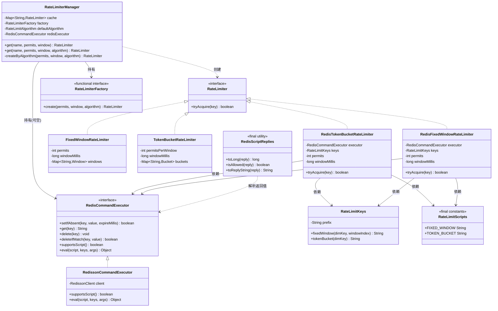
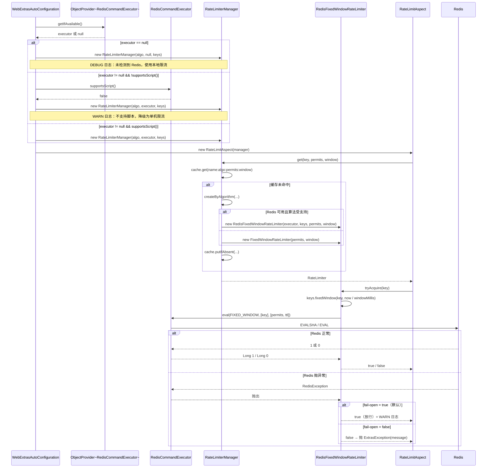
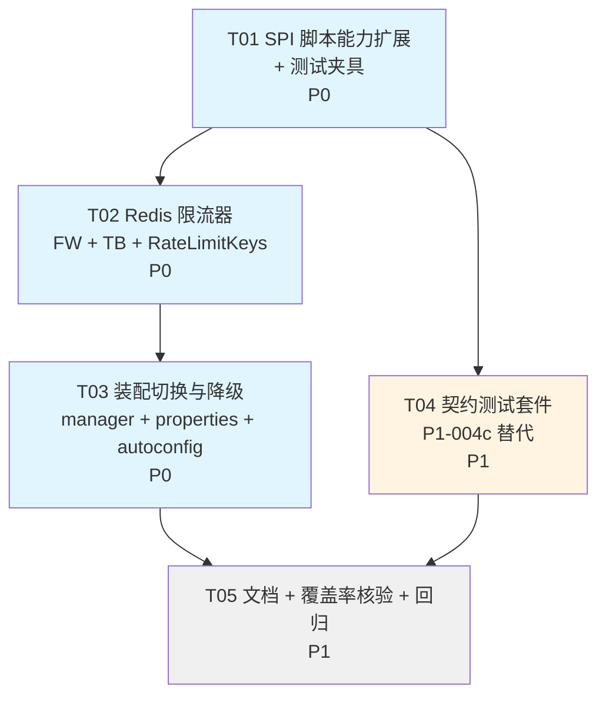

# 限流集群化（P1-004b）架构设计与任务分解

| 项 | 内容 |
|---|---|
| 文档编号 | DESIGN-P1-004b |
| 作者 | 高见远（Gao） |
| 日期 | 2026-09-07 |
| 基线 commit | `3ab9892` |
| 相关任务 | P1-004b（限流集群化）、P1-004c（Redis 集成测试替代方案）、N-003（Notification 空转配置存废） |
| 状态 | 设计定稿，待评审；**本文不含生产代码与测试代码** |

---

## 0. 事实基线（已一手核实）

| 事实 | 位置 | 备注 |
|---|---|---|
| `RedisCommandExecutor` 4 方法 | `framework-boot-web/.../extras/web/lock/RedisCommandExecutor.java` | `setIfAbsent` / `get` / `delete` / `deleteIfMatch`；无通用 eval |
| 装配层已有 Redisson 适配器 | `framework-boot-autoconfigure/.../extras/RedissonCommandExecutor.java` | **已用 `client.getScript().eval(...)` 实现 `deleteIfMatch`** → 证明脚本能力在本仓库已有落地路径 |
| 限流本地实现 4 个 | `framework-boot-web/.../extras/web/ratelimit/` | `FixedWindow` / `SlidingWindow` / `LeakyBucket` / `TokenBucket` |
| `RateLimiterManager` 已内置工厂抽象 | 同上 | `RateLimiterFactory` 函数式接口 + `DEFAULT_FACTORY = RateLimiterManager::createByAlgorithm`（**static**） |
| `RateLimit` 注解 | 同上 | `key()` / `permits()` / `window()` / `message()`，**目前无 `algorithm()` 属性** |
| `RateLimitAspect` 调用 | 同上 | `manager.get(key, permits, window)` → 走 `defaultAlgorithm`（默认 `TOKEN_BUCKET`） |
| 幂等/验证码装配范式 | `WebExtrasAutoConfiguration` | `ObjectProvider<RedisCommandExecutor>` + `getIfAvailable()`，注释明确写了"规避 bean 注册顺序陷阱" |
| 限流配置块 | `ExtrasWebProperties.RateLimit` | **当前仅 `enabled` 一个字段**；由 `BootWebExtrasProperties` 绑定前缀 `framework.extras.web` |
| 另一份限流配置 | `extras-common` 的 `RateLimitProperties` | 含 `enabled` + `defaultAlgorithm`；绑定到 `ExtrasProperties` 下（前缀不同）→ **注意不要加错地方** |
| LeakyBucket P0 修复痕迹 | `LeakyBucketRateLimiter` | `leakPerMillis == Double.MAX_VALUE` 分支 + `elapsed > 0` 的 `0*Infinity=NaN` 防御 |
| boot-web 测试依赖 | `framework-boot-web/pom.xml` | `junit-jupiter` / `assertj-core` / `awaitility` / `mockito-core`（**均已在线，无需新增**） |

---

## 1. 决策摘要

| # | 问题 | 一句话结论 | 核心取舍理由 |
|---|---|---|---|
| 1 | 一致性语义 | **最终一致**。Fixed Window / Token Bucket 天然适配；Sliding Window 成本陡增；Leaky Bucket 会明显退化。误差边界：**单窗口超发 ≤ 1 次/节点 × 一次 Redis RTT 内并发数**，工程上取 α ≈ RTT/window < 0.5%（window ≥ 1s、同城 Redis < 5ms） | 限流不是安全边界，超发 0.5% 的业务代价 << 强一致（Redlock/分布式事务）的复杂度与延迟代价 |
| 2 | SPI 脚本能力扩展 | **在 `RedisCommandExecutor` 上加两个 `default` 方法**：`boolean supportsScript()`（默认 `false`）+ `@Nullable Object eval(script, keys, args)`（默认抛 `UnsupportedOperationException`） | `default` 方法 = **编译期零破坏**；保留单一 SPI 类型，装配层无需解析两个 `ObjectProvider`；与现有 `deleteIfMatch`（内部走 Lua、对外暴露语义）风格一脉相承 |
| 3 | 4 种算法分布式化 | **分阶段**：本轮只做 **Fixed Window + Token Bucket**；Sliding Window 留 P2；**Leaky Bucket 本轮不动**，Redis 路径下显式回落本地 + WARN | 前两者是"单 key、少字段、一个 Lua 搞定"；Leaky Bucket 刚修 P0（09-04），且依赖共享"上次漏水时间戳"，多节点时钟漂移会放大误差，收益/风险比最低 |
| 4 | 装配切换策略 | **照抄幂等/验证码范式**：`ObjectProvider<RedisCommandExecutor>` + `getIfAvailable()`；`RateLimiterManager` 新增可空构造参数 `@Nullable RedisCommandExecutor`，`createByAlgorithm` 由 static 改为实例方法 | 与既有代码零认知负担；`RateLimiterManager` 本身是 POJO，用构造参数（而非注入 `ObjectProvider`）才能保持实现层零 Spring 依赖 |
| 5 | 降级策略 | **能力缺失（executor 为 null 或 `!supportsScript()`）→ 回落本地限流 + 一次性 WARN；运行期 Redis 异常 → fail-open（放行）**，可由 `framework.extras.web.ratelimit.fail-open=false` 切换为 fail-closed | 限流是体验/保护性能力，Redis 抖动导致**全站 503** 的代价 >> 短暂超流；与 `LockAspect` 降级为本地锁的既有风格一致 |
| 6 | key 命名规范 | `ratelimit:{algo}:{dimKey}[:{windowIndex}]`，默认前缀 `ratelimit:` 可配置；新建 `RateLimitKeys` 集中拼接与校验 | 与幂等 `idempotent:` 前缀隔离；新增 `ratelimit:` 段从根上杜绝与 `idempotent:` / captcha / lock 键空间冲突 |

**新增配置项一律加在 `ExtrasWebProperties.RateLimit`（web 层纯 POJO），由 `BootWebExtrasProperties` 继承后自动获得 `framework.extras.web.ratelimit.*` 前缀。严禁加到 `extras-common` 的 `RateLimitProperties`**（那份挂在 `ExtrasProperties` 下，前缀不同，配了会静默失效）。

---

## 2. SPI 扩展方案：给 `RedisCommandExecutor` 增加脚本能力

### 2.1 三个方案对比

| 方案 | 做法 | 编译期兼容 | 运行期能力探测 | 装配复杂度 | 契约表达力 |
|---|---|---|---|---|---|
| **A. `default` 方法扩展** | 接口加 `default supportsScript()` + `default eval(...)`，默认 `false` / 抛 `UnsupportedOperationException` | ✅ 完全兼容，业务方一行不改 | 需显式调用 `supportsScript()` | 低（单一类型） | 中（异常即不支持） |
| **B. 独立 SPI `RedisScriptExecutor`** | 新接口，适配器选择性 `implements` | ✅ 兼容 | `instanceof` 或第二个 `ObjectProvider` | 高（装配要解析两个 ObjectProvider 并决定优先级） | 强（类型即能力） |
| **C. A + B 混合** | `default` 方法 + 标记接口 `RedisScriptExecutor extends RedisCommandExecutor` | ✅ 兼容 | 两者皆可 | 中 | 最强，但概念冗余 |

### 2.2 推荐：**方案 A**（纯 `default` 方法扩展）

理由：

1. **非 breaking 是最强硬约束**。`default` 方法对既有 4 方法实现是**二进制与源码双兼容**——业务方已写的 `class MyExecutor implements RedisCommandExecutor` 编译、运行均不受影响；`RedissonCommandExecutor`（本仓库）也无需强制改动即可继续工作。
2. **单一 SPI 类型**。装配层、限流器、契约测试只需面向 `RedisCommandExecutor` 一个类型编程。方案 B 会引入"容器里可能有两个 Redis 抽象 bean"的新问题，且 `@ConditionalOnMissingBean` 语义会变模糊。
3. **与本仓库既有设计同源**。`deleteIfMatch` 已经是"SPI 暴露脚本语义、实现方内部用 Lua"的先例；`eval` 只是把这件事泛化，不算另起炉灶。
4. **方案 B 的"类型即能力"优势被高估**。适配器作者要写的仍是同一个 `eval`，用 `default` + `supportsScript()` 一样能在装配期一次性探测并打日志；而"编译期强制"恰恰是我们**不想要**的（那等于变相 breaking）。

> **不采纳方案 B/C 的关键理由**：引入第二个 SPI 会让"框架到底有几个 Redis 抽象"这个问题出现两个答案，文档、示例、排查路径全部翻倍。在只有一个可选能力（脚本）的情况下，收益不抵复杂度。

### 2.3 接口签名草案（`lock/RedisCommandExecutor.java`，**新增两个 default 方法，不动现有 4 个**）

```java
@NullMarked
public interface RedisCommandExecutor {

    // ===== 既有 4 方法：签名、Javadoc、顺序一律不动 =====
    boolean setIfAbsent(String key, String value, long expireMillis);
    @Nullable String get(String key);
    void delete(String key);
    boolean deleteIfMatch(String key, String value);

    /**
     * 是否支持执行 Lua 脚本。
     *
     * <p>默认 {@code false}：既有的四方法实现无需改动即可继续工作。
     * 实现方若重写了 {@link #eval(String, List, List)}，<b>必须同时重写本方法并返回
     * {@code true}</b>，否则框架仍按"不支持脚本"处理（契约测试套件会强制校验这一致性）。
     *
     * @return 支持脚本执行返回 {@code true}
     * @since 0.0.2
     */
    default boolean supportsScript() {
        return false;
    }

    /**
     * 原子执行一段 Lua 脚本。
     *
     * <p>默认实现抛出 {@link UnsupportedOperationException}，保证未实现脚本能力的
     * 适配器不会被静默降级为"什么都不做"。调用方应先通过 {@link #supportsScript()}
     * 探测，或在装配期一次性探测后决定降级路径。
     *
     * @param script Lua 脚本源码，不可为 {@code null} 或空白
     * @param keys   KEYS 数组，可为 {@link java.util.List#of()}（无 key 脚本），元素不可为 {@code null}
     * @param args   ARGV 数组，可为 {@link java.util.List#of()}，元素不可为 {@code null}
     * @return 脚本返回值；Redis Lua 的常见返回类型为 {@code Long} / {@code String} /
     *         {@code List<?>} / {@code null}，由调用方按脚本约定解析
     *         （建议配合 {@code RedisScriptReplies} 做类型收敛）
     * @throws UnsupportedOperationException 当前实现不支持脚本执行
     * @since 0.0.2
     */
    default @Nullable Object eval(String script, List<String> keys, List<String> args) {
        throw new UnsupportedOperationException(
                "RedisCommandExecutor [" + getClass().getName()
                        + "] does not support Lua script execution");
    }
}
```

### 2.4 返回值收敛工具（新增 `lock/RedisScriptReplies.java`）

Redis Lua 返回值在不同客户端下类型不一致（Redisson `ReturnType.LONG` 给 `Long`，`ReturnType.STATUS` 给 `String` 或 `Boolean`...）。为避免每个调用点各写一套解析，提供一个无状态工具类：

```java
/** Lua 脚本返回值的类型收敛工具（纯静态，无状态）。 */
public final class RedisScriptReplies {
    private RedisScriptReplies() { }                       // 私有构造

    public static long toLong(@Nullable Object reply);     // null -> 0L；Number -> longValue()
                                                           // String -> Long.parseLong；Boolean -> 1/0
                                                           // 其它 -> IllegalArgumentException（含实际类型名）
    public static boolean isAllowed(@Nullable Object reply); // toLong(reply) > 0
    public static @Nullable String toReplyString(@Nullable Object reply);
}
```

### 2.5 非 breaking 论证（逐条）

| 兼容维度 | 论证 |
|---|---|
| **源码兼容** | `default` 方法不增加实现方的抽象方法义务；既有实现类不重写也能编译通过 |
| **二进制兼容** | 接口新增 `default` 方法不改变已有方法的 vtable 槽位；老 class 文件可直接在含新接口的 runtime 上加载运行（JVM 规范：default 方法解析在调用点完成，老调用点仍指向原有 abstract 分派） |
| **行为兼容** | 未重写 `supportsScript()` 的实现返回 `false`，框架走既有本地路径，**行为与今天完全一致** |
| **序列化兼容** | 该接口不参与序列化；无影响 |
| **Mockito 兼容** | 现有测试用 `mock(RedisCommandExecutor.class)` 时，`supportsScript()` 默认返回 `false`（不是 `null`，因为是 primitive boolean），`eval` 走真实 default 抛异常——**这是期望行为**；但需注意 `Mockito.mock` 默认会 stub default 方法返回默认值（false/null）而不抛异常，故测试"不支持脚本"分支时应显式 `when(...).thenCallRealMethod()`。此点须写入 T01 的实现备注 |

### 2.6 降级路径（三级，逐级收敛）

```
L1  executor == null                       → 本地内存限流器（与现状 100% 一致）+ DEBUG 日志
L2  executor != null && !supportsScript()  → 本地内存限流器 + WARN 日志
                                              "RedisCommandExecutor [X] 不支持脚本，集群限流未生效，已降级为单机限流"
L3  executor != null && supportsScript()   → Redis 限流器
       └─ 运行期 eval 抛异常               → 按 fail-open 配置：true=放行+WARN / false=拒绝+抛 ExtrasException
```

**关于 L2 是否提供"纯原语近似方案"（槽位法）**：理论上可用 `setIfAbsent` 抢占 `ratelimit:fw:{dim}:{win}:{i}`（i ∈ [0, permits)）N 个槽位实现无脚本的固定窗口，但：① key 数量线性等于 permits，permits ≥ 100 时键空间爆炸；② 无脚本无法原子回收，只能靠 TTL；③ 只在 ≤ 50 的小阈值场景划算。**本轮不实现**，仅在此留档，如需请单独立项。L2 直接回落本地是更简单、更可预期的选择。

---

## 3. 四种算法的分布式化方案

### 3.1 一致性语义下的适配度矩阵

| 算法 | Redis 状态模型 | 原子性手段 | 最终一致适配度 | 超发/误差特征 | 本轮 |
|---|---|---|---|---|---|
| **Fixed Window** | 单 String 计数器 + TTL | `INCR` + `PEXPIRE`（Lua） | ★★★★★ | 窗口边界 2 倍突刺（本地版同样存在）；Redis 主从异步复制在主故障切换时可能丢最后若干次计数 | ✅ 实现 |
| **Token Bucket** | 单 Hash `{tokens, ts}` + TTL | `HMGET`/`HSET`/`PEXPIRE`（Lua） | ★★★★★ | 与本地版语义对齐（窗口重置），误差仅来自并发 RTT | ✅ 实现 |
| **Sliding Window** | ZSET（成员=请求唯一 ID，score=时间戳） | `ZREMRANGEBYSCORE`+`ZCARD`+`ZADD`+`PEXPIRE`（Lua） | ★★★☆☆ | 语义精确（无边界突刺），但**内存与带宽成本随 QPS 线性增长**（每请求 1 成员），大促下 Redis 内存是硬约束 | ⏸ P2 |
| **Leaky Bucket** | 单 Hash `{water, lastLeak}` + TTL | 同 Token Bucket | ★★☆☆☆ | 连续漏水模型依赖**共享的"上次漏水时间"**；多节点时钟漂移（无 NTP 保障时可达数十 ms~数秒）会被 `elapsed × leakRate` 直接放大成水位误差，最终一致下最不可控 | ❌ 本轮不动 |

### 3.2 误差边界（写给业务方看的"SLA"）

在"最终一致"前提下，Redis 限流的**保证**与**不保证**：

- **保证**：任意长度为 `window` 的时间区间内，全局放行量 ≤ `permits × (1 + α) + β`。
  - `α ≈ (节点间最大时钟偏差 + 单次 eval RTT) / window`。同城 Redis（RTT < 5ms）、NTP 校准后时钟偏差 < 50ms、`window ≥ 1000ms` 时，`α < 5.5%`；同机柜/云内网（RTT < 1ms、偏差 < 10ms）时 `α < 1.1%`。
  - `β = 节点数`（每个节点最多有 1 个 in-flight 请求在读到旧值后仍被放行）。对 3 节点、`permits=100` 的场景，`β/permits = 3%`。
- **不保证**：① 严格不超发（那需要分布式共识，代价不可接受）；② Redis 主故障切换期间计数不丢（异步复制的固有代价，故障窗口内最多丢数秒计数）。

> 文档须明确写："本限流用于**防止滥用与削峰**，不作为配额计费或安全边界。需要硬配额的场景请把 `fail-open` 设为 `false` 并配合下游账务对账。"

### 3.3 Lua 脚本草案

**Fixed Window**（`RateLimitScripts.FIXED_WINDOW`）

```lua
-- KEYS[1] = ratelimit:fw:{dimKey}:{windowIndex}
-- ARGV[1] = permits（窗口内最大放行数）
-- ARGV[2] = ttlMillis（建议 2 * windowMillis，兜底防漏删）
-- 返回 1=放行 / 0=拒绝
local c = redis.call('INCR', KEYS[1])
if c == 1 then
    redis.call('PEXPIRE', KEYS[1], ARGV[2])
end
if c <= tonumber(ARGV[1]) then
    return 1
end
return 0
```

设计要点：
- 只在 `c == 1` 时设 TTL，避免每次请求刷新导致 key 永不过期。
- 超过 `permits` 后**仍继续 INCR**（不回退），便于运维观测真实流量峰值；拒绝发生在应用层。
- TTL 取 `2 × window`：即使窗口索引推进，旧 key 也能在 2 个窗口内被回收，不会无限堆积。

**Token Bucket**（`RateLimitScripts.TOKEN_BUCKET`）

```lua
-- KEYS[1] = ratelimit:tb:{dimKey}
-- ARGV[1] = capacity（= permits）
-- ARGV[2] = windowMillis
-- ARGV[3] = nowMillis（应用侧传入，与固定窗口一致）
-- ARGV[4] = ttlMillis（建议 3 * windowMillis）
-- 返回 1=放行 / 0=拒绝
local data     = redis.call('HMGET', KEYS[1], 'tokens', 'ts')
local tokens   = tonumber(data[1])
local ts       = tonumber(data[2])
local capacity = tonumber(ARGV[1])
local window   = tonumber(ARGV[2])
local now      = tonumber(ARGV[3])

if tokens == nil or ts == nil then
    tokens = capacity
    ts = now
end
-- 与本地 TokenBucketRateLimiter 语义对齐：窗口到期一次性重置为满桶（而非连续补充）
if now - ts >= window then
    tokens = capacity
    ts = now
end

local allowed = 0
if tokens >= 1 then
    tokens = tokens - 1
    allowed = 1
end

redis.call('HSET', KEYS[1], 'tokens', tostring(tokens), 'ts', tostring(ts))
redis.call('PEXPIRE', KEYS[1], ARGV[4])
return allowed
```

> **语义对齐说明（重要决策）**：经典令牌桶是"按速率连续补充"，但本地 `TokenBucketRateLimiter` 实现的是"窗口到期重置为满桶"。为保证**切换实现不改变业务可观测行为**，Redis 版严格对齐本地语义。两者共同的缺陷（窗口切换瞬间可放行 2×permits）在"最终一致"容忍范围内，统一演进为连续补充留待后续版本（见 §10 风险 5）。

### 3.4 类图（新增/修改部分）



---

## 4. 装配切换设计

### 4.1 与幂等/验证码范式逐条对齐

| 幂等/验证码既有范式 | 限流本轮做法 | 一致性 |
|---|---|---|
| `@Bean @ConditionalOnMissingBean` | 补上 `@ConditionalOnMissingBean`（现有限流 bean 缺失，业务方无法替换） | ✅ |
| 参数 `ObjectProvider<RedisCommandExecutor>` | 同 | ✅ |
| `getIfAvailable()` 判空 | 同 | ✅ |
| 三元表达式选实现 | 同（但限流是**按算法**选，`RateLimiterManager` 内部决策） | ✅ |
| 不用 `@ConditionalOnBean` | 同 | ✅ |

### 4.2 `RateLimiterManager` 改造（关键点：`DEFAULT_FACTORY` 是 static 方法引用）

现状：

```java
private static final RateLimiterFactory DEFAULT_FACTORY = RateLimiterManager::createByAlgorithm;

public RateLimiterManager(RateLimitAlgorithm defaultAlgorithm) {
    this(defaultAlgorithm, DEFAULT_FACTORY);
}
```

`createByAlgorithm` 是 `private static`，拿不到实例字段 `redisExecutor`；而 `this::method` 不能出现在 `this(...)` 实参中。因此采用「最全构造器 + null 兜底」：

```java
/** 最全构造：factory 为 null 时使用内置工厂（实例方法引用，可访问 redisExecutor）。 */
public RateLimiterManager(RateLimitAlgorithm defaultAlgorithm,
                          @Nullable RedisCommandExecutor redisExecutor,
                          @Nullable RateLimiterFactory factory) {
    this.defaultAlgorithm = defaultAlgorithm;
    this.redisExecutor = redisExecutor;
    this.factory = factory != null ? factory : this::createByAlgorithm;
}

public RateLimiterManager(RateLimitAlgorithm defaultAlgorithm,
                          @Nullable RedisCommandExecutor redisExecutor) {
    this(defaultAlgorithm, redisExecutor, null);
}

public RateLimiterManager(RateLimitAlgorithm defaultAlgorithm) {
    this(defaultAlgorithm, null, null);
}

public RateLimiterManager() {
    this(RateLimitAlgorithm.TOKEN_BUCKET, null, null);   // 现有无参构造行为不变
}

private RateLimiter createByAlgorithm(int permits, int window, RateLimitAlgorithm algorithm) {
    if (redisExecutor != null && redisExecutor.supportsScript()) {
        switch (algorithm) {
            case FIXED_WINDOW -> { return new RedisFixedWindowRateLimiter(redisExecutor, keys, permits, window); }
            case TOKEN_BUCKET -> { return new RedisTokenBucketRateLimiter(redisExecutor, keys, permits, window); }
            default -> { /* 落到下方本地分支 */ }
        }
    }
    return switch (algorithm) { /* 既有本地 4 分支，一行不改 */ };
}
```

**为什么用构造参数而不是在 manager 里注入 `ObjectProvider`**：`RateLimiterManager` 位于实现层（`framework-boot-web`），硬约束要求**实现层零 Spring 依赖**。`ObjectProvider` 只能在装配层（`@Bean` 方法参数）使用，这正好与幂等/验证码的做法一致——抽象在装配层收口，POJO 只接收解析后的结果。

### 4.3 `WebExtrasAutoConfiguration` 改造

```java
/**
 * 限流器管理器：存在支持脚本的 {@code RedisCommandExecutor} 时按算法自动切换为
 * Redis 集群限流（FIXED_WINDOW / TOKEN_BUCKET），否则回落本地内存限流。
 *
 * <p>与 {@link #idempotentStore} 采用同一范式：{@code ObjectProvider} 惰性解析而非
 * {@code @ConditionalOnBean}，以规避自动配置中 bean 注册顺序导致的条件判断失效。
 */
@Bean
@ConditionalOnMissingBean
@ConditionalOnProperty(prefix = "framework.extras.web.ratelimit", name = "enabled", matchIfMissing = true)
public RateLimiterManager rateLimiterManager(ObjectProvider<RedisCommandExecutor> redisExecutor) {
    RedisCommandExecutor executor = redisExecutor.getIfAvailable();
    return new RateLimiterManager(
            props.getRateLimit().getAlgorithm(),
            executor,
            new RateLimitKeys(props.getRateLimit().getKeyPrefix()));
}
```

> **`RateLimiterManager` 的 key 前缀来源**：由装配层从配置读出后构造 `RateLimitKeys` 传入；manager 内部不在意前缀，保持 POJO 纯粹。
>
> **注意**：现有限流 bean **没有** `@ConditionalOnMissingBean`，本次补上是行为改进（业务方此前无法替换 `RateLimiterManager`）。属新增能力，不破坏既有装配。

### 4.4 装配决策时序



---

## 5. 降级策略与配置项

### 5.1 三类"不可用"的处置

| 场景 | 判定时机 | 默认行为 | 可配置 | 日志 |
|---|---|---|---|---|
| **A. 无 executor**（未引入 Redis） | 装配期，一次性 | 本地内存限流 | 否（无意义） | DEBUG |
| **B. 有 executor 但不支持脚本** | 装配期，一次性 | 本地内存限流 | 否 | **WARN**（明确告知"集群限流未生效"） |
| **C. 运行期 Redis 异常** | 每次 `tryAcquire` | **fail-open（放行）** | `fail-open`（默认 `true`） | WARN（含 key + 异常） |

### 5.2 fail-open 为默认：理由

1. **代价不对称**。限流是体验/保护性能力，不是安全边界。fail-closed 意味着 Redis 一次抖动 → **全站 503**；fail-open 意味着 Redis 抖动 → 短暂超流（且超流本身仍被本地限流部分兜住，因为 L2 之外的场景仍有本地实例？不，L3 场景下用的是 Redis 限流器，无本地兜底）。
2. **与既有风格一致**。`LockAspect` 在拿不到 `DistributedLock` 时也是"降级为本地锁 + warn"而非拒绝服务；限流沿用同一哲学。
3. **fail-closed 仍是可选**。金融/秒杀/防刷等硬配额场景可显式设 `fail-open=false`。

> **补强建议（本轮可选实现）**：fail-open 时若连续失败超过阈值（如 100 次），打一条 ERROR 日志，便于接入现有告警。实现为 `RateLimiterManager` 内的一个 `AtomicLong` 计数器 + 阈值判断，约 10 行。

### 5.3 新增配置项（**只加在 `ExtrasWebProperties.RateLimit`**）

```java
/** 限流配置。 */
@NullMarked
public static class RateLimit {
    private boolean enabled = true;

    /** Redis 异常时是否放行（默认 true）。false=拒绝并抛 ExtrasException。 */
    private boolean failOpen = true;

    /** Redis key 前缀（默认 "ratelimit:"）。必须以分隔符结尾。 */
    private String keyPrefix = "ratelimit:";

    /** 默认限流算法（默认 TOKEN_BUCKET）。 */
    private RateLimitAlgorithm algorithm = RateLimitAlgorithm.TOKEN_BUCKET;

    // getter / setter 全量补齐（覆盖率要求）
}
```

对应 YAML：

```yaml
framework:
  extras:
    web:
      ratelimit:
        enabled: true
        fail-open: true          # Redis 异常时放行
        key-prefix: "ratelimit:" # Redis key 前缀
        algorithm: TOKEN_BUCKET  # 默认算法
```

### 5.4 双层配置绑定的注意事项（**这是最容易踩的坑**）

| 层 | 类 | 前缀 | 是否加 `@ConfigurationProperties` |
|---|---|---|---|
| 实现层 POJO | `ExtrasWebProperties`（`framework-boot-web`） | — | ❌ **不加**（实现层零 Spring 依赖） |
| 装配层绑定 | `BootWebExtrasProperties extends ExtrasWebProperties`（`framework-boot-autoconfigure`） | `framework.extras.web` | ✅ 唯一加注处 |
| 实现层 POJO（另一份，勿动） | `RateLimitProperties`（`framework-extras-common`） | — | ❌ |
| 装配层绑定（另一份，勿动） | `BootExtrasProperties`（前缀 `framework.extras`） | `framework.extras` | ✅ |

**踩坑清单**：

1. **新增字段只加在 `ExtrasWebProperties.RateLimit`**。若误加到 `extras-common` 的 `RateLimitProperties`，绑定前缀是 `framework.extras.*` 而非 `framework.extras.web.ratelimit.*`，业务方照文档配 `framework.extras.web.ratelimit.fail-open` 会**静默失效**（Spring Boot 忽略未知属性，不报错）。
2. **`RateLimitAlgorithm` 从 `extras-common` 引入**——`framework-boot-web` 已依赖 `framework-extras-common`，无需新增模块依赖。
3. **`@ConditionalOnProperty` 的 prefix 必须逐段匹配**：`framework.extras.web.ratelimit`（不是 `framework.extras.web.rate-limit`）。松散绑定对 `@ConditionalOnProperty` 的 `prefix` **不生效**，这是常见静默失败源。
4. **枚举绑定**：`RateLimitAlgorithm` 的 4 个常量名含下划线，YAML 写 `FIXED_WINDOW` 或 `fixed_window` 均可（Spring 松散绑定对枚举值生效）。
5. **测试兜底**：`ExtrasWebPropertiesTest` 必须对新字段做"默认值 + setter 往返"断言；`WebExtrasAutoConfigurationTest` 必须断言 `fail-open=false` 时确实走了拒绝分支（否则配置项形同虚设，重蹈 N-003 覆辙）。

---

## 6. key 命名规范

### 6.1 格式

```
ratelimit:{algo}:{dimKey}[:{windowIndex}]
```

| 段 | 含义 | 取值 | 说明 |
|---|---|---|---|
| `ratelimit:` | 框架级前缀 | 可配置（`key-prefix`），默认 `ratelimit:` | 与幂等 `idempotent:`、验证码、锁的键空间隔离 |
| `{algo}` | 算法短码 | `fw` / `tb` / `sw` / `lb` | 短码省带宽；同一 `dimKey` 下不同算法互不干扰 |
| `{dimKey}` | 业务维度 key | `RateLimit.key()` 经 SpEL 解析后的值（如 `login:13800138000`、`api:/order/create`） | **由业务方控制**，框架只做非空校验 |
| `{windowIndex}` | 窗口序号 | `System.currentTimeMillis() / windowMillis` | 仅 Fixed Window / Sliding Window 需要；Token Bucket / Leaky Bucket 状态常驻，无此段 |

### 6.2 示例

```
ratelimit:fw:login:13800138000:19234567     # 固定窗口，TTL = 2 × window
ratelimit:tb:login:13800138000              # 令牌桶，TTL = 3 × window
ratelimit:fw:api:/order/create:19234567     # 接口维度
```

### 6.3 TTL 策略

| 算法 | TTL | 理由 |
|---|---|---|
| Fixed Window | `2 × windowMillis` | 窗口索引推进后旧 key 在 2 个窗口内回收；取 2 是为了容忍脚本中 `PEXPIRE` 恰好在窗口边界执行的抖动 |
| Token Bucket | `3 × windowMillis` | 状态常驻，TTL 只是"长期无人访问"的兜底清理；取 3 保证用户以 `window` 为节奏访问时不会被误清 |

### 6.4 冲突规避（与既有键空间）

| 能力 | 前缀 | 冲突风险 | 结论 |
|---|---|---|---|
| 幂等 | `idempotent:`（`RedisIdempotentStore.DEFAULT_KEY_PREFIX`） | 无 | ✅ 隔离 |
| 验证码 | `captcha:`（`RedisCaptchaStore.DEFAULT_KEY_PREFIX`，**已核实**） | 无 | ✅ 隔离 |
| 分布式锁 | **无固定前缀**（`RedisDistributedLock` 直接使用 `@Lockable` 的 SpEL 值作为完整 key） | ⚠️ 理论存在：若业务方把锁 key 写成 `ratelimit:xxx` 会撞 | ✅ 以 `ratelimit:` 为框架保留段；文档声明"业务方锁 key 请勿以 `ratelimit:` 开头" |
| 业务自有 key | 业务方控制 | 低 | 提供 `key-prefix` 可配置，业务方已有 `ratelimit:` 命名空间时可整体迁移 |

### 6.5 `RateLimitKeys`（新增，集中拼接与校验）

```java
/**
 * 限流 Redis key 构造器：集中管理前缀、算法短码与窗口序号拼接，
 * 避免各处手写字符串导致键空间失控。
 */
@NullMarked
public final class RateLimitKeys {
    /** 默认 key 前缀。 */
    public static final String DEFAULT_PREFIX = "ratelimit:";
    private static final String FW = "fw";
    private static final String TB = "tb";

    private final String prefix;

    public RateLimitKeys() { this(DEFAULT_PREFIX); }
    public RateLimitKeys(String prefix) {
        Assert.notEmpty(prefix, null, "keyPrefix must not be blank");
        this.prefix = prefix;
    }

    /** 固定窗口 key。 */
    public String fixedWindow(String dimKey, long windowIndex) {
        Assert.notEmpty(dimKey, null, "dimKey must not be blank");
        return prefix + FW + ':' + dimKey + ':' + windowIndex;
    }

    /** 令牌桶 key。 */
    public String tokenBucket(String dimKey) {
        Assert.notEmpty(dimKey, null, "dimKey must not be blank");
        return prefix + TB + ':' + dimKey;
    }
}
```

> 注：`Assert` 真实签名是 3 参数 `(x, ErrorCode code, String message)`，无 `hasText`；无错误码场景传 `null`。`Assert.notEmpty` 是否已存在需在 T02 开工前确认（幂等里已用过 `Assert.notEmpty`，故应存在）。

---

## 7. P1-004c 替代方案：Docker-free 适配器契约测试套件

### 7.1 背景与结论

Testcontainers 路线已实测不可行（本机 `docker: command not found`）。替代目标不变：**让业务方（或未来的 Jedis / Lettuce / StringRedisTemplate 适配器）能一键自证"我的实现符合框架契约"**，尤其是新增的脚本执行语义。

**推荐方案：`RedisCommandExecutorContract`——放在 `src/main/java` 的零依赖自测器。**

### 7.2 三个放置位置对比

| 方案 | 位置 | 优点 | 缺点 | 采纳 |
|---|---|---|---|---|
| **A. 生产源码自测器** | `framework-boot-web/src/main/java/.../lock/RedisCommandExecutorContract.java` | 零新增依赖；**随主 jar 发布**，业务方 `test` scope 引主依赖即可用；无需 test-jar 配置；离线 `-o` 100% 可得 | 进入生产包（约 200 行）；纳入 jacoco 分母（须自带测试覆盖） | ✅ **推荐** |
| **B. 抽象类 + test-jar** | `src/test/java/.../AbstractRedisCommandExecutorContractTest.java` + `maven-jar-plugin:test-jar` | JUnit 原生体验（`extends` 后自动跑） | **需要发布 test-jar**（根 pom 是否配置未确认，改根 pom 影响 13 个模块）；业务方要多加 `<type>test-jar</type>` 依赖 | ⏸ 备选 |
| **C. 抽象测试类 + 复制粘贴** | `src/test/java/...`，业务方 copy | 零配置 | 契约会分叉，失去意义 | ❌ |

**为何选 A**：离线构建是硬约束，引入任何新依赖或改根 pom 都有不可控风险。方案 A **零新增依赖、零构建配置改动**，`junit-jupiter` / `assertj` / `awaitility` / `mockito-core` 在 boot-web 均已在用（离线仓库已有），业务方侧只需 JUnit（必然有）。

方案 A 的用法（业务方视角）：

```java
@Test
void shouldComplyWithFrameworkContract() {
    RedisCommandExecutor executor = new MyLettuceExecutor(client);
    List<String> failures = RedisCommandExecutorContract.verify(executor);
    assertThat(failures).isEmpty();          // 失败时逐条打印，定位精准
}
```

### 7.3 依赖可行性核查

| 依赖 | 是否已用 | 离线可得 | 结论 |
|---|---|---|---|
| `junit-jupiter` | ✅ 现有测试在用 | ✅ 本地仓库已有 | 无需新增 |
| `assertj-core` | ✅ | ✅ | 无需新增 |
| `awaitility` 4.2.2 | ✅（TTL 过期断言） | ✅ | 无需新增 |
| `mockito-core` | ✅ | ✅ | 无需新增 |
| Testcontainers | ❌ | — | 不引入 |
| 嵌入式 Redis（如 `it.ozimov:embedded-redis` / `com.github.codemonstur:embedded-redis`） | ❌ | ⚠️ **未确认本地仓库是否有** | **不引入**（违反"不确定就选零依赖"） |

**结论：零新增依赖。**

### 7.4 契约项清单（`verify()` 逐项执行，收集 failures 而非 fail-fast）

`verify(RedisCommandExecutor)` 返回 `List<String>`；每项失败追加一条 `说明 + 期望 + 实际`。

#### A 组：既有 4 方法契约（回归保护）

| # | 契约项 | 期望 |
|---|---|---|
| A1 | `setIfAbsent` 首次写入 | 返回 `true` |
| A2 | `setIfAbsent` 后 `get` | 返回写入的值（字符串相等） |
| A3 | `setIfAbsent` 键已存在 | 返回 `false`，且**不覆盖**原值 |
| A4 | `setIfAbsent` 键已存在时的 TTL | **不刷新**原 TTL（明确契约，避免实现分歧） |
| A5 | `setIfAbsent` 过期后可重入 | 用 200ms TTL + Awaitility（≤ 2s）等待后再次 `setIfAbsent` 返回 `true` |
| A6 | `get` 不存在的键 | 返回 `null`（**不是空串、不抛异常**） |
| A7 | `delete` 已存在的键 | 之后 `get` 返回 `null` |
| A8 | `delete` 不存在的键 | **不抛异常**（幂等） |
| A9 | `deleteIfMatch` 值匹配 | 返回 `true`，且键被删除 |
| A10 | `deleteIfMatch` 值不匹配 | 返回 `false`，且键**仍在**（原值不变） |
| A11 | `deleteIfMatch` 键不存在 | 返回 `false`，不抛异常 |

#### B 组：脚本能力契约（本轮新增）

| # | 契约项 | 期望 |
|---|---|---|
| B1 | `supportsScript()` 与 `eval` 一致性（true 分支） | 返回 `true` 时，`eval` 必须**可用**（不抛 `UnsupportedOperationException`） |
| B2 | `supportsScript()` 与 `eval` 一致性（false 分支） | 返回 `false` 时，`eval` **必须**抛 `UnsupportedOperationException` |
| B3 | `eval` 字符串往返 | `return ARGV[1]` → 回传值 equals 入参 |
| B4 | `eval` 数值返回 | `return 1` → `Number` 且 `longValue() == 1`（允许 `Long`/`Integer`） |
| B5 | `eval` KEYS 隔离 | `return KEYS[1]` → equals 传入的第一个 key |
| B6 | `eval` 多 KEYS 顺序 | `return KEYS[1] .. KEYS[2]` → 顺序与入参一致 |
| B7 | `eval` 空 keys/args | `List.of()` 不抛异常 |
| B8 | `eval` 计数原子性 | 连续 100 次执行 `redis.call('INCR', KEYS[1])` 后 `get` 等于 `"100"` |
| B9 | `eval` 无 key 脚本 | `return 42` 且 `keys=List.of()` → 返回 `42` |
| B10 | `eval` null 脚本 | 抛 `NullPointerException` 或 `IllegalArgumentException`（**契约要求：快速失败，不得返回 null 静默**） |
| B11 | `eval` null keys | 同上 |
| B12 | `eval` 脚本语法错误 | 抛出**运行时异常**（不得返回 `null`、不得静默吞掉） |
| B13 | `eval` 写操作可见性 | 脚本内 `redis.call('SET', KEYS[1], ARGV[1])` 后，`get(KEYS[1])` 立即可见（排除 READ_ONLY 模式的误用） |
| B14 | `eval` TTL 设置 | 脚本内 `SETEX`/`PEXPIRE` 后键在 TTL 内可读（验证脚本写权限完整） |

#### C 组：限流脚本语义契约（可选，P2 再补）

| # | 契约项 |
|---|---|
| C1 | Fixed Window 脚本：连续 `permits` 次返回 1，第 `permits+1` 次返回 0 |
| C2 | Fixed Window 脚本：窗口推进（`windowIndex+1`）后重新放行 |
| C3 | Token Bucket 脚本：耗尽后拒绝、窗口到期后重置为满桶 |

> B1/B2 的**一致性校验是这套契约的核心价值**——它把"实现方忘记重写 `supportsScript()`"这个最容易犯的错变成一条可执行的断言。

### 7.5 自带测试要求（`RedisCommandExecutorContractTest`）

契约器本身在生产源码，必须自带测试覆盖所有分支（boot-web 余量 +2.83pt，可控）：

| 测试 | 内容 |
|---|---|
| 合规实现 | 用 `FakeRedisCommandExecutor`（内存模拟，支持脚本）→ `verify()` 返回空列表 |
| 不支持脚本实现 | 一个只实现 4 方法的 Fake → 返回空列表（B 组自动跳过，因为 `supportsScript()==false` 且 `eval` 正确抛异常） |
| 不合规实现 1 | `supportsScript()=true` 但 `eval` 抛 `UnsupportedOperationException` → failures 含 B1 |
| 不合规实现 2 | `supportsScript()=false` 但重写了 `eval`（可用）→ failures 含 B2 |
| 不合规实现 3 | `get` 不存在键返回 `""` 而非 `null` → failures 含 A6 |
| 不合规实现 4 | `deleteIfMatch` 值不匹配时**仍删除** → failures 含 A10 |
| 不合规实现 5 | `eval` 语法错误时返回 `null` → failures 含 B12 |
| 参数校验 | `verify(null)` → 抛 `NullPointerException`（`assertThrows` 断言类型与消息） |

### 7.6 `FakeRedisCommandExecutor`（测试夹具，T01 产出，T02/T03 复用）

一个纯内存的 `RedisCommandExecutor` 实现，支持：

- `ConcurrentHashMap<String, Value>`，`Value = {String data; long expireAtMillis}`，读写时惰性判过期
- `deleteIfMatch` / `eval` 用**极简 Lua 子集解释器**？—— **不可行**（不能引入 Lua 解释器依赖）。

**务实做法**：Fake 的 `eval` 采用「**按脚本内容分派到预置 Java 实现**」：

```java
// 生产脚本 -> 等价 Java 实现 的映射；不匹配则抛 IllegalStateException（提示"未预置该脚本"）
fake.onScript(RateLimitScripts.FIXED_WINDOW, (keys, args) -> /* 纯 Java 模拟 INCR+PEXPIRE */ (long) ...);
```

这样：① 零新依赖；② 限流器测试能真实走"脚本 → 计数器"的完整链路；③ 一旦限流器传了未预置的脚本，测试立刻炸（防止脚本常量与实现脱节）。

---

## 8. N-003 结论：`Notification` 配置块空转

### 8.1 现状核实

| 文件 | 行数 | 被谁引用 |
|---|---|---|
| `extras-common/.../properties/NotificationProperties.java` | 51 | `ExtrasProperties`（字段 + getter/setter） |
| `extras-common/.../common/exception/NotificationException.java` | 45 | `ErrorCodeEnum.NOTIFICATION_SEND_FAILED("E2004", ...)`、`ExtrasCommonExceptionsTest`、`ExtrasExceptionTest` |
| `extras-common/.../properties/NotificationPropertiesTest.java` | 20 | — |
| `boot-web/.../properties/ExtrasWebProperties.Notification`（内部类） | ~25 | `ExtrasWebPropertiesTest` |
| **实现包 / 装配** | **无** | — |

### 8.2 影响面评估（若删除）

| 影响类型 | 具体 | 是否 breaking |
|---|---|---|
| **源码 breaking** | `ExtrasProperties.getNotification()` 移除；`NotificationException` 移除；业务方 `catch (NotificationException e)` 编译失败 | ✅ **是** |
| **协议 breaking** | `ErrorCodeEnum.NOTIFICATION_SEND_FAILED("E2004")` 枚举常量移除 → 已上线系统的错误码映射表出现空洞；反序列化历史日志/审计记录时找不到该枚举 | ✅ **是，且比源码 breaking 更严重** |
| **配置 breaking** | `framework.extras.web.notification.*` / `framework.extras.notification.*` 无绑定器 → Spring Boot 4 对未知属性默认**忽略不报错**（启动不失败，但配了无效） | ⚠️ 弱 |
| **跨模块** | 需同时改 `extras-common`（3 类 + 3 测试 + `ExtrasProperties` + `ErrorCodeEnum`）与 `boot-web`（`ExtrasWebProperties` + 1 测试） | 2 个模块 |
| **与未来规划冲突** | `framework-extras-message` 已存在，未来"通知中心"大概率复用该错误码 | ⚠️ |

### 8.3 覆盖率影响预估（若执行删除）

| 模块 | 当前 | 门禁 | 余量 | 删除后预估 |
|---|---|---|---|---|
| `extras-common` | 96.22% | > 95% | **+1.22pt** | 删除 `NotificationProperties`(51) + `NotificationException`(45) + 其测试 → **分母分子同减，比例基本持平，预估 96.1% ~ 96.4%**（波动 ±0.2pt）。无实质风险 |
| `boot-web` | 97.83% | > 95% | +2.83pt | 删除 `ExtrasWebProperties.Notification`(~25) 及其测试覆盖 → **±0.05pt** |
| `extras-message` | 100% | > 95% | 不受影响 | 不涉及 |

**结论：覆盖率不是决策依据——删与不删都在安全区内。**

### 8.4 明确结论：**保留，不删除；标注 `@deprecated` 并列入移除预告**

理由（按权重排序）：

1. **`ErrorCodeEnum` 是协议级 API**。删除枚举常量属于**协议 breaking**，比代码 breaking 严重得多：已上线系统的错误码映射、审计日志、前端文案都会出现空洞，且这类问题往往在半年后才暴露。相比之下，~120 行死代码的维护成本几乎为零。
2. **YAGNI 的适用边界被误用了**。YAGNI 说的是"不要为**假想**的未来需求写代码"，而这里是"**已发布且被引用**的既有 API"——回收它是**重构**，应在明确的大版本窗口（1.0）统一进行，而不是在 P1-004b 这个限流任务里顺手做。顺手删除会让限流这个 PR 的 review 面从 3 个文件膨胀到 10+ 个文件，且与限流主题无关。
3. **版本号仍在 `0.0.1`**，但正因如此，`0.0.1 → 0.0.2` 的语义应该是"增量"，breaking 应集中在 `0.1.0`/`1.0.0` 明确公告。
4. **`framework-extras-message` 已存在**，通知能力大概率会在该模块落地；届时 `E2004` 是现成的错误码。现在删掉、将来再加回来，等于制造两次 breaking。

**执行动作（本轮可做，独立于 P1-004b，建议单独立项为 N-003a）**：

```java
/**
 * 通知配置。
 *
 * @deprecated 暂无实现包与装配，配置后不产生任何效果；
 *             计划于 1.0.0 移除（与 {@code framework-extras-message} 通知能力合并后统一处理）。
 *             请勿在新代码中使用。
 * @author 王飞
 * @since 0.0.1
 * @version 0.0.2
 */
@Deprecated(since = "0.0.2", forRemoval = true)
public class NotificationProperties { ... }
```

- 同步给 `NotificationException`、`ExtrasProperties.getNotification()`、`ExtrasWebProperties.Notification`、`ErrorCodeEnum.NOTIFICATION_SEND_FAILED` 加 `@Deprecated(since, forRemoval=true)` + Javadoc。
- 在 `CHANGELOG.md` 的 **Breaking Changes（预告）** 段落登记。
- **不动任何生产逻辑、不删任何测试** → 对覆盖率**零影响**，对门禁零风险。

> ⚠️ 加 `@Deprecated` 后需确认构建是否开启 `-Werror`（若开启，`ExtrasPropertiesTest` / `ExtrasWebPropertiesTest` 对 deprecated 成员的调用会触发 deprecation 警告 → 可能构建失败）。**开工前须核查根 pom 的 `maven-compiler-plugin` 是否配置了 `-Xlint` + `-Werror`**；若开启，需在测试类上加 `@SuppressWarnings("removal")` 或调整编译器参数。这是 N-003a 的第一个待办。

---

## 9. 有序任务列表

### 9.1 任务总览

| ID | 任务 | 优先级 | 依赖 | 新增生产行 | 新增测试行 |
|---|---|---|---|---|---|
| **T01** | SPI 脚本能力扩展（非 breaking）+ 测试夹具 | P0 | — | ~145 | ~230 |
| **T02** | Redis 限流器（Fixed Window / Token Bucket）+ key 规范 | P0 | T01 | ~380 | ~430 |
| **T03** | 装配切换与降级策略（manager / properties / autoconfiguration） | P0 | T02 | ~115 | ~320 |
| **T04** | 契约测试套件 + 参考实现验证（P1-004c 替代） | P1 | T01 | ~220 | ~220 |
| **T05** | 文档、双模块覆盖率核验与回归 | P1 | T03, T04 | ~0 | ~0 |

> **实现顺序**：T01 → T02 → T03（主链路，P1-004b 交付）→ T04（P1-004c）→ T05（收尾）。
> **并行建议**：T04 只依赖 T01，可与 T02/T03 **并行**开发（不同文件集，无冲突）。

---

### 9.2 T01：SPI 脚本能力扩展 + 测试夹具

**目标**：让 `RedisCommandExecutor` 具备可选的脚本执行能力，且对既有实现零破坏。

| 文件（相对仓库根） | 动作 | 预估新增行 |
|---|---|---|
| `framework-boot/framework-boot-web/src/main/java/cn/jowen/framework/extras/web/lock/RedisCommandExecutor.java` | 改：新增 2 个 `default` 方法 + Javadoc | +40 |
| `framework-boot/framework-boot-web/src/main/java/cn/jowen/framework/extras/web/lock/RedisScriptReplies.java` | **新**：返回值类型收敛工具 | +70 |
| `framework-boot/framework-boot-autoconfigure/src/main/java/cn/jowen/framework/boot/autoconfigure/extras/RedissonCommandExecutor.java` | 改：重写 `supportsScript()` / `eval()` | +35 |

**测试（同模块 `src/test`）**

| 文件 | 预估新增行 | 兜底要求 |
|---|---|---|
| `.../web/lock/RedisCommandExecutorDefaultTest.java`（新） | +100 | ① 4 方法 + 2 default 的最小实现 → `supportsScript()==false`、`eval` 抛 `UnsupportedOperationException`（`assertThrows` 断言**类型 + 消息含类名**）；② 只重写 `eval` 不重写 `supportsScript()` → 仍为 false（证明 default 生效） |
| `.../web/lock/RedisScriptRepliesTest.java`（新） | +130 | `toLong` 覆盖 `Long/Integer/String/"12"/Boolean.TRUE/null` + 非法类型（`assertThrows(IllegalArgumentException.class, ...)` 断言消息含实际类型名）；`isAllowed` 覆盖 `1/0/null`；私有构造用反射断言（`assertThrows(InvocationTargetException.class)`） |
| `.../autoconfigure/extras/RedissonCommandExecutorScriptTest.java`（新） | +100 | 用 **Mockito mock `RedissonClient`/`RScript`** 验证 `supportsScript()==true`、`eval` 正确透传 `Mode.READ_WRITE` / `ReturnType` / keys / args；`getScript().eval(...)` 返回 `null` 时不 NPE |

**覆盖率自检**：`framework-boot-web` 97.83%（+2.83pt）→ 新增 110 生产行，按 3 倍测试行数兜底，覆盖率变动预估 **-0.1 ~ -0.3pt**，安全。
`framework-boot-autoconfigure` 需单独确认当前覆盖率（**T01 开工前必须先跑一次基线**）。

**实现备注（必须遵守）**

- `@author 王飞`；Javadoc 全量（`@param` / `@return` / `@throws` / `@since 0.0.2` / `@version 0.0.2`）。
- `Mockito.mock(RedisCommandExecutor.class)` 会 stub default 方法返回默认值（`false` / `null`）而**不抛异常**；测试"不支持脚本"分支时必须 `when(mock.eval(any(), any(), any())).thenCallRealMethod()` 或直接用真实最小实现类。
- 私有构造方法必须覆盖（反射 + `assertThrows`），这是本仓库既有惯例。

---

### 9.3 T02：Redis 限流器 + key 规范

**目标**：实现 Fixed Window 与 Token Bucket 的 Redis 版本，并集中管理 key。

| 文件 | 动作 | 预估新增行 |
|---|---|---|
| `.../web/ratelimit/RateLimitKeys.java` | **新** | +80 |
| `.../web/ratelimit/RateLimitScripts.java` | **新**（Lua 常量，含参数协议注释） | +60 |
| `.../web/ratelimit/RedisFixedWindowRateLimiter.java` | **新** | +110 |
| `.../web/ratelimit/RedisTokenBucketRateLimiter.java` | **新** | +130 |

**测试**

| 文件 | 预估新增行 | 兜底要求 |
|---|---|---|
| `.../web/ratelimit/RateLimitKeysTest.java`（新） | +90 | 默认/自定义前缀拼接正确；`fixedWindow` 含 windowIndex、`tokenBucket` 不含；`dimKey` 空串 → `assertThrows(BusinessException.class)`（或实际类型）并断言消息；`prefix` 空串 → 同上；**验证与 `idempotent:` 前缀不冲突**（断言前缀常量不等于 `RedisIdempotentStore` 的前缀） |
| `.../web/ratelimit/RedisFixedWindowRateLimiterTest.java`（新） | +160 | ① 前 `permits` 次放行、第 `permits+1` 次拒绝；② 窗口推进后重新放行；③ **fail-open=true** 时 executor 抛异常 → 放行；④ **fail-open=false** 时 → 拒绝；⑤ TTL 参数 = `2 × windowMillis`（用 Fake 捕获 `eval` 入参断言）；⑥ key 格式断言；⑦ 构造参数 `executor=null` → `assertThrows`；⑧ `executor` 不支持脚本 → `assertThrows(IllegalStateException)`（构造期快速失败，避免静默无效） |
| `.../web/ratelimit/RedisTokenBucketRateLimiterTest.java`（新） | +180 | ① 桶初始满、耗尽后拒绝；② 窗口到期重置为满桶（**与本地语义一致**）；③ TTL = `3 × windowMillis`；④ fail-open 双分支；⑤ 并发 100 线程 `tryAcquire` 恰好放行 `permits` 次（**用 `CountDownLatch` + 原子计数，不用 `Thread.sleep`**）；⑥ 参数校验异常路径 |
| `.../web/ratelimit/RateLimitScriptsTest.java`（新） | +0（常量类，无需独立测试；由上面两个测试通过 Fake 的脚本分派间接覆盖） | — |

> **关键设计约束（写入实现备注）**：两个 Redis 限流器的**构造器必须校验 `executor.supportsScript()`**，不满足直接抛 `IllegalStateException("...does not support Lua script...")`。理由：把"能力缺失"从运行期静默失效前移到装配期快速失败，避免重蹈 N-003「配了不生效」的覆辙。

**覆盖率自检**：`framework-boot-web` 新增 380 生产行 + 430 测试行 → 覆盖率变动预估 **-0.3 ~ -0.6pt**，仍在 97%+ 安全区。

---

### 9.4 T03：装配切换与降级策略

**目标**：让限流在"有 Redis / 无 Redis / Redis 挂了"三种场景下都行为正确，且配置真正生效。

| 文件（相对仓库根） | 动作 | 预估新增行 |
|---|---|---|
| `framework-boot/framework-boot-web/src/main/java/cn/jowen/framework/extras/web/ratelimit/RateLimiterManager.java` | 改：新增 `redisExecutor` 字段、`RateLimitKeys` 字段、最全构造器、`createByAlgorithm` 改实例方法并加 Redis 分支 | +60 |
| `framework-boot/framework-boot-web/src/main/java/cn/jowen/framework/extras/web/properties/ExtrasWebProperties.java` | 改：`RateLimit` 内部类新增 `failOpen` / `keyPrefix` / `algorithm` 三字段 + getter/setter | +45 |
| `framework-boot/framework-boot-autoconfigure/src/main/java/cn/jowen/framework/boot/autoconfigure/extras/WebExtrasAutoConfiguration.java` | 改：`rateLimiterManager` bean 方法加 `@ConditionalOnMissingBean` + `ObjectProvider<RedisCommandExecutor>` 参数 | +10 |

**测试**

| 文件 | 预估新增行 | 兜底要求 |
|---|---|---|
| `.../web/ratelimit/RateLimiterManagerRedisTest.java`（新） | +180 | ① `executor=null` → 返回本地 `FixedWindowRateLimiter`/`TokenBucketRateLimiter` 实例（断言具体类型）；② 支持脚本的 executor + `FIXED_WINDOW` → 返回 `RedisFixedWindowRateLimiter`；③ 支持脚本 + `TOKEN_BUCKET` → `RedisTokenBucketRateLimiter`；④ **支持脚本 + `SLIDING_WINDOW`/`LEAKY_BUCKET` → 回落本地实现**（断言类型，这是本轮的重要行为契约）；⑤ 不支持脚本的 executor → 全部回落本地；⑥ 缓存 key 含 algorithm，`permits`/`window` 不同返回不同实例；⑦ 自定义 `RateLimiterFactory` 优先于内置工厂；⑧ 并发 `get` 返回同一实例 |
| `.../web/properties/ExtrasWebPropertiesTest.java`（改） | +60 | `RateLimit` 三个新字段的默认值断言 + setter 往返 + 边界（`keyPrefix=""` 不抛异常，由 `RateLimitKeys` 兜校验） |
| `.../autoconfigure/extras/WebExtrasAutoConfigurationTest.java`（改） | +80 | ① 无 executor → 上下文中的 `RateLimiterManager` 走本地（反射读取内部字段或调用 `get` 断言类型）；② 注册一个 mock executor（`supportsScript()=true`）→ 走 Redis 实现；③ `framework.extras.web.ratelimit.fail-open=false` → `RateLimit` 配置被真实绑定（**断言 `props.getRateLimit().isFailOpen()==false`，防止前缀写错导致静默失效**）；④ 业务方自定义 `RateLimiterManager` bean 时 `@ConditionalOnMissingBean` 让位 |

**覆盖率自检**：`boot-web` +60 生产 / +240 测试；`autoconfigure` +10 生产 / +80 测试 → 均安全。

---

### 9.5 T04：契约测试套件（P1-004c 替代）

| 文件 | 动作 | 预估新增行 |
|---|---|---|
| `.../web/lock/RedisCommandExecutorContract.java`（新，`src/main/java`） | **新**：`verify(executor) → List<String>`，覆盖 §7.4 的 A/B 两组 25 项 | +220 |
| `.../web/lock/FakeRedisCommandExecutor.java`（新，`src/test/java`） | **新**：内存模拟 + 脚本分派 | +150（测试，不计生产） |
| `.../web/lock/RedisCommandExecutorContractTest.java`（新） | **新**：见 §7.5 的 8 组用例 | +220 |

**覆盖率自检**：契约器 220 生产行进入 `boot-web` 分母，需 220+ 测试行全覆盖（§7.5 的 8 组用例覆盖 `verify` 主流程 + 全部失败分支 + null 参数分支）→ 覆盖率变动预估 **-0.2pt**，安全。

**注意**：`FakeRedisCommandExecutor` 放在 `src/test`，T02 的测试可直接复用（同模块同 classpath）。

---

### 9.6 T05：文档、覆盖率核验与回归

| 文件 | 动作 |
|---|---|
| `docs/design-rate-limit-cluster-2026-09-07.md` | 改：补充实现过程中确认的 captcha/lock 实际 key 前缀、实测覆盖率数据 |
| `CHANGELOG.md` | 改：登记 P1-004b 新增能力、新增配置项、N-003 的 `@Deprecated` 预告 |
| `README.md`（如有限流章节） | 改：补充集群限流配置示例与"SLA/误差边界"声明 |

**核验步骤（逐条执行，禁止跳步）**

1. `JAVA_HOME=D:\95_Programs\99_Runtimes\Java\liberica-21.0.11` + `%MVN_HOME%\bin\mvn.cmd -o -pl :framework-boot-web test`（**不加 `-am`**）→ 确认 `boot-web` 行覆盖率 > 95%
2. `mvn.cmd -o -pl :framework-boot-autoconfigure test` → 确认 autoconfigure 覆盖率
3. **禁止**运行 `jacoco:instrument`；若已误跑，只能 `mvn.cmd -o clean` 恢复
4. Git Bash 下输出重定向：`mvn.cmd ... > /tmp/x.log 2>&1` 后再 `grep -a`
5. 全模块回归（在 T01~T04 全部合并后、且确认无其他 agent 并行构建时执行）

---

### 9.7 任务依赖图



---

## 10. 风险与待明确事项

| # | 事项 | 类型 | 影响 | 建议处置 |
|---|---|---|---|---|
| 1 | **`ExtrasProperties.rateLimit` 与 `ExtrasWebProperties.rateLimit` 双份配置并存** | 风险（**已确认**） | 新增配置若加错地方 → 静默失效（N-003 同款问题） | **已核实**：`BootExtrasProperties` 前缀为 `framework.extras`，因此 `extras-common` 的 `RateLimitProperties` 绑的是 `framework.extras.ratelimit.*`，与 `framework.extras.web.ratelimit.*` **是两个不同的键空间**。新增配置 100% 放 `ExtrasWebProperties.RateLimit` |
| 2 | ~~captcha / lock 的 Redis key 实际前缀未核实~~ | 已闭环 | — | **已核实**：captcha = `captcha:`；lock 无固定前缀。见 §6.4 |
| 3 | ~~`Assert` 现有方法清单未核实~~ | 已闭环 | — | **已核实**：`Assert` 提供 `notNull(obj, code, msg)` / `notEmpty(String|Collection|Map, code, msg)` / `isTrue(boolean, code, msg)`，**无 `hasText`**。本设计只需 `notEmpty` + `isTrue`，全部可得 |
| 4 | ~~根 pom 是否开启 `-Werror`~~ | 已闭环 | — | **已核实**：根 pom 仅开启 `-Xlint:deprecation` + `-Xlint:unchecked`，**未开 `-Werror`**。故 N-003a 加 `@Deprecated` 后不会产生告警转错误，测试类无需 `@SuppressWarnings`（但建议仍加上以保持日志干净） |
| 5 | **Token Bucket 语义分歧**：本地是"窗口重置"，经典是"连续补充" | 风险 | Redis 版对齐本地，意味着保留了"窗口切换瞬间放行 2×permits"的缺陷 | 本轮对齐本地（行为可预期）；统一演进为连续补充列入 P2，届时需同步改本地实现 + 现有测试 |
| 6 | **时钟来源**：`windowIndex` 与 `nowMillis` 用应用时间还是 Redis `TIME` | 待明确 | 用应用时间 → 多节点时钟漂移导致窗口边界不对齐（误差 ≤ 最大时钟偏差） | 本轮用应用时间（与本地实现一致、省一次 round-trip）；漂移敏感的集群可改用脚本内 `redis.call('TIME')`，列为可选项 |
| 7 | **Redis 主从切换丢计数** | 风险（已接受） | 故障窗口内最多丢数秒计数 → 短暂超发 | 已在 §3.2 SLA 中明确声明"不作为配额计费依据" |
| 8 | **大 `window` 值导致 key 堆积** | 风险 | `window=3600` → TTL=7200s，高基数 `dimKey` 下 key 数量膨胀 | 文档标注建议 `window ≤ 300s`；`permits` 与 `window` 的组合在 Javadoc 中给出推荐范围 |
| 9 | **`Mockito` 对 default 方法的 stub 行为** | 风险 | 测试可能"假通过"（mock 不抛 `UnsupportedOperationException`） | T01 实现备注已写明；优先用真实最小实现类而非 mock |
| 10 | **契约器放在 `src/main/java` 会随主 jar 发布** | 风险 | 生产包体积 +220 行；API 面扩大 | 已权衡：随主 jar 发布正是业务方零成本使用的前提；类标注 `@since 0.0.2` 并在 Javadoc 写明"供适配器实现方在测试中自证契约，生产代码无需调用" |
| 11 | **`extras-message` 模块 100% 覆盖率** | 约束 | 本轮不触碰该模块 | T01~T05 文件清单中不含 `framework-extras-message` 任何文件，已确认 |
| 12 | **Redis Cluster 下的 hash tag** | 风险 | 多 key 脚本在 Cluster 下需同 slot | 本设计所有脚本**只用 1 个 KEYS**，天然无跨 slot 问题；未来 Sliding Window 若需多 key 必须加 `{...}` hash tag |
| 13 | **N-003 的 `@Deprecated` 与 P1-004b 混在同一个 PR** | 风险 | review 面膨胀、职责不清 | **建议拆分为独立任务 N-003a**，不与 P1-004b 合并提交 |

---

## 附录 A：本文档中"未做"的事（明确排除范围）

- ❌ 不实现 Sliding Window / Leaky Bucket 的 Redis 版本（§3.1 已论证）
- ❌ 不实现"纯原语槽位法"降级（§2.6 已论证）
- ❌ 不引入 Testcontainers / 嵌入式 Redis / 任何新依赖（§7.3）
- ❌ 不删除 `Notification` 相关类（§8.4 结论为保留 + `@deprecated`）
- ❌ 不修改 `framework-extras-message` 任何文件（100% 覆盖率保护）
- ❌ 不改动 `RateLimit` 注解（新增 `algorithm()` 属性属独立需求，本轮不做）
- ❌ 不调整任何模块的 jacoco 阈值或 excludes

---

## 附录 B：评审确认清单

- [ ] §2.2 方案 A（`default` 方法扩展）是否认可？
- [ ] §3.1 分阶段范围（本轮仅 FW + TB）是否认可？Leaky Bucket 不动是否认可？
- [ ] §5.1 fail-open 为默认是否认可？
- [ ] §7.2 契约器放 `src/main/java`（方案 A）是否认可？
- [ ] §8.4 N-003「保留 + `@deprecated` + 独立立项」是否认可？
- [ ] §10 风险 1/2/3/4 四项待核实事项由谁在何时完成？

