# framework-extras 本轮详细设计 + 任务分解（核心逻辑层）

> 文档角色：本轮 6 项能力的**详细设计 + 任务分解**，供工程师编码直接落地。
> - **模块**：framework-extras
> - **本轮范围**：核心逻辑层（接口 + 本地/算法实现 + 模型/枚举/注解），零/低外部依赖，可独立单测
> - **基线**：Spring Boot 4.x + Java 21（Jackson 3 `tools.jackson`、虚拟线程）
> - **包约定**：`cn.jowen.framework.extras.<feature>`（与既有 `lock`/`ratelimit`/`idempotent` 对齐，已确认实际包名为 `cn.jowen.framework.extras`，README 中 `com/framework/extras` 为笔误）
> - **不可逾越**：见 PRD 第三节 Out of Scope（AOP 拦截器 / Redis 实现 / 自动装配上移 / 云后端 / 真实渠道 Handler 均不做）

---

## 一、实现方案 + 框架选型

全局技术决策（已与主理人拍板，7 项待确认全部落定）：

| # | 决策点 | 落定方案 |
|:--|:--------|:---------|
| 1 | operatelog 是否依赖 core EventBus | **不依赖**。保持零依赖，`OperateLogDispatcher` 用 `Executors.newVirtualThreadPerTaskExecutor()`（Java 21 虚拟线程）异步聚合 Handler；不引用 `core.event`，避免与后续装配层循环依赖 |
| 2 | datapermission 防 SQL 注入 | 规则只使用**内置列名常量**（`DEPT_COLUMN="dept_id"`、`USER_COLUMN="create_by"`，在 `DataPermissionColumns` 常量类声明）；生成**参数化占位符**片段 `(dept_id IN (?, ?, ?))`；`TableInfo` 仅接收常量列名（校验白名单），禁止外部注入任意列名/表名 |
| 3 | storage `getPresignedUrl` 本地语义 | `LocalFileStorage.getPresignedUrl` 返回 **`null`**，JavaDoc 注明"本地方略不支持预签名 URL，下载请使用 `download()`" |
| 4 | desensitize 管理员免脱敏 skip | 便捷注解支持 `skip()`（布尔，默认 `false`）；新增全局键 `ContextKey<Boolean> DESENSITIZE_SKIP`（定义于 `extras.desensitize`，类名 `DesensitizeSkipContextKey`）；`DesensitizeSerializerModifier` 在序列化前检查该键，`true` 时跳过整对象脱敏 |
| 5 | operatelog 异步线程边界 | 统一 `Executors.newVirtualThreadPerTaskExecutor()`，`Dispatcher` 持有 `ExecutorService`；提供 `shutdown()` 钩子，无额外线程池配置 |
| 6 | 轻量 Properties POJO | 各功能包内放普通 POJO/record（如 `cn.jowen.framework.extras.captcha.CaptchaProperties`），**不标 `@ConfigurationProperties`**，仅作配置数据载体 + 默认值 |
| 7 | captcha 枚举全量声明 | `CaptchaType` 声明 `IMAGE`/`ARITHMETIC`/`SLIDER`/`SMS` 全量；仅 `IMAGE`/`ARITHMETIC` 有 generator 实现；`SLIDER`/`SMS` 的 `generate()` 抛 `UnsupportedOperationException("本轮未实现")` |

### 各项技术选型

| 功能 | 接口/模型 | 本地实现技术 | 关键外部依赖 |
|:-----|:----------|:-------------|:-------------|
| **captcha** | `CaptchaService`/`CaptchaResult`/`CaptchaType` | `BufferedImage` + `Graphics2D`（字符/干扰线/噪点）、`ArithmeticCaptchaGenerator` 拼随机算式；`ImageIO`/`Base64` 输出 `data:image/png;base64,`；`LocalCaptchaStore` 用 `ConcurrentHashMap` + TTL（惰性 + `clearExpired` 清理） | 零依赖（JDK 图形） |
| **storage** | `FileStorage`/`FileInfo`/`FileStorageManager` | `LocalFileStorage` 基于 `java.nio.file`（按 `yyyy/MM/dd` 日期分目录）；4 种 `ObjectNameStrategy`（`DatePathStrategy`/`HashStrategy`(SHA-256 分桶)/`UuidStrategy`/`OriginalNameStrategy`） | 零依赖（`java.nio.file`） |
| **operatelog** | `OperateLogRecord`/`OperateLogHandler`/`OperateLogDispatcher`/`@OperateLog`/`OperateStatus` | `LoggingOperateLogHandler` 写 SLF4J 日志；`Dispatcher` 用虚拟线程池异步调用各 Handler | 零依赖（JDK 并发） |
| **datapermission** | `DataPermissionRule`/`DataScope`/`UserInfo`/`TableInfo`/`DataPermissionContext` + 3 个 Rule | 纯字符串拼接**参数化占位符** SQL 片段；`DataPermissionContext` 读写 `core.context.ContextCarrier`（`ContextKey`/`runWith`/`snapshot`/`replay`） | `framework-core`（compile，已存在） |
| **notification** | `NotificationService`/`NotificationRequest`/`NotificationResult`/`NotificationChannel`/`NotificationChannelHandler` | `LocalNotificationService` 按 channel 路由到 `ConsoleNotificationHandler`（`System.out`）/`LogNotificationHandler`（SLF4J）；`sendAsync` 返回 `CompletableFuture` | 零依赖 |
| **desensitize** | 便捷注解 + Jackson 3 适配 | 便捷注解 `@XxxDesensitize` **元标注** `core @DesensitizeField(strategy=...)`；`DesensitizeModule`（`tools.jackson.databind.Module`）+ `DesensitizeSerializerModifier`（`BeanSerializerModifier`）+ `DesensitizeJsonSerializer`（`JsonSerializer<String>`）挂到 Jackson 3 序列化链；脱敏算法**复用** `core.desensitize.Desensitizer`（不重定义规则） | `framework-core`（compile）+ `tools.jackson.core:jackson-databind`（**optional**，BOM 管理） |

---

## 二、文件列表及相对路径

> 相对基准：`framework-extras/src/main/java/`
> 测试基准：`framework-extras/src/test/java/`（建议，与 main 同包结构；已有 `cn/jowen/framework/extras/ExtrasTest.java` 作冒烟测试，本轮各功能独立测试类放在同名包下）

### 2.1 captcha
```
cn/jowen/framework/extras/captcha/CaptchaService.java            # 接口
cn/jowen/framework/extras/captcha/CaptchaResult.java             # 模型(record)
cn/jowen/framework/extras/captcha/CaptchaType.java               # 枚举(全量4值)
cn/jowen/framework/extras/captcha/CaptchaProperties.java         # 轻量POJO(P1)
cn/jowen/framework/extras/captcha/LocalCaptchaService.java      # 实现
cn/jowen/framework/extras/captcha/CaptchaException.java          # extends BusinessException(可选,校验/过期)
cn/jowen/framework/extras/captcha/generator/CaptchaGenerator.java       # 接口
cn/jowen/framework/extras/captcha/generator/ImageCaptchaGenerator.java  # 实现
cn/jowen/framework/extras/captcha/generator/ArithmeticCaptchaGenerator.java # 实现
cn/jowen/framework/extras/captcha/store/CaptchaStore.java        # 接口
cn/jowen/framework/extras/captcha/store/LocalCaptchaStore.java   # 实现(内存Map+TTL)
# test:
cn/jowen/framework/extras/captcha/LocalCaptchaServiceTest.java
cn/jowen/framework/extras/captcha/generator/ArithmeticCaptchaGeneratorTest.java
```

### 2.2 storage
```
cn/jowen/framework/extras/storage/FileStorage.java               # 接口
cn/jowen/framework/extras/storage/FileInfo.java                  # 模型(record)
cn/jowen/framework/extras/storage/FileStorageManager.java        # 接口/管理器
cn/jowen/framework/extras/storage/StorageProperties.java         # 轻量POJO(P1)
cn/jowen/framework/extras/storage/StorageException.java          # extends FrameworkException(可选)
cn/jowen/framework/extras/storage/strategy/ObjectNameStrategy.java      # 接口
cn/jowen/framework/extras/storage/strategy/DatePathStrategy.java       # 实现 yyyy/MM/dd/<uuid>_原名
cn/jowen/framework/extras/storage/strategy/HashStrategy.java          # 实现 内容SHA-256/分桶
cn/jowen/framework/extras/storage/strategy/UuidStrategy.java          # 实现 UUID命名
cn/jowen/framework/extras/storage/strategy/OriginalNameStrategy.java  # 实现 保留原名
cn/jowen/framework/extras/storage/impl/LocalFileStorage.java     # 实现(nio,日期分目录)
# test:
cn/jowen/framework/extras/storage/impl/LocalFileStorageTest.java
cn/jowen/framework/extras/storage/strategy/ObjectNameStrategyTest.java
```

### 2.3 operatelog
```
cn/jowen/framework/extras/operatelog/OperateLogRecord.java       # 模型(record)
cn/jowen/framework/extras/operatelog/OperateLogHandler.java      # 接口(SPI)
cn/jowen/framework/extras/operatelog/OperateLogDispatcher.java   # 实现(虚拟线程池)
cn/jowen/framework/extras/operatelog/OperateLog.java            # 注解(@OperateLog)
cn/jowen/framework/extras/operatelog/OperateStatus.java          # 枚举 SUCCESS/FAIL
cn/jowen/framework/extras/operatelog/OperateLogProperties.java  # 轻量POJO(P1)
cn/jowen/framework/extras/operatelog/handler/LoggingOperateLogHandler.java # 实现
# test:
cn/jowen/framework/extras/operatelog/OperateLogDispatcherTest.java
cn/jowen/framework/extras/operatelog/handler/LoggingOperateLogHandlerTest.java
```

### 2.4 datapermission
```
cn/jowen/framework/extras/datapermission/DataPermissionRule.java        # 接口
cn/jowen/framework/extras/datapermission/DataScope.java                # 枚举(5值)
cn/jowen/framework/extras/datapermission/UserInfo.java                 # 模型(record)+of()
cn/jowen/framework/extras/datapermission/TableInfo.java                # 模型(常量列名,白名单校验)
cn/jowen/framework/extras/datapermission/DataPermissionColumns.java    # 常量(DEPT_COLUMN/USER_COLUMN)
cn/jowen/framework/extras/datapermission/DataPermissionExpression.java  # 模型(record: sql+params) 设计新增
cn/jowen/framework/extras/datapermission/DataPermissionContext.java    # 基于ContextCarrier
cn/jowen/framework/extras/datapermission/DataPermissionProperties.java # 轻量POJO(P1)
cn/jowen/framework/extras/datapermission/DataPermissionException.java  # extends BusinessException(可选)
cn/jowen/framework/extras/datapermission/rule/DeptDataPermissionRule.java    # 实现
cn/jowen/framework/extras/datapermission/rule/UserDataPermissionRule.java   # 实现
cn/jowen/framework/extras/datapermission/rule/CustomDataPermissionRule.java # 实现
# test:
cn/jowen/framework/extras/datapermission/rule/DeptDataPermissionRuleTest.java
cn/jowen/framework/extras/datapermission/DataPermissionContextTest.java
```

### 2.5 notification
```
cn/jowen/framework/extras/notification/NotificationService.java          # 接口
cn/jowen/framework/extras/notification/NotificationRequest.java          # 模型(record)
cn/jowen/framework/extras/notification/NotificationResult.java           # 模型(record)
cn/jowen/framework/extras/notification/NotificationChannel.java          # 枚举(6值)
cn/jowen/framework/extras/notification/NotificationChannelHandler.java   # 接口(SPI)
cn/jowen/framework/extras/notification/NotificationProperties.java        # 轻量POJO(P1)
cn/jowen/framework/extras/notification/LocalNotificationService.java      # 实现(按channel路由)
cn/jowen/framework/extras/notification/channel/ConsoleNotificationHandler.java # 实现
cn/jowen/framework/extras/notification/channel/LogNotificationHandler.java       # 实现
# test:
cn/jowen/framework/extras/notification/LocalNotificationServiceTest.java
cn/jowen/framework/extras/notification/channel/ConsoleNotificationHandlerTest.java
```

### 2.6 desensitize
```
cn/jowen/framework/extras/desensitize/annotation/PhoneDesensitize.java     # 元标注 @DesensitizeField(PHONE)
cn/jowen/framework/extras/desensitize/annotation/IdCardDesensitize.java    # 元标注 @DesensitizeField(ID_CARD)
cn/jowen/framework/extras/desensitize/annotation/BankCardDesensitize.java  # 元标注 @DesensitizeField(BANK_CARD)
cn/jowen/framework/extras/desensitize/annotation/EmailDesensitize.java     # 元标注 @DesensitizeField(EMAIL)
cn/jowen/framework/extras/desensitize/annotation/NameDesensitize.java     # 元标注 @DesensitizeField(NAME)
cn/jowen/framework/extras/desensitize/annotation/AddressDesensitize.java   # 元标注 @DesensitizeField(ADDRESS)
cn/jowen/framework/extras/desensitize/annotation/CustomDesensitize.java    # 元标注 @DesensitizeField(CUSTOM+参数)
cn/jowen/framework/extras/desensitize/DesensitizeSkipContextKey.java       # 持有 ContextKey<Boolean> DESENSITIZE_SKIP
cn/jowen/framework/extras/desensitize/serializer/DesensitizeModule.java            # Jackson3 Module
cn/jowen/framework/extras/desensitize/serializer/DesensitizeSerializerModifier.java # BeanSerializerModifier
cn/jowen/framework/extras/desensitize/serializer/DesensitizeJsonSerializer.java     # JsonSerializer<String>
cn/jowen/framework/extras/desensitize/DesensitizeProperties.java           # 轻量POJO(P1)
# test:
cn/jowen/framework/extras/desensitize/serializer/DesensitizeModuleTest.java
```

> 说明：`CaptchaException`/`StorageException`/`DataPermissionException` 为可选；校验类异常优先复用 `cn.jowen.framework.core.exception.BusinessException`（可预期业务错误，如验证码不匹配/过期、权限非法列名）。`NotificationChannelHandler.send` 返回 `NotificationResult`，不放异常抛出（未知 channel 返回 `success=false`）。

---

## 三、数据结构与接口（类图）

### 3.1 captcha
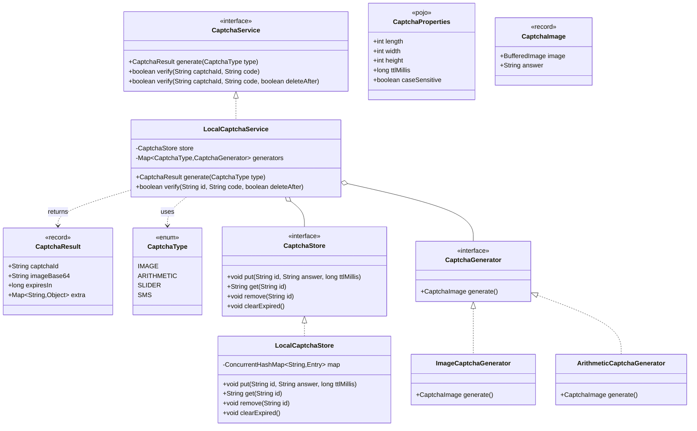

### 3.2 storage
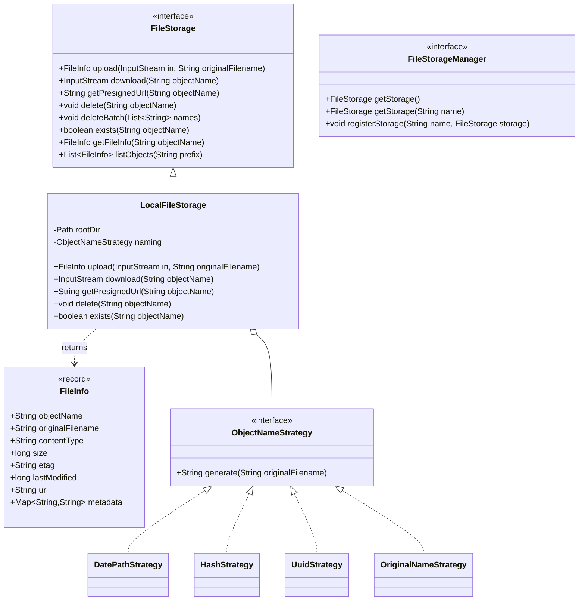

### 3.3 operatelog
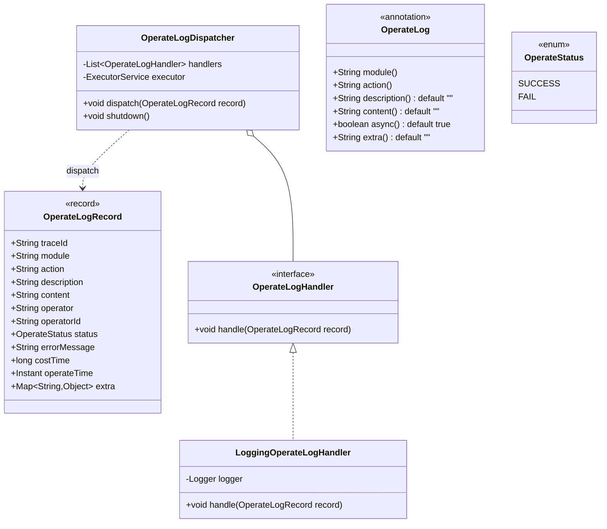

### 3.4 datapermission
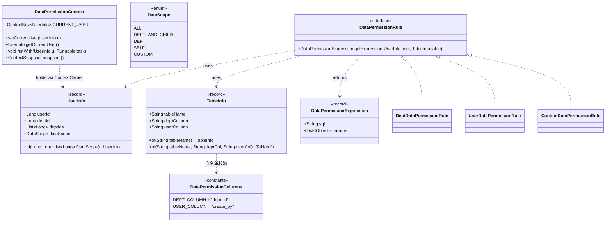

### 3.5 notification
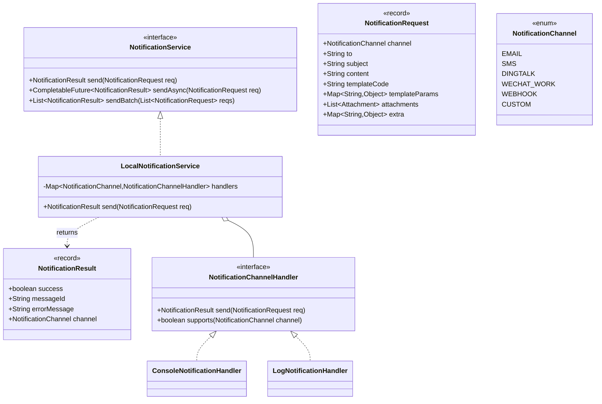

### 3.6 desensitize
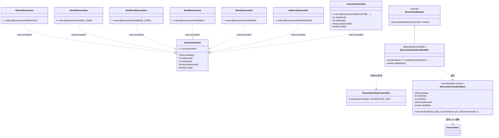

---

## 四、程序调用流程（时序图）

### 4.1 captcha — 生成
```mermaid
sequenceDiagram
    participant C as Client
    participant S as LocalCaptchaService
    participant G as CaptchaGenerator(IMAGE)
    participant Store as LocalCaptchaStore
    C->>S: generate(CaptchaType.IMAGE)
    S->>G: generate()
    G-->>S: CaptchaImage(image, answer)
    S->>S: ImageIO + Base64 -> data:image/png;base64,...
    S->>Store: put(captchaId, answer, ttl)
    S-->>C: CaptchaResult(captchaId, imageBase64, expiresIn)
```
> 注：`CaptchaType.SLIDER`/`SMS` 调用 `generate()` 时 `ImageCaptchaGenerator`/`ArithmeticCaptchaGenerator` 之外的默认分支抛 `UnsupportedOperationException("本轮未实现")`。

### 4.2 captcha — 校验
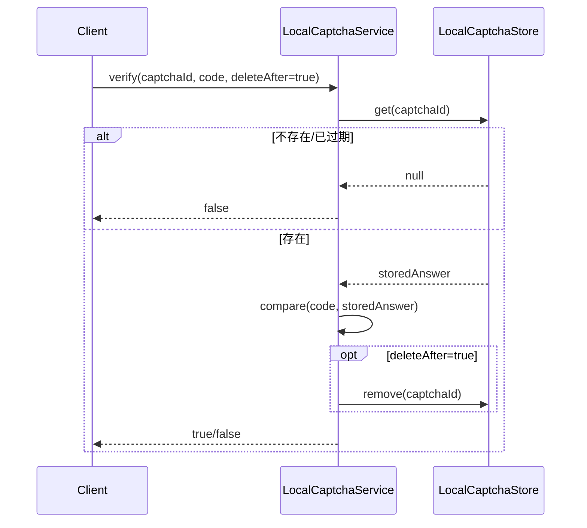

### 4.3 storage — 上传/下载
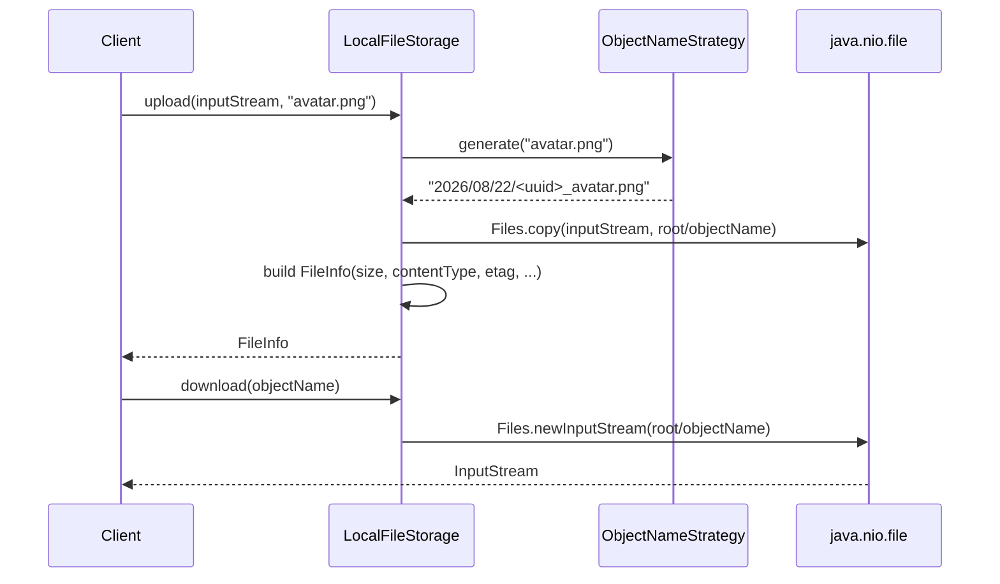

### 4.4 operatelog — 异步分发
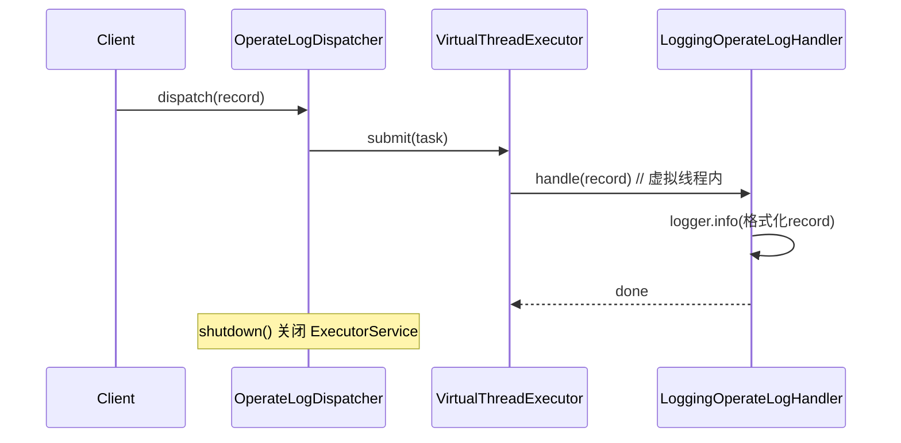

### 4.5 datapermission — 规则计算 + 上下文
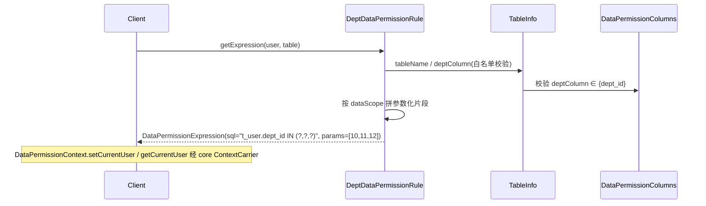

### 4.6 notification — 发送
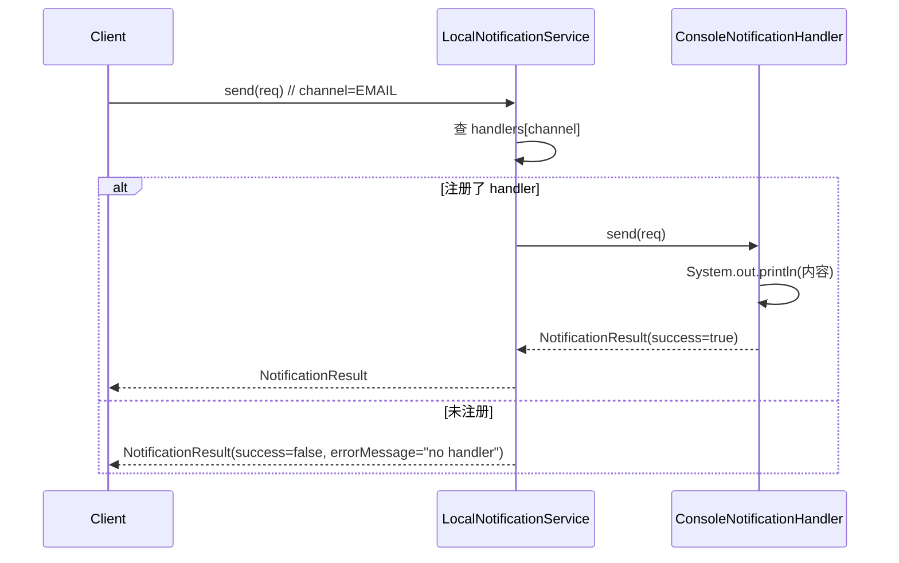

### 4.7 desensitize — 序列化脱敏
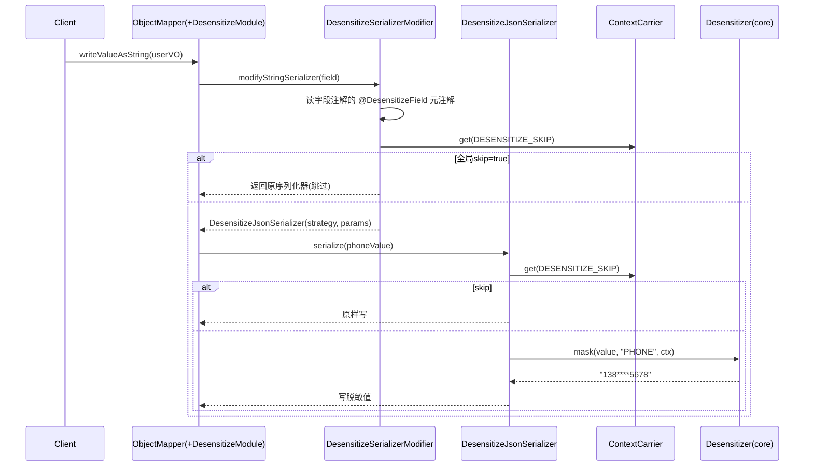

---

## 五、任务列表（有序、含依赖、按实现顺序）

> 建议顺序（依据主理人拍板）：**captcha → storage → notification → operatelog → datapermission → desensitize**。
> 6 项彼此**零代码耦合**，可独立编码与单测；仅共享"跨文件共享约定"（见第六节）。`desensitize` 对 `core.desensitize` 依赖最重（且需新增 optional 的 jackson-databind），放最后。
> 每个 Task 给出：目标 / 涉及文件 / 验收点 / 依赖 / 优先级。

### T1 — captcha 核心逻辑层
- **目标**：落地验证码接口、图形/算术生成器、内存存储、本地服务；枚举全量声明，SLIDER/SMS 抛 `UnsupportedOperationException`。
- **涉及文件**：`captcha/` 下全部（见 §2.1），含 `generator/`、`store/`、`CaptchaProperties`、`CaptchaException`。
- **验收点**：
  - [ ] `generate(IMAGE)` 返回非空 `captchaId` 与非空 `imageBase64`（前缀 `data:image/png;base64,`）。
  - [ ] `generate(ARITHMETIC)` 答案与算式自洽。
  - [ ] 正确码 `verify` 返回 `true`；错误码返回 `false`；`deleteAfter=true` 后再次 `verify` 返回 `false`。
  - [ ] 超 `expiresIn` 条目在 `clearExpired` 后失效（惰性判定亦可）。
  - [ ] `CaptchaType.SLIDER/SMS` 调用 `generate()` 抛 `UnsupportedOperationException("本轮未实现")`。
  - [ ] 单测直接 `new LocalCaptchaService(new LocalCaptchaStore())`，零 Spring。
- **依赖**：无（仅 `framework-core` 传递 jspecify）。**优先级 P0**。

### T2 — storage 核心逻辑层
- **目标**：本地磁盘文件存储（nio，日期分目录）+ 4 种命名策略 + Manager；`getPresignedUrl` 返回 `null` 并注明。
- **涉及文件**：`storage/` 下全部（见 §2.2），含 `strategy/`、`impl/LocalFileStorage`、`StorageProperties`、`StorageException`。
- **验收点**：
  - [ ] `upload` 后 `exists` 为 `true`，`getFileInfo` 返回正确 `size`/`contentType`。
  - [ ] `download` 流内容与上传字节一致。
  - [ ] `delete`/`deleteBatch` 生效。
  - [ ] `DatePathStrategy` 落盘路径含 `yyyy/MM/dd` 目录；其余策略命名符合定义。
  - [ ] `listObjects(prefix)` 可按前缀过滤返回集合。
  - [ ] `LocalFileStorage.getPresignedUrl` 返回 `null`（JavaDoc 注明本地方略不支持）。
  - [ ] 单测直接 `new LocalFileStorage(rootDir, new DatePathStrategy())`，零 Spring。
- **依赖**：无。**优先级 P0**。

### T3 — notification 核心逻辑层
- **目标**：通知模型 + Service 接口 + Channel SPI + 本地 Console/Log Handler + 聚合服务。
- **涉及文件**：`notification/` 下全部（见 §2.5），含 `channel/`、`LocalNotificationService`、`NotificationProperties`。
- **验收点**：
  - [ ] `send` 经对应本地 Handler 返回 `success=true`，stdout/日志可见内容。
  - [ ] 未知/未注册 channel 返回 `success=false` + `errorMessage`（不抛 NPE）。
  - [ ] `sendAsync` 返回 `CompletableFuture` 且最终完成。
  - [ ] `sendBatch` 每条独立返回结果，部分失败不影响其他。
  - [ ] 单测直接 `new LocalNotificationService(List.of(new ConsoleNotificationHandler()))`，零 Spring。
- **依赖**：无。**优先级 P0**。

### T4 — operatelog 核心逻辑层
- **目标**：操作日志模型 + Handler SPI + 默认日志 Handler + 虚拟线程异步分发器 + `@OperateLog` 注解（零依赖，不引 core Event）。
- **涉及文件**：`operatelog/` 下全部（见 §2.3），含 `handler/LoggingOperateLogHandler`、`OperateLogDispatcher`、`@OperateLog`、`OperateStatus`、`OperateLogProperties`。
- **验收点**：
  - [ ] `LoggingOperateLogHandler.handle(record)` 不抛异常且日志可见（用 `ListAppender` 断言）。
  - [ ] `OperateLogDispatcher.dispatch(record)` 经 `Executors.newVirtualThreadPerTaskExecutor()` 并发调用所有已注册 Handler；`shutdown()` 可关闭。
  - [ ] `OperateLogRecord` 必填 `module`/`action`/`operateTime` 非空（构建器/校验）。
  - [ ] `@OperateLog` `@Retention(RUNTIME)` 可被后续 AOP 读取。
  - [ ] 单测直接 `new OperateLogDispatcher(List.of(new LoggingOperateLogHandler()))`，零 Spring、零 core.event。
- **依赖**：无（**不依赖** `framework-core.event`）。**优先级 P0**。

### T5 — datapermission 核心逻辑层
- **目标**：规则引擎（UserInfo + DataScope → 参数化 SQL WHERE 片段）+ 3 个 Rule 实现 + 基于 `ContextCarrier` 的上下文；防 SQL 注入（列名常量白名单）。
- **涉及文件**：`datapermission/` 下全部（见 §2.4），含 `rule/`、`DataPermissionColumns`、`TableInfo`、`DataPermissionExpression`、`DataPermissionContext`、`DataPermissionProperties`、`DataPermissionException`。
- **验收点**：
  - [ ] `DEPT_AND_CHILD` 输出含 `deptId+deptIds` 全部值的 IN 条件；`DEPT` 仅本部门；`SELF` 仅 `userId`；`ALL` 返回空/恒真片段。
  - [ ] 参数列表与 `?` 占位符数量一致，可绑定 `PreparedStatement`。
  - [ ] `TableInfo` 的 `tableName`/`deptColumn`/`userColumn` 经白名单 + 标识符校验，**非法/任意列名构造即抛 `IllegalArgumentException`**（防注入）。
  - [ ] `DataPermissionContext.setCurrentUser/getCurrentUser/runWith` 经 `core.context.ContextCarrier` 正确读写与作用域还原。
  - [ ] 单测直接构造 `UserInfo`+`TableInfo` 调规则，零 Spring/MyBatis。
- **依赖**：`framework-core`（`compile`，已存在；用 `context.ContextCarrier`/`ContextKey`/`ContextSnapshot`）。**优先级 P0**。

### T6 — desensitize 核心逻辑层 + pom optional 依赖
- **目标**：便捷脱敏注解（元标注 core `@DesensitizeField`）+ Jackson 3 序列化适配（`DesensitizeModule`/`SerializerModifier`/`JsonSerializer`）+ 全局 skip 键；并向 `framework-extras/pom.xml` 追加 `jackson-databind`（optional，BOM 管理）。脱敏算法复用 `core.desensitize.Desensitizer`，不重定义规则。
- **涉及文件**：`desensitize/` 下全部（见 §2.6），含 `annotation/`、`serializer/`、`DesensitizeSkipContextKey`、`DesensitizeProperties`；**并修改** `framework-extras/pom.xml`（新增 optional 依赖，见第七节 R-pom-1）。
- **验收点**：
  - [ ] 标注 `@PhoneDesensitize` 字段序列化输出 `138****5678`（PHONE 前3后4）；`@IdCardDesensitize` 前3后4。
  - [ ] 便捷注解等价解析为 `@DesensitizeField(strategy=...)`，最终走 `Desensitizer.mask`。
  - [ ] `@DesensitizeField(skip=true)` 或 `ContextCarrier` 中 `DESENSITIZE_SKIP=true` 时原样输出（管理员免脱敏）。
  - [ ] 非 String 字段 / 无注解字段原样序列化。
  - [ ] 单测 `new JsonMapper().addModule(new DesensitizeModule())` 序列化 VO 断言脱敏结果。
  - [ ] pom 新增 `tools.jackson.core:jackson-databind`（`<optional>true</optional>`，不写 version）。
- **依赖**：`framework-core`（compile）；新增 `jackson-databind`（optional）。**优先级 P0**。

> 依赖关系总览（Mermaid）：
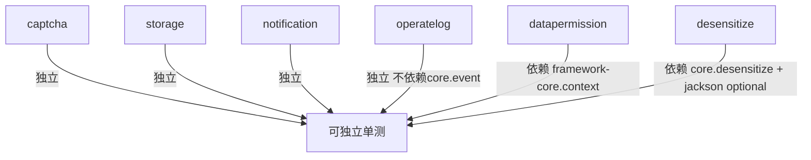

---

## 六、依赖包列表

本轮需加入 `framework-extras/pom.xml` 的依赖（其余沿用现有 `framework-core`/`framework-cache`/test 依赖）：

```xml
<!-- R-pom-1：数据脱敏 Jackson 3 序列化适配（仅 desensitize 需要） -->
<dependency>
    <groupId>tools.jackson.core</groupId>
    <artifactId>jackson-databind</artifactId>
    <optional>true</optional>   <!-- 版本由 framework-bom 管理，不写 version -->
</dependency>
```

**为何 optional**：
- 仅 `desensitize` 子包的 Jackson 3 适配需要；`captcha`/`storage`/`notification`/`operatelog`/`datapermission` 均不依赖 Jackson。
- `optional=true` 保证：framework-extras 编译/测试时 jackson 在 classpath（desensitize 子包可编译），但**不强制传导**给下游消费者；下游未引入 Jackson 时不会因 transitive 拉入，符合 README "不用的功能不引入额外依赖"。
- 后续 `framework-boot-autoconfigure` 的 `ExtrasAutoConfiguration` 用 `@ConditionalOnClass(JsonMapper)` 控制 desensitize 是否装配——缺失时不装配、不报错（本轮不实现该层，仅预留契约）。

> 注：现有 `framework-cache`（compile）本轮 6 项**不使用**（PRD 明确本轮 6 项不依赖 cache）；保留它是为既有 `lock`/`ratelimit`/`idempotent` 服务，本设计新增代码不引入对它的引用。

---

## 七、跨文件共享约定（Shared Knowledge）

1. **包名**：统一 `cn.jowen.framework.extras.<feature>`（与既有 `lock`/`ratelimit`/`idempotent` 完全一致）。
2. **空安全注解**：类/接口/枚举头部统一标注 `@NullMarked`（来自 `org.jspecify.annotations.NullMarked`）；可空返回值/参数用 `@Nullable`。与 core 风格一致。
3. **注解风格**：所有自定义注解（`@OperateLog`、`@PhoneDesensitize` 等）必须 `@Documented` + `@Retention(RetentionPolicy.RUNTIME)`；字段级注解加 `@Target(ElementType.FIELD)`。便于后续 AOP/`getAnnotation` 读取。
4. **异常继承**：业务可预期错误继承 `cn.jowen.framework.core.exception.BusinessException`（如 `CaptchaException`、`DataPermissionException`）；系统级/不可预期错误继承 `cn.jowen.framework.core.exception.FrameworkException`。**禁止**直接抛裸 `RuntimeException` 表达业务语义。
5. **异常命名**：每功能至多一个异常类（优先复用 `BusinessException` 带 `ErrorCode`），避免异常类膨胀；确需细分时类名以 `XxxException` 结尾并置于对应功能包。
6. **虚拟线程 Executor 用法**：异步一律 `Executors.newVirtualThreadPerTaskExecutor()`（Java 21），持有为 `ExecutorService` 字段，提供 `shutdown()` 钩子；**禁止**自建固定大小线程池（operatelog 唯一异步点，见决策 #5）。
7. **ContextCarrier 使用规范**：`datapermission` 与 `desensitize` 经 `framework-core.context` 读写上下文；键统一用 `ContextKey.named(name, type)`，命名全局唯一。本论新增键：
   - `cn.jowen.framework.extras.desensitize.DesensitizeSkipContextKey#DESENSITIZE_SKIP`：`ContextKey<Boolean>`，值 `true` 时全局跳过脱敏（管理员免脱敏，决策 #4）。
   - `DataPermissionContext#CURRENT_USER`：`ContextKey<UserInfo>`（内部常量，命名 `dataPermission.currentUser`）。
8. **SQL 片段安全（datapermission 强制）**：
   - 列名只来自常量 `DataPermissionColumns.DEPT_COLUMN`/`USER_COLUMN`，**禁止**把外部任意字符串拼入 SQL。
   - `TableInfo` 构造时对 `tableName` 做标识符校验（正则 `^[A-Za-z_][A-Za-z0-9_]*$` 或带 schema 点号），对列名做白名单校验（必须等于已知常量），不满足即抛 `IllegalArgumentException`。
   - 生成的 WHERE 片段一律**参数化占位符**（`?`），值经 `DataPermissionExpression.params` 返回，绝不做字符串内插。
9. **轻量 Properties（P1）**：各功能 `XxxProperties` 为普通 POJO/record（提供默认值工厂），**不标** `@ConfigurationProperties`、`@Component`；仅作数据载体，等待后续 `framework-boot-autoconfigure` 绑定。
10. **便捷注解元标注方案（desensitize）**：`@PhoneDesensitize` 等**本身**以 `@DesensitizeField(strategy="PHONE")` 作元注解；`DesensitizeSerializerModifier` 遍历字段注解、读取其元注解 `@DesensitizeField` 取出 `strategy/startKeep/endKeep/replacement/skip`，再调用 `core.Desensitizer.mask(value, strategy, ctx)`。**新增便捷注解无需改动修饰器**（只要带 `@DesensitizeField` 元注解即自动生效）。
11. **可独立单测**：所有核心类必须支持 `new` 出来直接跑（构造函数注入依赖，不依赖 Spring 容器）；测试用 JUnit 5 + AssertJ（已配置）。
12. **注释与文档**：每个 public 类/接口/枚举/注解附 JavaDoc（含 `@author Jowen`、与 core 一致的版权头）；包级 `package-info.java` 可沿用既有风格（非强制本轮新建）。

---

## 八、待明确事项

**none**（PRD 第六节 7 项待确认已由主理人全部拍板，见第一节决策表；本轮边界清晰，无遗留待确认问题）。

### 工程师注意点（非待确认，落地提示）
- **Jackson 3 API 细节**：`DesensitizeModule`/`DesensitizeSerializerModifier`/`DesensitizeJsonSerializer` 基于 `tools.jackson.databind`（Jackson 3）。`BeanSerializerModifier` 在 Jackson 3 中使用 `BeanPropertyDefinition` 与 `modifyStringSerializer(SerializationConfig, BeanPropertyDefinition, JsonSerializer<?>)`；`Module` 需实现 `getModuleName()`/`version()`/`setupModule(SetupContext)`，并在 `setupModule` 中 `context.addBeanSerializerModifier(this)`。实现前请先 `mvn dependency:resolve` 确认 jackson 3 确切包名（避免与 Jackson 2 `com.fasterxml.jackson` 混淆）。
- **虚拟线程 + ScopedValue 上下文传播**：`ContextCarrier` 默认 `SCOPED_VALUE` 模式，子虚拟线程**不自动继承**父作用域；operatelog 分发不依赖上下文（无影响），但 datapermission/desensitize 若需在异步链路共享用户/跳过标记，须用 `ContextSnapshot.capture()` + `replay()` 显式传递（本轮单测均在同线程，无需处理）。
- **`CaptchaResult.extra`**：保留为 `Map<String,Object>` 供 SLIDER/SMS 后续扩展（本轮仅占位，不写入）。
- **`DataPermissionExpression` 为设计新增**：PRD 类清单未列返回值类型；因 `getExpression` 需同时返回 SQL 片段与参数列表（满足"参数化占位符"验收），本设计新增 `DataPermissionExpression(String sql, List<Object> params)` record，请工程师按此实现。
- **`getPresignedUrl` 返回 null 的调用方处理**：下游若调用需判空，文档已注明"本地方略不支持预签名，下载用 download()"。
