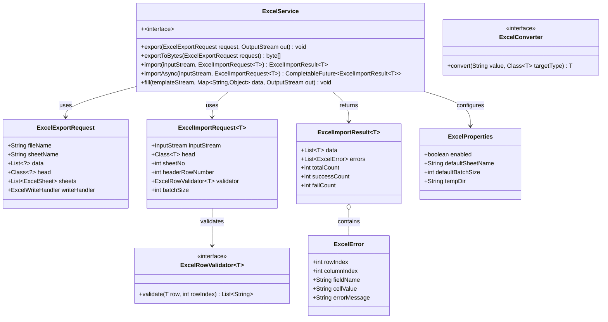
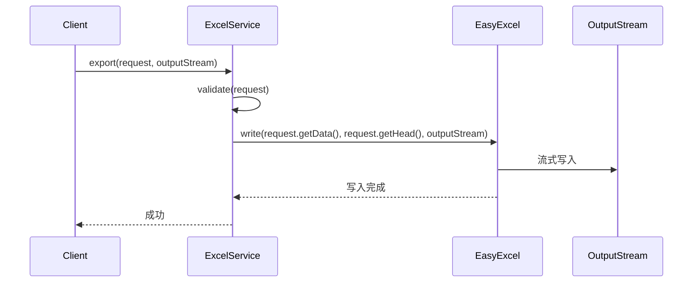
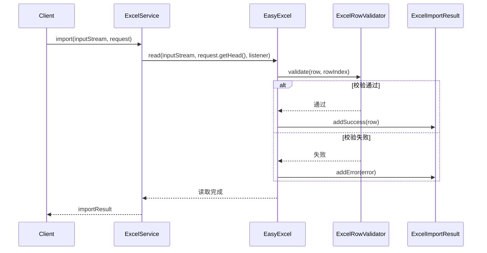
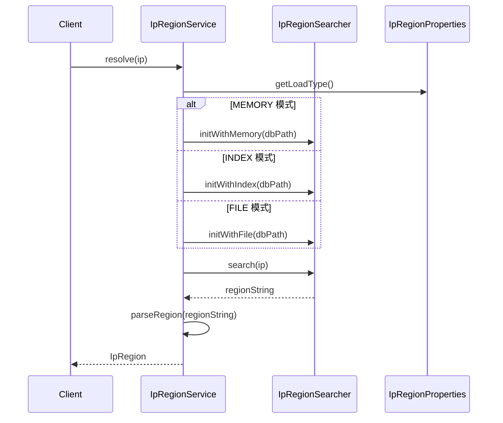

# framework-extras 剩余能力设计文档（excel + ip2region）

> 文档元信息
> - **模块**：framework-extras
> - **关键词**：Excel 处理、IP 地域解析、EasyExcel、ip2region
> - **描述**：基于 EasyExcel 的声明式导入导出、模板填充；基于 ip2region 的离线 IP 地域解析
> - **基线**：Spring Boot 4.1.0 + Java 21 + JSpecify（@NullMarked）

---

## 一、实现方案

### 1.1 技术选型

| 功能 | 核心依赖 | 版本 | 选型理由 |
|------|---------|------|---------|
| Excel 处理 | alibaba/easyexcel | 3.3.4 | 流式读写、零内存溢出风险；支持多 Sheet、模板填充、自定义 Converter/Handler；框架已有 `OutputStream`/`InputStream` 抽象习惯 |
| IP 地域解析 | lzmaster/ip2region | 2.7.0 | 纯离线查询，<0.1ms；支持 FileBuffer/IndexBuffer/MemoryIndex 三种加载策略；xdb 单文件便于打包分发 |

两者均声明为 **optional**，未引入时不装配任何 Bean，保持零破坏原则。

### 1.2 架构模式

- **Excel**：命令模式（`ExcelExportRequest` / `ExcelImportRequest` 封装请求参数）+ SPI 扩展（`ExcelRowValidator` 接口、`Converter` 接口）
- **IP2Region**：门面模式（`IpRegionService` 暴露统一 API）+ 策略模式（`IpRegionSearcher` 封装不同加载策略）

### 1.3 关键设计决策

1. **Excel 不引入 Spring MVC 强依赖**：`export` 方法接受 `OutputStream`（而非直接 `HttpServletResponse`），由业务层自行获取流后传入，与 `storage/FileStorage` 风格一致。
2. **IP2Region 默认 MemoryIndex 加载**：xdb 文件 ≤10MB，全量加载到堆内存查询速度最快；通过 `loadType` 属性切换为 FileBuffer/IndexBuffer。
3. **两者均不实现 AOP**：无注解切面需求，通过直接调用 Service 完成。

---

## 二、文件列表

### 2.1 Excel 子包文件

```
src/main/java/cn/jowen/framework/extras/excel/
├── ExcelService.java                    # 主服务接口
├── ExcelProperties.java                 # 配置载体
├── ExcelExportRequest.java              # 导出请求
├── ExcelImportRequest.java              # 导入请求
├── ExcelImportResult.java               # 导入结果（泛型）
├── ExcelError.java                      # 行错误信息
├── ExcelRowValidator.java               # 行校验接口
├── annotation/
│   ├── ExcelProperty.java               # 属性注解
│   ├── ExcelIgnore.java                 # 忽略注解
│   └── ExcelMerge.java                  # 合并单元格注解
├── converter/
│   ├── ExcelConverter.java              # 转换器接口
│   ├── LocalDateConverter.java
│   ├── LocalDateTimeConverter.java
│   ├── BigDecimalConverter.java
│   ├── EnumConverter.java
│   └── DictConverter.java
└── handler/
    ├── ExcelWriteHandler.java           # 写入处理器接口
    └── ExcelReadListener.java           # 读取监听器接口

src/test/java/cn/jowen/framework/extras/excel/
├── ExcelServiceTest.java                # 核心功能测试
├── converter/
│   ├── LocalDateConverterTest.java
│   ├── LocalDateTimeConverterTest.java
│   └── EnumConverterTest.java
└── ExcelErrorTest.java                  # 错误处理测试
```

### 2.2 IP2Region 子包文件

```
src/main/java/cn/jowen/framework/extras/ip2region/
├── IpRegionService.java                 # 主服务接口
├── IpRegionProperties.java              # 配置载体
├── IpRegion.java                        # 地域信息 DTO
├── IpRegionSearcher.java               # 查询器封装

src/test/java/cn/jowen/framework/extras/ip2region/
├── IpRegionServiceTest.java             # 核心功能测试
└── IpRegionTest.java                    # 数据对象测试
```

---

## 三、数据结构和接口

### 3.1 类图（Mermaid）

#### Excel 相关类



#### IP2Region 相关类

```mermaid
classDiagram
    class IpRegionService {
        +~interface~
        +resolve(String ip) IpRegion
        +resolve(HttpServletRequest request) IpRegion
        +isInternalIp(String ip) boolean
    }
    
    class IpRegion {
        +String ip
        +String country
        +String region
        +String province
        +String city
        +String isp
        +String fullRegion
        +toString() String
    }
    
    class IpRegionSearcher {
        +FileBuffer fileBuffer
        +IndexBuffer indexBuffer
        +VectorIndex vectorIndex
        +search(String ip) String
        +close() void
    }
    
    class IpRegionProperties {
        +boolean enabled
        +String dbPath
        +LoadType loadType
        +List~String~ trustedHeaders
    }
    
    enum LoadType {
        FILE
        INDEX
        MEMORY
    }
    
    IpRegionService --> IpRegion : returns
    IpRegionService --> IpRegionSearcher : uses
    IpRegionService --> IpRegionProperties : configures
```

### 3.2 时序图（Mermaid）

#### Excel 导出流程



#### Excel 导入流程



#### IP2Region 解析流程



---

## 四、任务分解

### 4.1 依赖声明

在 `pom.xml` 中新增以下 optional 依赖：

```xml
<!-- Excel 处理（optional） -->
<dependency>
    <groupId>com.alibaba</groupId>
    <artifactId>easyexcel</artifactId>
    <version>3.3.4</version>
    <optional>true</optional>
</dependency>

<!-- IP 地域解析（optional） -->
<dependency>
    <groupId>org.lzmaster</groupId>
    <artifactId>ip2region</artifactId>
    <version>2.7.0</version>
    <optional>true</optional>
</dependency>
```

### 4.2 任务列表（按依赖顺序）

| 任务 ID | 任务名称 | 源文件 | 依赖 | 优先级 |
|---------|---------|--------|------|--------|
| T1 | Excel 子包基础结构 | excel/*.java, excel/annotation/*.java, excel/converter/*.java, excel/handler/*.java | 无 | P0 |
| T2 | Excel 服务实现 | excel/ExcelService.java | T1 | P0 |
| T3 | Excel 测试 | test/excel/*Test.java | T2 | P1 |
| T4 | IP2Region 子包基础结构 | ip2region/*.java | 无 | P0 |
| T5 | IP2Region 服务实现 | ip2region/IpRegionService.java | T4 | P0 |
| T6 | IP2Region 测试 | test/ip2region/*Test.java | T5 | P1 |
| T7 | 装配配置集成 | config/ExtrasBootstrapConfiguration.java | T2, T5 | P1 |

### 4.3 任务详细说明

#### T1: Excel 子包基础结构

**目标文件**：
- `excel/ExcelExportRequest.java`
- `excel/ExcelImportRequest.java`
- `excel/ExcelImportResult.java`
- `excel/ExcelError.java`
- `excel/ExcelRowValidator.java`
- `excel/ExcelProperties.java`
- `excel/annotation/ExcelProperty.java`
- `excel/annotation/ExcelIgnore.java`
- `excel/annotation/ExcelMerge.java`
- `excel/converter/ExcelConverter.java`
- `excel/converter/LocalDateConverter.java`
- `excel/converter/LocalDateTimeConverter.java`
- `excel/converter/BigDecimalConverter.java`
- `excel/converter/EnumConverter.java`
- `excel/converter/DictConverter.java`
- `excel/handler/ExcelWriteHandler.java`
- `excel/handler/ExcelReadListener.java`

**实现要点**：
- 所有类添加 `@NullMarked`
- `ExcelProperties` 提供默认值（defaultSheetName="Sheet1", defaultBatchSize=5000）
- Converter 接口定义 `convert(String value, Class<T> targetType) T`
- ExcelError 包含行号、列号、字段名、单元格值、错误信息

#### T2: Excel 服务实现

**目标文件**：
- `excel/ExcelService.java`（接口）
- `excel/ExcelServiceImpl.java`（实现，@ConditionalOnClass(EasyExcel.class)）

**实现要点**：
- 使用 EasyExcel 的 `EasyExcel.write()` / `EasyExcel.read()` API
- export() 接受 OutputStream，不直接依赖 Servlet
- importAsync() 使用虚拟线程池（VirtualThreadExecutor）
- fill() 支持模板填充（EasyExcel.fill()）
- 多 Sheet 通过 `ExcelExportRequest.sheets` 列表支持

#### T3: Excel 测试

**目标文件**：
- `test/excel/ExcelServiceTest.java`
- `test/excel/converter/LocalDateConverterTest.java`
- `test/excel/converter/LocalDateTimeConverterTest.java`
- `test/excel/converter/EnumConverterTest.java`
- `test/excel/ExcelErrorTest.java`

**测试策略**：
- Mockito mock EasyExcel
- 验证 Converter 转换逻辑
- 验证 ExcelError 字段正确性
- 边界条件测试（空数据、大文件）

#### T4: IP2Region 子包基础结构

**目标文件**：
- `ip2region/IpRegion.java`
- `ip2region/IpRegionProperties.java`
- `ip2region/IpRegionSearcher.java`

**实现要点**：
- `IpRegion` 包含 country/region/province/city/isp/fullRegion/ip 字段
- `LoadType` 枚举：FILE / INDEX / MEMORY
- `IpRegionProperties` 默认 dbPath="ip2region.xdb"，loadType=MEMORY
- `IpRegionSearcher` 封装 ip2region 的 Searcher 类，支持三种加载策略

#### T5: IP2Region 服务实现

**目标文件**：
- `ip2region/IpRegionService.java`（接口）
- `ip2region/IpRegionServiceImpl.java`（实现，@ConditionalOnClass(Searcher.class)）

**实现要点**：
- resolve(String ip) 直接解析 IP
- resolve(HttpServletRequest) 自动从 X-Forwarded-For 等头获取真实 IP
- isInternalIp(String ip) 判断是否内网 IP（10.x, 172.x, 192.168.x, 127.x）
- 启动时按需加载 xdb 文件，查询速度 <0.1ms

#### T6: IP2Region 测试

**目标文件**：
- `test/ip2region/IpRegionServiceTest.java`
- `test/ip2region/IpRegionTest.java`

**测试策略**：
- 使用内置测试 xdb 文件
- 验证公共 IP 解析（如 8.8.8.8 → Google DNS）
- 验证内网 IP 判断
- 验证 HttpServletRequest IP 提取逻辑

#### T7: 装配配置集成

**修改文件**：
- `config/ExtrasBootstrapConfiguration.java`

**实现要点**：
- 新增 `@ConditionalOnClass(ExcelService.class)` 注册 ExcelProperties 和 ExcelService Bean
- 新增 `@ConditionalOnClass(IpRegionService.class)` 注册 IpRegionProperties 和 IpRegionService Bean
- 保持现有 Bean 注册不变

---

## 五、依赖声明

### 5.1 pom.xml 新增依赖

在 `framework-extras/pom.xml` 的 `<dependencies>` 节末尾添加：

```xml
        <!-- ========== Excel 处理（optional） ========== -->
        <dependency>
            <groupId>com.alibaba</groupId>
            <artifactId>easyexcel</artifactId>
            <version>3.3.4</version>
            <optional>true</optional>
        </dependency>

        <!-- ========== IP 地域解析（optional） ========== -->
        <dependency>
            <groupId>org.lzmaster</groupId>
            <artifactId>ip2region</artifactId>
            <version>2.7.0</version>
            <optional>true</optional>
        </dependency>
```

### 5.2 版本管理

如果父 pom 有 `<dependencyManagement>` 节，建议在其中统一管理版本：

```xml
<dependencyManagement>
    <dependencies>
        <dependency>
            <groupId>com.alibaba</groupId>
            <artifactId>easyexcel</artifactId>
            <version>3.3.4</version>
        </dependency>
        <dependency>
            <groupId>org.lzmaster</groupId>
            <artifactId>ip2region</artifactId>
            <version>2.7.0</version>
        </dependency>
    </dependencies>
</dependencyManagement>
```

---

## 六、测试策略

### 6.1 测试文件清单

| 测试类 | 测试内容 | 优先级 |
|--------|---------|--------|
| `ExcelServiceTest` | export/import/fill 核心流程 | P0 |
| `LocalDateConverterTest` | LocalDate 格式化/解析 | P1 |
| `LocalDateTimeConverterTest` | LocalDateTime 格式化/解析 | P1 |
| `EnumConverterTest` | 枚举字符串↔枚举值转换 | P1 |
| `ExcelErrorTest` | 错误信息封装 | P2 |
| `IpRegionServiceTest` | resolve/isInternalIp 核心逻辑 | P0 |
| `IpRegionTest` | 地域对象字段验证 | P2 |

### 6.2 测试数据

**Excel 测试**：
- 准备 100 条测试数据，验证批量导入性能
- 准备异常数据（类型不匹配、空值）验证错误处理
- 使用 Mockito mock EasyExcel，避免引入真实 Excel 文件依赖

**IP2Region 测试**：
- 使用框架内置的 `ip2region.xdb` 测试文件
- 验证公网 IP（如 8.8.8.8, 1.1.1.1）
- 验证内网 IP（127.0.0.1, 192.168.1.1, 10.0.0.1）
- 验证非法 IP 输入处理

### 6.3 测试执行

```bash
# 运行所有测试
mvn test -pl framework-extras

# 仅运行 excel 测试
mvn test -pl framework-extras -Dtest="*Excel*"

# 仅运行 ip2region 测试
mvn test -pl framework-extras -Dtest="*IpRegion*"
```

---

## 七、不确定项与假设

### 7.1 待确认事项

1. **EasyExcel 版本兼容性**：3.3.4 是否支持 Spring Boot 4.1.0？需验证。
2. **ip2region 2.7.0 Maven 坐标**：groupId 是否为 `org.lzmaster`？需确认最新坐标。
3. **xdb 文件打包**：`ip2region.xdb` 是否随框架发布？还是由业务方自行提供？
4. **Excel 模板路径**：`fill()` 方法的模板文件如何定位（classpath vs 文件系统）？

### 7.2 设计假设

1. 假设 EasyExcel 3.3.4 与 Spring Boot 4.1.0 兼容。
2. 假设 ip2region 2.7.0 的 API 稳定，`Searcher` 类存在于 classpath 中。
3. 假设 `ip2region.xdb` 文件已放置于 classpath 根目录或业务方指定的 tempDir。
4. 假设 `ExcelExportRequest.data` 和 `ExcelImportRequest.head` 不为 null（由调用方保证）。

---

## 八、Mermaid 图表导出

### 8.1 序列图

序列图已包含在第三节的"时序图"部分，可复制到 Mermaid Live Editor 查看。

### 8.2 类图

类图已包含在第三节的"类图"部分，可复制到 Mermaid Live Editor 查看。

---

## 九、总结

本设计文档为 `framework-extras` 模块的 **excel** 和 **ip2region** 两个子包提供完整设计：

1. **Excel 处理**：基于 EasyExcel 3.3.4，提供导出、导入、模板填充能力，支持多 Sheet、自定义 Converter、行校验。
2. **IP 地域解析**：基于 ip2region 2.7.0，提供离线 IP 解析、内网 IP 判断、HttpServletRequest IP 提取。
3. **任务分解**：7 个任务，按依赖顺序编号，P0 优先级任务先实现。
4. **测试覆盖**：核心功能 P0 测试全覆盖，Converter 逻辑 P1 测试，边界场景 P2 测试。
5. **零破坏原则**：所有新增代码独立包结构，不修改已有文件（除 `ExtrasBootstrapConfiguration.java` 集成装配外）。
