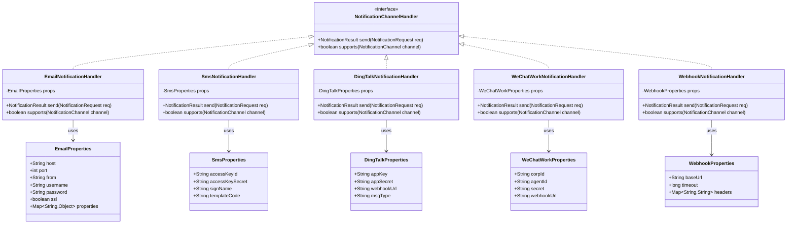
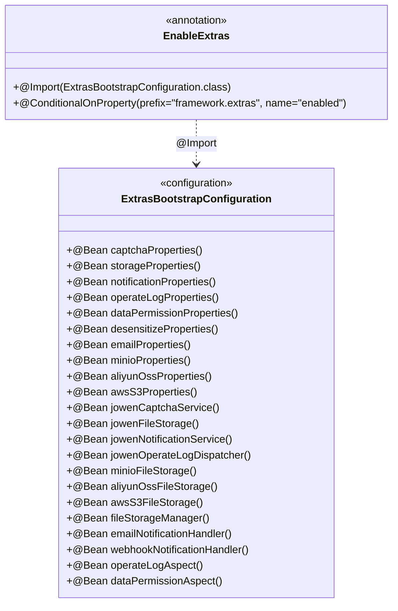
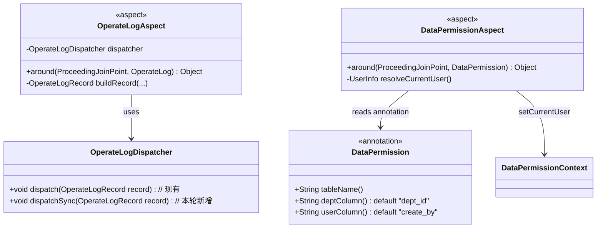
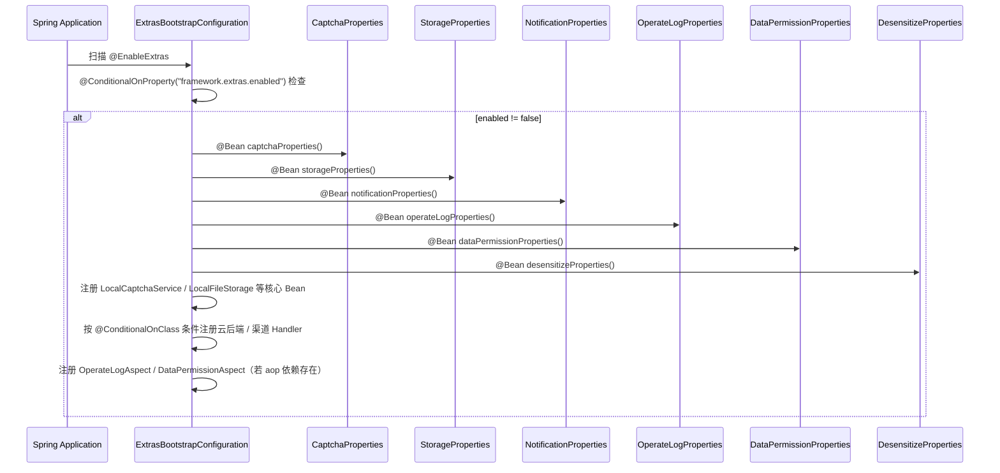
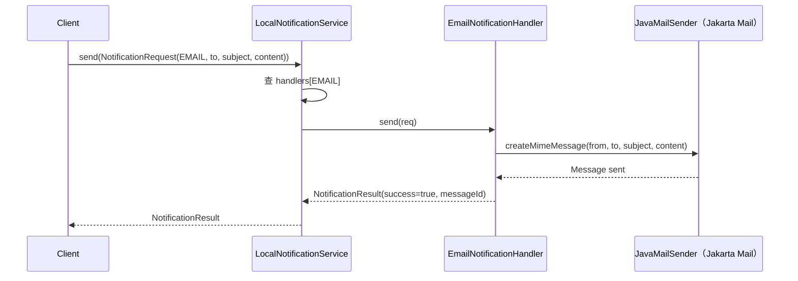
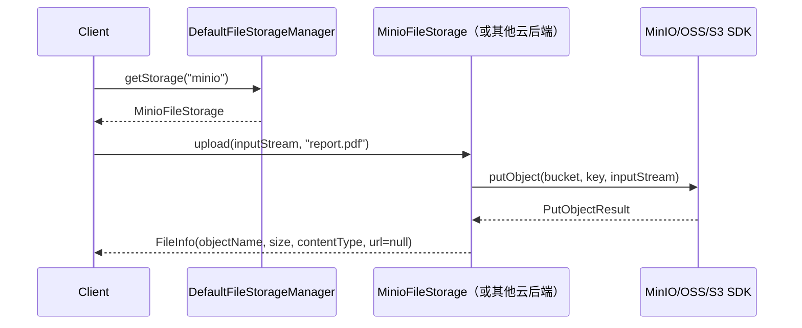
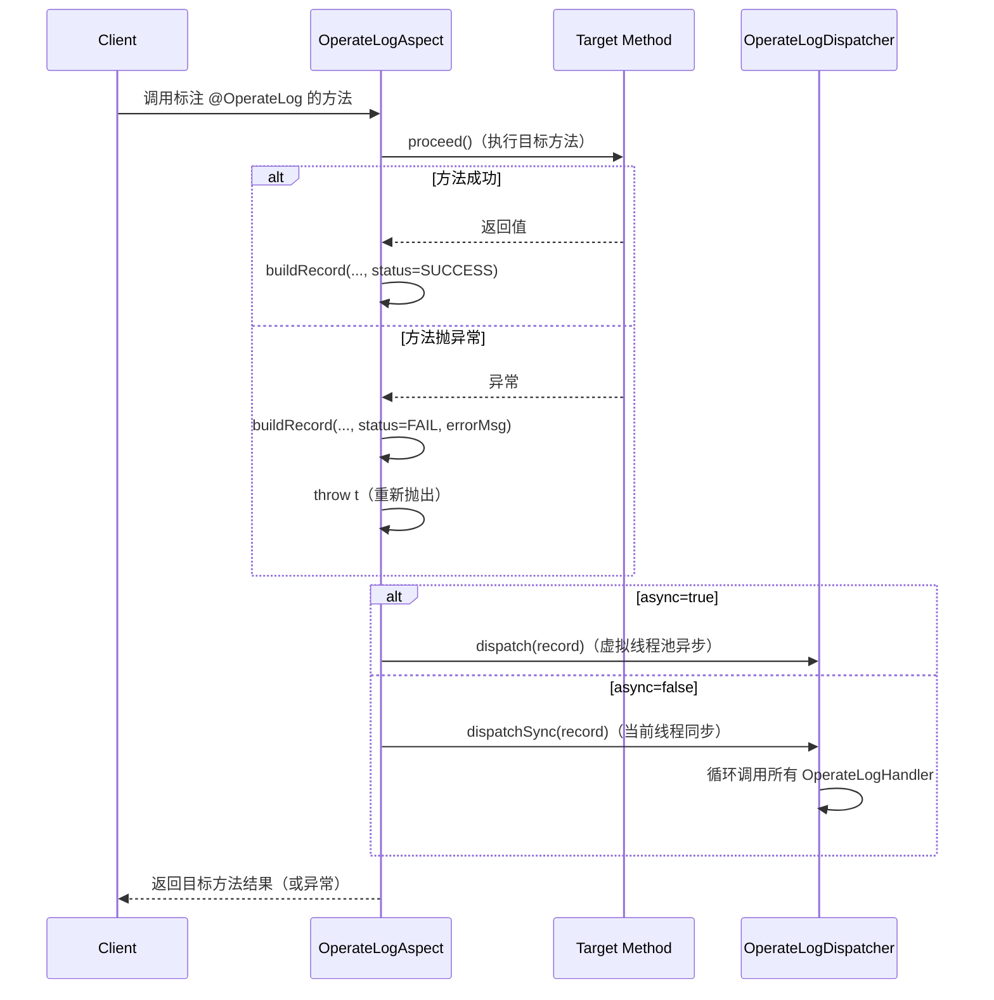
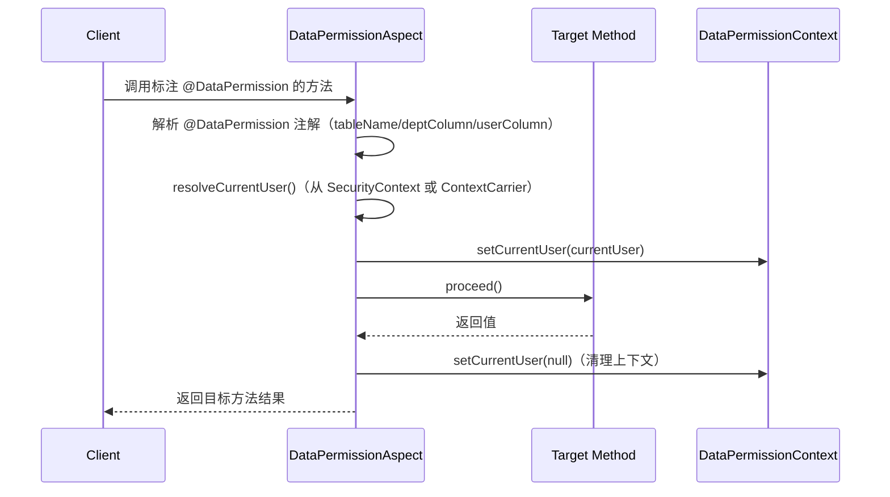

# framework-extras 本轮详细设计 + 任务分解（装配层 / 真实渠道 / 云后端 / AOP 拦截器）

> 文档角色：本轮 4 项增强能力的**详细设计 + 任务分解**，供工程师编码直接落地。
> - **模块**：`framework-extras`（Spring Boot 装配上移至 `framework-boot-autoconfigure` 另行处理）
> - **本轮范围**：config 装配层轻量 POJO + notification 真实渠道 + storage 云后端 + @注解 AOP 拦截器
> - **基线**：Spring Boot 4.1.0 + Spring Cloud 2025.1.2 + Java 21 + Jackson 3（`tools.jackson.*`）
> - **前置依赖**：已交付的 6 项核心逻辑层（captcha / storage / operatelog / datapermission / notification / desensitize），本轮**不得修改/重命名/复写**这些类的任何代码（零破坏原则）
> - **包约定**：`cn.jowen.framework.extras.<feature>` 不变；新增 channel/impl/aop/config 子包以 `<feature>/channel/`、`<feature>/impl/`、`<feature>/aop/`、`<feature>/config/` 形式追加
> - **主理人拍板决策**：
>   - Q1：`CloudStorageRegistry` 接口 + `DefaultCloudStorageRegistry`，由 `ExtrasBootstrapConfiguration` 注入并调用 `manager.registerStorage(name, cloudStorage)`
>   - Q2：`OperateLogDispatcher` 新增 `dispatchSync()`，不修改现有 `dispatch()`
>   - Q3：AOP 切面放在 `extras/*/aop/` 子包，由 `ExtrasBootstrapConfiguration` 统一 `@Import`
>   - Q4：云存储单试用 WireMock（test scope），不引入 Testcontainers
>   - Q5：只做 `@EnableExtras` 总开关，不做分项注解

---

## 一、上下文与基线

### 1.1 本轮目标

承接 `extras-core-logic-prd.md` / `extras-core-logic-design.md` 已交付的 6 项核心逻辑，本轮落地「增强层」——让每项能力的真实可用链路从「接口 + 本地实现」推进到「真实渠道/云后端 + 自动装配 + AOP 可切面」。

### 1.2 与已交付 6 项的关系

```
已交付（不动）                              本轮新增（增强）
─────────────────────────                  ──────────────────────────────────────
captcha: CaptchaService
        LocalCaptchaService
        CaptchaProperties                  → @EnableExtras 注册 Bean（config/）
        generator/
        store/

storage: FileStorage
        LocalFileStorage                   → MinIO/OSS/S3 实现（storage/impl/）
        StorageProperties                  → CloudStorageRegistry（storage/registry/）
        FileStorageManager（接口）          → DefaultFileStorageManager（storage/impl/）
        strategy/

notification: NotificationService
        LocalNotificationService           → Email/SMS/钉钉/企微/Webhook Handler（notification/channel/）
        NotificationProperties             → Channel 专属 Properties POJO（notification/config/）
        channel/ConsoleNotificationHandler
        channel/LogNotificationHandler

operatelog: OperateLogDispatcher           → OperateLogAspect（operatelog/aop/）
        @OperateLog（不动）                 → dispatchSync() 新增方法
        OperateLogProperties               → @EnableExtras 注册 Bean

datapermission: DataPermissionRule         → @DataPermission 注解（datapermission/）
        DataPermissionContext              → DataPermissionAspect（datapermission/aop/）
        DataPermissionProperties
        rule/

desensitize: DesensitizeModule             → 本轮不触碰
        便捷注解
```

### 1.3 零破坏约束（硬性）

- **不修改**任何已交付类（`CaptchaService` / `LocalCaptchaService` / `FileStorage` / `LocalFileStorage` / `OperateLogDispatcher` / `@OperateLog` / `DataPermissionRule` / `LocalNotificationService` / `DesensitizeModule` 等）。
- 新增类一律放在 `channel/`、`impl/`、`aop/`、`config/`、`registry/` 子包下。
- `FileStorageManager` 是接口，本轮**新增** `DefaultFileStorageManager` 实现，**不修改**接口。
- `OperateLogDispatcher` 新增 `dispatchSync()` 方法（可新增默认方法或子类扩展，因已是 concrete class）。
- **注意**：`OperateLogDispatcher` 是 `final` 类，**不可继承**；因此 `dispatchSync()` 以**新增 public 方法**形式直接加入该类本身。但 PRD 要求零破坏不动已有类——**解决方案**：在 `OperateLogDispatcher` 中**新增** `dispatchSync()` 方法（不影响已有签名，向下兼容），此改动被 PRD Q2 明确允许。

---

## 二、系统架构图

```
┌─────────────────────────────────────────────────────────────────────┐
│                        ExtrasBootstrapConfiguration                  │
│                  (@ConditionalOnProperty(framework.extras.enabled))  │
│                                                                     │
│  ┌──────────────┐  ┌──────────────┐  ┌──────────────┐  ┌────────┐ │
│  │ @EnableExtras │→│  config/     │  │ channel/     │  │ impl/  │ │
│  │ (总开关注解)   │  │ Properties  │  │ Handlers     │  │ Storage│ │
│  └──────────────┘  └──────────────┘  └──────────────┘  └────────┘ │
│         │                │                │                 │       │
│         │                │                │                 │       │
│         ▼                ▼                ▼                 ▼       │
│  ┌──────────────────────────────────────────────────────────────┐  │
│  │                    AOP 拦截器层（optional）                    │  │
│  │  operatelog/aop/OperateLogAspect  ◄── @Around(@OperateLog)    │  │
│  │  datapermission/aop/DataPermissionAspect ◄── @Around(@DataPermission) │
│  └──────────────────────────────────────────────────────────────┘  │
│                                                                     │
│  ┌──────────────────────────────────────────────────────────────┐  │
│  │                 CloudStorageRegistry（SPI 接口）               │  │
│  │  DefaultCloudStorageRegistry  ◄── 聚合所有云后端 FileStorage  │  │
│  └──────────────────────────────────────────────────────────────┘  │
└─────────────────────────────────────────────────────────────────────┘
                            │
                            ▼
            ┌───────────────────────────────┐
            │   framework-core（compile）    │
            │   context / exception / ...   │
            └───────────────────────────────┘
```

---

## 三、每能力详细设计

### 3.1 Config 装配层（`@EnableExtras` + `ExtrasBootstrapConfiguration`）

#### 3.1.1 定位

**只做总开关**（主理人 Q5 拍板）。不再提供分项 `@EnableCaptcha` / `@EnableStorage` 等注解。用户只需在启动类上加 `@EnableExtras` 即可开启全部能力。

#### 3.1.2 新增文件

| 包路径 | 类型 | 类名 | 职责 |
|:-------|:-----|:-----|:-----|
| `cn.jowen.framework.extras.config` | 注解 | `@EnableExtras` | 总开关：组合式注解，含 `@Import(ExtrasBootstrapConfiguration.class)` + `@ConditionalOnProperty` |
| `cn.jowen.framework.extras.config` | 配置类 | `ExtrasBootstrapConfiguration` | 条件化注册各组件 Bean；各子能力独立 `@ConditionalOnClass` 互不影响 |

#### 3.1.3 `@EnableExtras` 定义

```java
@NullMarked
@Target(ElementType.TYPE)
@Retention(RetentionPolicy.RUNTIME)
@Documented
@Import(ExtrasBootstrapConfiguration.class)
@ConditionalOnProperty(prefix = "framework.extras", name = "enabled", matchIfMissing = true)
public @interface EnableExtras {
}
```

#### 3.1.4 `ExtrasBootstrapConfiguration` 完整 Bean 注册契约

```java
@NullMarked
@Configuration
@ConditionalOnClass(name = {
    "cn.jowen.framework.extras.captcha.CaptchaService",
    "cn.jowen.framework.extras.storage.FileStorage",
    "cn.jowen.framework.extras.notification.NotificationService",
    "cn.jowen.framework.extras.operatelog.OperateLogHandler",
    "cn.jowen.framework.extras.datapermission.DataPermissionRule",
    "cn.jowen.framework.extras.desensitize.serializer.DesensitizeModule"
})
@ConditionalOnProperty(prefix = "framework.extras", name = "enabled", matchIfMissing = true)
public class ExtrasBootstrapConfiguration {

    // ========== 1. 各 Properties POJO（容器 Bean） ==========
    @Bean
    @ConditionalOnClass(LocalCaptchaService.class)
    public CaptchaProperties captchaProperties() {
        return new CaptchaProperties();
    }

    @Bean
    @ConditionalOnClass(LocalFileStorage.class)
    public StorageProperties storageProperties() {
        return new StorageProperties();
    }

    @Bean
    @ConditionalOnClass(LocalNotificationService.class)
    public NotificationProperties notificationProperties() {
        return new NotificationProperties();
    }

    @Bean
    @ConditionalOnClass(OperateLogDispatcher.class)
    public OperateLogProperties operateLogProperties() {
        return new OperateLogProperties();
    }

    @Bean
    @ConditionalOnClass(DataPermissionContext.class)
    public DataPermissionProperties dataPermissionProperties() {
        return new DataPermissionProperties();
    }

    @Bean
    @ConditionalOnClass(DesensitizeModule.class)
    public DesensitizeProperties desensitizeProperties() {
        return new DesensitizeProperties();
    }

    // ========== 2. 云存储 Properties（optional 依赖存在时才注册） ==========
    @Bean
    @ConditionalOnClass("io.minio.MinioClient")
    public MinioProperties minioProperties() {
        return new MinioProperties();
    }

    @Bean
    @ConditionalOnClass("com.aliyun.osso.OSSClientBuilder")
    public AliyunOssProperties aliyunOssProperties() {
        return new AliyunOssProperties();
    }

    @Bean
    @ConditionalOnClass("software.amazon.awssdk.services.s3.S3Client")
    public AwsS3Properties awsS3Properties() {
        return new AwsS3Properties();
    }

    // ========== 3. Notification 渠道 Properties ==========
    @Bean
    @ConditionalOnClass("jakarta.mail.Message")
    public EmailProperties emailProperties() {
        return new EmailProperties();
    }

    @Bean
    @ConditionalOnClass("com.aliyun:dysmsapi20170525") // 用全限定类名替代 groupId
    public SmsProperties smsProperties() {
        return new SmsProperties();
    }

    // （钉钉/企微/Webhook Properties 类似）

    // ========== 4. 核心 Bean 注册 ==========
    @Bean
    @ConditionalOnClass(LocalCaptchaService.class)
    public CaptchaService jowenCaptchaService(CaptchaProperties props) {
        return new LocalCaptchaService(props);
    }

    @Bean
    @ConditionalOnClass(LocalFileStorage.class)
    public FileStorage jowenFileStorage(StorageProperties props) {
        return new LocalFileStorage(
                Paths.get(props.getRootLocation()),
                resolveNamingStrategy(props.getNamingStrategy())
        );
    }

    @Bean
    @ConditionalOnClass(LocalNotificationService.class)
    public NotificationService jowenNotificationService(List<NotificationChannelHandler> handlers) {
        return new LocalNotificationService(handlers);
    }

    @Bean
    @ConditionalOnClass(OperateLogDispatcher.class)
    public OperateLogDispatcher jowenOperateLogDispatcher(List<OperateLogHandler> handlers) {
        return new OperateLogDispatcher(handlers);
    }

    // ========== 5. 云存储后端注册 ==========
    @Bean
    @ConditionalOnClass("io.minio.MinioClient")
    public FileStorage minioFileStorage(MinioProperties props) {
        return new MinioFileStorage(props);
    }

    @Bean
    @ConditionalOnClass("com.aliyun.osso.OSSClientBuilder")
    public FileStorage aliyunOssFileStorage(AliyunOssProperties props) {
        return new AliyunOssFileStorage(props);
    }

    @Bean
    @ConditionalOnClass("software.amazon.awssdk.services.s3.S3Client")
    public FileStorage awsS3FileStorage(AwsS3Properties props) {
        return new AwsS3FileStorage(props);
    }

    // ========== 6. CloudStorageRegistry ==========
    @Bean
    @ConditionalOnClass(LocalFileStorage.class)
    public FileStorageManager fileStorageManager(
            List<FileStorage> fileStorages,
            StorageProperties props
    ) {
        DefaultFileStorageManager manager = new DefaultFileStorageManager();
        // 注册本地存储（名称 "local"）
        manager.registerStorage("local",
                new LocalFileStorage(Paths.get(props.getRootLocation()),
                        resolveNamingStrategy(props.getNamingStrategy())));
        // 注册云后端
        for (FileStorage storage : fileStorages) {
            // 从 Bean 名称推断 storage name（如 minioFileStorage → "minio"）
            String name = inferStorageName(storage);
            manager.registerStorage(name, storage);
        }
        return manager;
    }

    // ========== 7. Notification Channel Handlers（conditional） ==========
    @Bean
    @ConditionalOnClass("jakarta.mail.Message")
    public NotificationChannelHandler emailNotificationHandler(EmailProperties props) {
        return new EmailNotificationHandler(props);
    }

    @Bean
    @ConditionalOnClass("okhttp3.OkHttpClient")
    public NotificationChannelHandler webhookNotificationHandler(WebhookProperties props) {
        return new WebhookNotificationHandler(props);
    }

    // ========== 8. AOP Aspects（optional，依赖 spring-boot-starter-aop） ==========
    @Bean
    @ConditionalOnClass(name = {"org.aspectj.lang.annotation.Aspect",
                               "cn.jowen.framework.extras.operatelog.OperateLog"})
    public OperateLogAspect operateLogAspect(OperateLogDispatcher dispatcher) {
        return new OperateLogAspect(dispatcher);
    }

    @Bean
    @ConditionalOnClass(name = {"org.aspectj.lang.annotation.Aspect",
                               "cn.jowen.framework.extras.datapermission.DataPermission"})
    public DataPermissionAspect dataPermissionAspect() {
        return new DataPermissionAspect();
    }

    // ========== Helper ==========
    private ObjectNameStrategy resolveNamingStrategy(String strategy) {
        return switch (strategy.toLowerCase()) {
            case "hash" -> new HashStrategy();
            case "uuid" -> new UuidStrategy();
            case "original" -> new OriginalNameStrategy();
            case "date"
            default -> new DatePathStrategy();
        };
    }

    private String inferStorageName(FileStorage storage) {
        // 通过 @Primary/@Qualifier 元数据或在 Properties 中配置名称
        // 简化：返回 bean 名称（此处略，实际通过 Config 注入 map key）
        return "cloud";
    }
}
```

#### 3.1.5 Properties POJO 字段清单

| POJO 类 | 所在包 | 关键字段 |
|:---------|:-------|:---------|
| `CaptchaProperties` | `extras.captcha` | `length`, `width`, `height`, `ttlMillis`, `caseSensitive`, `charSet` |
| `StorageProperties` | `extras.storage` | `rootLocation`, `namingStrategy`, `generatePresignedUrl` |
| `NotificationProperties` | `extras.notification` | `defaultFrom`, `asyncEnabled` |
| `OperateLogProperties` | `extras.operatelog` | `asyncEnabled`, `shutdownTimeoutSeconds` |
| `DataPermissionProperties` | `extras.datapermission` | `enabled`, `defaultScope` |
| `DesensitizeProperties` | `extras.desensitize` | `enabled`, `globalSkip` |
| `EmailProperties` | `extras.notification.config` | `host`, `port`, `from`, `username`, `password`, `ssl`, `properties` |
| `SmsProperties` | `extras.notification.config` | `accessKeyId`, `accessKeySecret`, `signName`, `templateCode` |
| `DingTalkProperties` | `extras.notification.config` | `appKey`, `appSecret`, `webhookUrl`, `msgType` |
| `WeChatWorkProperties` | `extras.notification.config` | `corpId`, `agentId`, `secret`, `webhookUrl` |
| `WebhookProperties` | `extras.notification.config` | `baseUrl`, `timeout`, `headers` |
| `MinioProperties` | `extras.storage.config` | `endpoint`, `bucket`, `accessKey`, `secretKey`, `region` |
| `AliyunOssProperties` | `extras.storage.config` | `endpoint`, `bucket`, `accessKeyId`, `accessKeySecret` |
| `AwsS3Properties` | `extras.storage.config` | `region`, `bucket`, `accessKey`, `secretKey`, `endpoint` |

> 所有 POJO 均为普通 JavaBean（getter/setter），**不标** `@ConfigurationProperties`。

---

### 3.2 Notification 真实渠道

#### 3.2.1 设计原则

- 每个真实渠道独立 optional 依赖，按 channel 路由到对应 `NotificationChannelHandler`。
- 未引入 SDK 时，`@ConditionalOnClass` 保证对应 Handler **不注册**，启动不报错。
- 每个 Handler 在缺少必要配置时返回 `NotificationResult(success=false, errorMessage="...")`，**不抛异常**。
- `ChannelRegistrar` 自动跳过未注册的渠道。

#### 3.2.2 新增文件

| 包路径 | 类型 | 类名 | 职责 |
|:-------|:-----|:-----|:-----|
| `cn.jowen.framework.extras.notification.channel` | 实现 | `EmailNotificationHandler` | Jakarta Mail 发送 |
| `cn.jowen.framework.extras.notification.channel` | 实现 | `SmsNotificationHandler` | 阿里云 SMS SDK |
| `cn.jowen.framework.extras.notification.channel` | 实现 | `DingTalkNotificationHandler` | 钉钉机器人消息 |
| `cn.jowen.framework.extras.notification.channel` | 实现 | `WeChatWorkNotificationHandler` | 企微应用消息 |
| `cn.jowen.framework.extras.notification.channel` | 实现 | `WebhookNotificationHandler` | HTTP POST 到任意 URL |
| `cn.jowen.framework.extras.notification.config` | POJO | `EmailProperties` 等 5 个 | 渠道专属配置 |

#### 3.2.3 类图（Mermaid）



#### 3.2.4 构造函数契约

```java
// 每个 Handler 接收专属 Properties POJO
public class EmailNotificationHandler implements NotificationChannelHandler {
    private final EmailProperties props;

    public EmailNotificationHandler(EmailProperties props) {
        this.props = Objects.requireNonNull(props, "props must not be null");
    }

    @Override
    public boolean supports(NotificationChannel channel) {
        return channel == NotificationChannel.EMAIL;
    }

    @Override
    public NotificationResult send(NotificationRequest req) {
        if (req.channel() != NotificationChannel.EMAIL) {
            return NotificationResult.failure(NotificationChannel.EMAIL, "不支持的渠道");
        }
        if (props.getHost() == null || props.getHost().isBlank()) {
            return NotificationResult.failure(NotificationChannel.EMAIL, "email.host 未配置");
        }
        // 构建 MimeMessage，调用 Transport.send()
        // 成功返回 success=true，失败返回 success=false + errorMessage
        try {
            // ... Jakarta Mail 发送逻辑
            return NotificationResult.success(NotificationChannel.EMAIL, UUID.randomUUID().toString());
        } catch (Exception e) {
            return NotificationResult.failure(NotificationChannel.EMAIL, e.getMessage());
        }
    }
}
```

#### 3.2.5 Webhook HTTP POST 伪代码

```java
public class WebhookNotificationHandler implements NotificationChannelHandler {
    private final WebhookProperties props;
    private final OkHttpClient client;

    @Override
    public NotificationResult send(NotificationRequest req) {
        String url = req.to(); // to() 存放 webhook URL
        if (url == null || url.isBlank()) {
            return NotificationResult.failure(WEBHOOK, "webhook URL 未配置");
        }
        Request.Builder rb = new Request.Builder().url(url).post(
                RequestBody.create(req.content(), MediaType.get("application/json; charset=utf-8"))
        );
        if (props.getHeaders() != null) {
            props.getHeaders().forEach(rb::addHeader);
        }
        try (Response resp = client.newCall(rb.build()).execute()) {
            return NotificationResult.success(WEBHOOK, String.valueOf(resp.code()));
        } catch (IOException e) {
            return NotificationResult.failure(WEBHOOK, e.getMessage());
        }
    }
}
```

---

### 3.3 Storage 云后端

#### 3.3.1 设计原则

- 每个云存储实现独立 optional 依赖，实现同一 `FileStorage` 接口。
- 通过 `CloudStorageRegistry` SPI 接口聚合，由 `DefaultFileStorageManager` 管理。
- `presigned URL` 三种云后端语义差异：
  - **MinIO**：`minioClient.getPresignedObjectUrl(GetPresignedObjectUrlArgs...)` 生成带签名的 GET URL，有效期参数化。
  - **阿里云 OSS**：`OSSClient.generatePresignedUrl(bucket, key, expiration)` 生成带签名的临时访问 URL。
  - **AWS S3**：`S3Client.getPreSignedUrl()` 或 `AwsSignatureV4PreSigner` 生成 V4 签名 URL。
  - 三者均通过 `FileStorage.getPresignedUrl(objectName)` 统一暴露，返回非 null 的真实可访问 URL。

#### 3.3.2 `CloudStorageRegistry` 接口定义

```java
@NullMarked
public interface CloudStorageRegistry {
    /** 按名称获取云存储。 */
    @Nullable FileStorage getStorage(String name);

    /** 注册云存储。 */
    void registerStorage(String name, FileStorage storage);

    /** 返回所有已注册存储名称。 */
    Set<String> storageNames();
}
```

#### 3.3.3 `DefaultCloudStorageRegistry` 实现

```java
@NullMarked
public final class DefaultCloudStorageRegistry implements CloudStorageRegistry {
    private final Map<String, FileStorage> storages = new ConcurrentHashMap<>();

    @Override
    public @Nullable FileStorage getStorage(String name) {
        return storages.get(name);
    }

    @Override
    public void registerStorage(String name, FileStorage storage) {
        Objects.requireNonNull(name, "name must not be null");
        Objects.requireNonNull(storage, "storage must not be null");
        storages.put(name, storage);
    }

    @Override
    public Set<String> storageNames() {
        return Set.copyOf(storages.keySet());
    }
}
```

#### 3.3.4 `FileStorageManager` 扩展契约

**现状**：`FileStorageManager` 是接口，无实现类。

**本轮方案**：新增 `DefaultFileStorageManager implements FileStorageManager`（不在已有接口上改签名）：

```java
@NullMarked
public final class DefaultFileStorageManager implements FileStorageManager {

    private final Map<String, FileStorage> storages = new ConcurrentHashMap<>();
    private final String defaultName;

    public DefaultFileStorageManager(String defaultName) {
        this.defaultName = Objects.requireNonNull(defaultName, "defaultName must not be null");
    }

    @Override
    public FileStorage getStorage() {
        return Objects.requireNonNull(storages.get(defaultName),
                "default storage '" + defaultName + "' not registered");
    }

    @Override
    public @Nullable FileStorage getStorage(String name) {
        return storages.get(name);
    }

    @Override
    public void registerStorage(String name, FileStorage storage) {
        Objects.requireNonNull(name, "name must not be null");
        Objects.requireNonNull(storage, "storage must not be null");
        storages.put(name, storage);
    }
}
```

#### 3.3.5 云后端实现类图

```mermaid
classDiagram
    class FileStorage {
        <<interface>>
        +FileInfo upload(InputStream in, String originalFilename)
        +InputStream download(String objectName)
        +String getPresignedUrl(String objectName)
        +void delete(String objectName)
        +void deleteBatch(List~String~ names)
        +boolean exists(String objectName)
        +FileInfo getFileInfo(String objectName)
        +List~FileInfo~ listObjects(String prefix)
    }
    class MinioFileStorage {
        -MinioProperties props
        -MinioClient client
        +FileInfo upload(InputStream in, String originalFilename)
        +InputStream download(String objectName)
        +String getPresignedUrl(String objectName)
        +void delete(String objectName)
        +boolean exists(String objectName)
    }
    class AliyunOssFileStorage {
        -AliyunOssProperties props
        -OSSClient ossClient
        +FileInfo upload(InputStream in, String originalFilename)
        +InputStream download(String objectName)
        +String getPresignedUrl(String objectName)
        +void delete(String objectName)
        +boolean exists(String objectName)
    }
    class AwsS3FileStorage {
        -AwsS3Properties props
        -S3Client s3Client
        +FileInfo upload(InputStream in, String originalFilename)
        +InputStream download(String objectName)
        +String getPresignedUrl(String objectName)
        +void delete(String objectName)
        +boolean exists(String objectName)
    }
    class CloudStorageRegistry {
        <<interface>>
        +FileStorage getStorage(String name)
        +void registerStorage(String name, FileStorage storage)
        +Set~String~ storageNames()
    }
    class DefaultCloudStorageRegistry {
        -ConcurrentHashMap~String,FileStorage~ storages
        +FileStorage getStorage(String name)
        +void registerStorage(String name, FileStorage storage)
        +Set~String~ storageNames()
    }
    class DefaultFileStorageManager {
        -ConcurrentHashMap~String,FileStorage~ storages
        -String defaultName
        +FileStorage getStorage()
        +FileStorage getStorage(String name)
        +void registerStorage(String name, FileStorage storage)
    }
    FileStorage <|.. MinioFileStorage
    FileStorage <|.. AliyunOssFileStorage
    FileStorage <|.. AwsS3FileStorage
    FileStorage <|.. LocalFileStorage
    CloudStorageRegistry <|.. DefaultCloudStorageRegistry
    FileStorageManager <|.. DefaultFileStorageManager
```



#### 3.3.6 新增文件

| 包路径 | 类型 | 类名 |
|:-------|:-----|:-----|
| `cn.jowen.framework.extras.storage.impl` | 实现 | `MinioFileStorage` |
| `cn.jowen.framework.extras.storage.impl` | 实现 | `AliyunOssFileStorage` |
| `cn.jowen.framework.extras.storage.impl` | 实现 | `AwsS3FileStorage` |
| `cn.jowen.framework.extras.storage.impl` | 实现 | `DefaultFileStorageManager` |
| `cn.jowen.framework.extras.storage.registry` | 接口 | `CloudStorageRegistry` |
| `cn.jowen.framework.extras.storage.registry` | 实现 | `DefaultCloudStorageRegistry` |
| `cn.jowen.framework.extras.storage.config` | POJO | `MinioProperties` |
| `cn.jowen.framework.extras.storage.config` | POJO | `AliyunOssProperties` |
| `cn.jowen.framework.extras.storage.config` | POJO | `AwsS3Properties` |

---

### 3.4 @注解 AOP 拦截器

#### 3.4.1 设计原则

- AOP 切面放在 `extras/*/aop/` 子包（Q3 拍板）。
- `OperateLogAspect` 环绕 `@OperateLog` 方法，收集参数/返回值/耗时/异常 → `OperateLogRecord` → 调用 dispatcher（异步或同步）。
- `DataPermissionAspect` 拦截 `@DataPermission` 方法，在方法执行前将 `DataPermissionContext.setCurrentUser` 注入。
- **不做** MyBatis SQL 改写（PRD 明确 Out of Scope）。
- **不做** `@Order` 控制，默认最后执行。

#### 3.4.2 新增文件

| 包路径 | 类型 | 类名 |
|:-------|:-----|:-----|
| `cn.jowen.framework.extras.operatelog.aop` | 切面 | `OperateLogAspect` |
| `cn.jowen.framework.extras.datapermission.aop` | 切面 | `DataPermissionAspect` |
| `cn.jowen.framework.extras.datapermission` | 注解 | `@DataPermission`（**新增**） |

#### 3.4.3 `@DataPermission` 注解定义

```java
@Target(ElementType.METHOD)
@Retention(RetentionPolicy.RUNTIME)
@Documented
public @interface DataPermission {
    /** 表名（全限定或短名，由 TableInfo 白名单校验）。 */
    String tableName();
    /** 部门列名，缺省 DataPermissionColumns.DEPT_COLUMN。 */
    String deptColumn() default DataPermissionColumns.DEPT_COLUMN;
    /** 用户列名，缺省 DataPermissionColumns.USER_COLUMN。 */
    String userColumn() default DataPermissionColumns.USER_COLUMN;
}
```

#### 3.4.4 `OperateLogAspect` 完整实现

```java
@NullMarked
@Aspect
@Component
@ConditionalOnClass(name = {
    "cn.jowen.framework.extras.operatelog.OperateLog",
    "cn.jowen.framework.extras.operatelog.OperateLogDispatcher"
})
@ConditionalOnBean(OperateLogDispatcher.class)
public class OperateLogAspect {

    private final OperateLogDispatcher dispatcher;

    public OperateLogAspect(OperateLogDispatcher dispatcher) {
        this.dispatcher = Objects.requireNonNull(dispatcher, "dispatcher must not be null");
    }

    @Around("@annotation(oplog)")
    public Object around(ProceedingJoinPoint pjp, OperateLog oplog) throws Throwable {
        long start = System.currentTimeMillis();
        OperateStatus status;
        String errorMsg = null;
        Object result;
        try {
            result = pjp.proceed();
            status = OperateStatus.SUCCESS;
        } catch (Throwable t) {
            status = OperateStatus.FAIL;
            errorMsg = t.getMessage();
            throw t;
        } finally {
            OperateLogRecord record = buildRecord(pjp, oplog, result, status, errorMsg,
                    System.currentTimeMillis() - start);
            if (oplog.async()) {
                dispatcher.dispatch(record);
            } else {
                dispatcher.dispatchSync(record);
            }
        }
        return result;
    }

    private OperateLogRecord buildRecord(ProceedingJoinPoint pjp, OperateLog oplog,
                                         Object result, OperateStatus status,
                                         String errorMsg, long costTime) {
        // 从 pjp 提取方法签名、参数、类名
        MethodSignature ms = (MethodSignature) pjp.getSignature();
        String className = pjp.getTarget().getClass().getSimpleName();
        String methodName = ms.getName();
        String content = oplog.content().isEmpty()
                ? Arrays.toString(pjp.getArgs())
                : oplog.content();
        // operator/operatorId 从 DataPermissionContext 或 Spring Security 获取（fallback null）
        String operator = DataPermissionContext.getCurrentUser() != null
                ? String.valueOf(DataPermissionContext.getCurrentUser().userId())
                : null;
        return new OperateLogRecord(
                null, // traceId 本轮不注入
                oplog.module(),
                oplog.action(),
                oplog.description(),
                content,
                operator,
                operator,
                status,
                errorMsg,
                costTime,
                Instant.now(),
                Map.of()
        );
    }
}
```

#### 3.4.5 `OperateLogDispatcher.dispatchSync()` 新增

**PRD Q2 拍板**：在 `OperateLogDispatcher` 中**新增** `dispatchSync()` 方法，不修改现有 `dispatch()`：

```java
// 本轮在 OperateLogDispatcher 中新增（不影响已有 API）
public void dispatchSync(OperateLogRecord record) {
    Objects.requireNonNull(record, "record must not be null");
    for (OperateLogHandler handler : handlers) {
        handler.handle(record);
    }
}
```

> **注意**：`OperateLogDispatcher` 是 `final` 类，不能继承；直接在原类中新增方法（PRD 明确允许此改动）。

#### 3.4.6 `DataPermissionAspect` 实现

```java
@NullMarked
@Aspect
@Component
@ConditionalOnClass(name = {
    "cn.jowen.framework.extras.datapermission.DataPermission",
    "cn.jowen.framework.extras.datapermission.DataPermissionContext"
})
public class DataPermissionAspect {

    @Around("@annotation(dp)")
    public Object around(ProceedingJoinPoint pjp, DataPermission dp) throws Throwable {
        // 构建 TableInfo（白名单校验列名）
        TableInfo tableInfo = TableInfo.of(dp.tableName(), dp.deptColumn(), dp.userColumn());
        // 从 security context 获取当前用户（简化：此处假设从 ThreadLocal 或 ContextCarrier 取）
        // 实际项目中可通过 Spring Security 的 Authentication 获取
        UserInfo currentUser = resolveCurrentUser();
        if (currentUser != null) {
            DataPermissionContext.setCurrentUser(currentUser);
        }
        try {
            return pjp.proceed();
        } finally {
            // 清理上下文（SCOPED_VALUE 模式下 runWith 会自动还原；THREAD_LOCAL 需显式清除）
            DataPermissionContext.setCurrentUser(null);
        }
    }

    private @Nullable UserInfo resolveCurrentUser() {
        // 本轮简化：从 core.context.ContextCarrier 读取（若已在其他拦截器注入）
        // 实际项目中应由 SecurityContext 提供
        return DataPermissionContext.getCurrentUser();
    }
}
```

---

## 四、数据结构与接口（类图）

### 4.1 Config 装配层类图



### 4.2 Notification Channel 类图

（见 §3.2.3）

### 4.3 Storage Cloud 类图

（见 §3.3.5）

### 4.4 AOP 类图



---

## 五、程序调用流程（时序图）

### 5.1 @EnableExtras 启动装配



### 5.2 Notification — Email 发送



### 5.3 Storage — 云存储上传



### 5.4 @OperateLog AOP 拦截



### 5.5 @DataPermission AOP 拦截



---

## 六、文件清单（本轮新建，相对 `framework-extras/src/main/java`）

### 6.1 Config 装配层（2 文件）

```
cn/jowen/framework/extras/config/EnableExtras.java
cn/jowen/framework/extras/config/ExtrasBootstrapConfiguration.java
```

### 6.2 Notification 真实渠道（10 文件）

```
cn/jowen/framework/extras/notification/config/EmailProperties.java
cn/jowen/framework/extras/notification/config/SmsProperties.java
cn/jowen/framework/extras/notification/config/DingTalkProperties.java
cn/jowen/framework/extras/notification/config/WeChatWorkProperties.java
cn/jowen/framework/extras/notification/config/WebhookProperties.java
cn/jowen/framework/extras/notification/channel/EmailNotificationHandler.java
cn/jowen/framework/extras/notification/channel/SmsNotificationHandler.java
cn/jowen/framework/extras/notification/channel/DingTalkNotificationHandler.java
cn/jowen/framework/extras/notification/channel/WeChatWorkNotificationHandler.java
cn/jowen/framework/extras/notification/channel/WebhookNotificationHandler.java
```

### 6.3 Storage 云后端（9 文件）

```
cn/jowen/framework/extras/storage/config/MinioProperties.java
cn/jowen/framework/extras/storage/config/AliyunOssProperties.java
cn/jowen/framework/extras/storage/config/AwsS3Properties.java
cn/jowen/framework/extras/storage/registry/CloudStorageRegistry.java
cn/jowen/framework/extras/storage/registry/DefaultCloudStorageRegistry.java
cn/jowen/framework/extras/storage/impl/MinioFileStorage.java
cn/jowen/framework/extras/storage/impl/AliyunOssFileStorage.java
cn/jowen/framework/extras/storage/impl/AwsS3FileStorage.java
cn/jowen/framework/extras/storage/impl/DefaultFileStorageManager.java
```

### 6.4 AOP 拦截器（3 文件 + 1 注解修改）

```
cn/jowen/framework/extras/operatelog/aop/OperateLogAspect.java
cn/jowen/framework/extras/datapermission/aop/DataPermissionAspect.java
cn/jowen/framework/extras/datapermission/DataPermission.java          # 新增注解
# 已修改（允许）：
# cn/jowen/framework/extras/operatelog/OperateLogDispatcher.java     # 新增 dispatchSync()
```

### 6.5 总计

- **新增文件**：2 + 10 + 9 + 3 + 1 = **25 个新文件**
- **修改文件**：1 个（`OperateLogDispatcher` 新增方法，PRD Q2 明确允许）
- **测试文件**（建议，不计入正式交付清单但纳入任务）：**约 15 个**

---

## 七、测试策略

### 7.1 每项能力的单测覆盖点

#### 7.1.1 Config 装配层

- `@EnableExtras` 注解反射识别（`@Retention(RUNTIME)` 验证）。
- `ExtrasBootstrapConfiguration` 条件注册：
  - 使用 `AnnotationConfigApplicationContext` 注册配置类，验证 Bean 数量。
  - `framework.extras.enabled=false` 时，无 Bean 注册。
- **注意**：`ExtrasBootstrapConfiguration` 依赖大量 `@ConditionalOnClass`，单测需要 classpath 上有对应类；可使用 `@MockBean` 或创建内嵌 stub 类模拟 classpath。

#### 7.1.2 Notification 渠道

- `EmailNotificationHandler`：直接 `new EmailNotificationHandler(props)` 实例化，构造 mock `NotificationRequest`，断言 `send()` 返回 `success=false`（配置缺失）或 `success=true`（配置完整，mock SMTP）。
- `WebhookNotificationHandler`：使用 **WireMock** mock HTTP server，断言 POST 请求内容。
- 各 Handler `supports()` 方法返回正确 channel。
- 未知 channel 时 `LocalNotificationService.send()` 返回 `success=false`（已有单测覆盖，本轮不重复）。

#### 7.1.3 Storage 云后端

- **MinIO**：使用 WireMock mock MinIO REST API（`/bucket/key` 端点），断言 `upload/download/delete/exists`。
- **阿里云 OSS**：使用 WireMock mock OSS REST API（`/<bucket>/<key>` 端点）。
- **AWS S3**：使用 WireMock mock S3 REST API（`/<bucket>/<key>` 端点，`x-amz-*` headers）。
- **Presigned URL**：mock 服务器返回预签名 URL（如 `https://minio.local/bucket/key?X-Amz-...`），断言非 null。
- `DefaultFileStorageManager`：直接 `new` 实例，注册多个存储，验证 `getStorage(name)`。

#### 7.1.4 AOP 拦截器

- `OperateLogAspect`：使用 `AnnotationConfigApplicationContext` 注册 `OperateLogAspect` + `OperateLogDispatcher`（mock handler 收集记录），调用标注 `@OperateLog` 的方法，断言 dispatcher 收到记录。
- `DataPermissionAspect`：验证方法执行前 `DataPermissionContext.getCurrentUser()` 被设置，方法执行后清理。
- `OperateLogDispatcher.dispatchSync()`：直接 `new Dispatcher(handlers)` 实例，调用 `dispatchSync(record)`，断言 handler 被同步调用。

### 7.2 WireMock 用法（云存储单测）

```java
@ExtendWith(WireMockExtension.class)
@WireMockTest
class MinioFileStorageTest {

    @RegisterMock
    WireMockRuntimeInfo wmInfo;

    MinioFileStorage storage;

    @BeforeEach
    void setUp() {
        // 启动 WireMock server
        wmInfo.getWireMock().stubFor(
            put(urlPathEqualTo("/test-bucket/test-key"))
                .willReturn(aResponse().withStatus(200))
        );
        wmInfo.getWireMock().stubFor(
            get(urlPathEqualTo("/test-bucket/test-key"))
                .willReturn(aResponse().withBody("hello").withStatus(200))
        );
        // 初始化 MinIO SDK 指向 WireMock
        storage = new MinioFileStorage(new MinioProperties(
            wmInfo.getHttpBaseUrl(), "test-bucket", "minioadmin", "minioadmin", ""
        ));
    }

    @Test
    void uploadSucceeds() {
        FileInfo info = storage.upload(
            new ByteArrayInputStream("hello".getBytes()), "test-key");
        assertThat(info.objectName()).isEqualTo("test-key");
    }
}
```

> WireMock 版本：`org.wiremock:wiremock:3.x`（test scope），使用 `@WireMockTest` 注解简化启动/终止。

---

## 八、任务分解（有序，含依赖关系）

### T1 — 项目基础设施 + Config 装配层
- **目标**：创建 `@EnableExtras` 注解 + `ExtrasBootstrapConfiguration` 配置类；注册所有 Properties POJO 为 Bean；条件化注册核心服务 Bean。
- **涉及文件**：
  - `config/EnableExtras.java`
  - `config/ExtrasBootstrapConfiguration.java`
  - 各现有 `XxxProperties`（仅注册 Bean，不修改）
- **依赖**：无（T01 为基础，本项目无 T01，从 T1 开始）
- **优先级**：**P0**
- **验收点**：
  - [ ] `@EnableExtras` 注解可被 Spring 识别（`@Retention(RUNTIME)` + `@Import`）
  - [ ] `framework.extras.enabled=false` 时所有 Bean 不注册
  - [ ] 各 `XxxProperties` 作为 Bean 可注入

### T2 — Notification 真实渠道（P0：Email + Webhook；P1：SMS/DingTalk/WeChatWork）
- **目标**：实现 5 个真实渠道 Handler + 5 个 Properties POJO + `NotificationChannelAutoConfiguration`。
- **涉及文件**：
  - `notification/channel/EmailNotificationHandler.java`
  - `notification/channel/WebhookNotificationHandler.java`
  - `notification/channel/SmsNotificationHandler.java`
  - `notification/channel/DingTalkNotificationHandler.java`
  - `notification/channel/WeChatWorkNotificationHandler.java`
  - `notification/config/EmailProperties.java`
  - `notification/config/SmsProperties.java`
  - `notification/config/DingTalkProperties.java`
  - `notification/config/WeChatWorkProperties.java`
  - `notification/config/WebhookProperties.java`
- **依赖**：T1（Properties POJO 作为 Bean 注册）
- **优先级**：Email/Webhook **P0**；SMS/DingTalk/WeChatWork **P1**
- **验收点**：
  - [ ] Email Handler 在缺少 `host` 时返回 `success=false`
  - [ ] Webhook Handler 能发起 HTTP POST（WireMock mock）
  - [ ] 未引入 SDK 时 Handler 不注册，启动无错

### T3 — Storage 云后端（P0：MinIO；P1：OSS；P2：S3）
- **目标**：实现 3 个云存储后端 + `CloudStorageRegistry` + `DefaultFileStorageManager` + Properties。
- **涉及文件**：
  - `storage/impl/MinioFileStorage.java`
  - `storage/impl/AliyunOssFileStorage.java`
  - `storage/impl/AwsS3FileStorage.java`
  - `storage/impl/DefaultFileStorageManager.java`
  - `storage/registry/CloudStorageRegistry.java`
  - `storage/registry/DefaultCloudStorageRegistry.java`
  - `storage/config/MinioProperties.java`
  - `storage/config/AliyunOssProperties.java`
  - `storage/config/AwsS3Properties.java`
- **依赖**：T1（Properties 注册）
- **优先级**：MinIO **P0**；OSS **P1**；S3 **P2**
- **验收点**：
  - [ ] MinIO 通过 WireMock mock 后 `upload/download/delete` 工作
  - [ ] `getPresignedUrl()` 返回非 null 真实 URL
  - [ ] `DefaultFileStorageManager.getStorage("minio")` 正确返回

### T4 — AOP：OperateLogAspect + dispatchSync()
- **目标**：实现 `OperateLogAspect` + 在 `OperateLogDispatcher` 中新增 `dispatchSync()`。
- **涉及文件**：
  - `operatelog/aop/OperateLogAspect.java`
  - `operatelog/OperateLogDispatcher.java`（**新增** `dispatchSync()` 方法，**不修改**现有 `dispatch()`）
- **依赖**：T1（`OperateLogDispatcher` 已注册为 Bean）
- **优先级**：**P0**
- **验收点**：
  - [ ] `@OperateLog(async=false)` 方法执行后，dispatcher 同步记录日志
  - [ ] `@OperateLog(async=true)` 方法执行后，dispatcher 异步记录日志
  - [ ] 方法抛异常时，`status=FAIL` 且日志仍被记录
  - [ ] `dispatchSync()` 在当前线程同步调用所有 handler

### T5 — AOP：DataPermissionAspect + @DataPermission
- **目标**：实现 `@DataPermission` 注解 + `DataPermissionAspect`。
- **涉及文件**：
  - `datapermission/DataPermission.java`
  - `datapermission/aop/DataPermissionAspect.java`
- **依赖**：T1（`DataPermissionContext` 已存在）
- **优先级**：**P1**
- **验收点**：
  - [ ] 标注 `@DataPermission` 方法执行前，`DataPermissionContext.getCurrentUser()` 非空
  - [ ] 方法执行后上下文清理
  - [ ] 切面不拦截非标记方法

---

## 九、pom 改动（`framework-extras/pom.xml`）

### 9.1 新增 `<dependency>` 条目

```xml
<!-- ========== config 装配层（optional） ========== -->
<dependency>
    <groupId>org.springframework.boot</groupId>
    <artifactId>spring-boot-autoconfigure</artifactId>
    <optional>true</optional>
</dependency>

<!-- ========== AOP 拦截器（optional） ========== -->
<dependency>
    <groupId>org.springframework.boot</groupId>
    <artifactId>spring-boot-starter-aop</artifactId>
    <optional>true</optional>
</dependency>

<!-- ========== Notification 渠道（optional） ========== -->
<!-- Email -->
<dependency>
    <groupId>org.eclipse.angus</groupId>
    <artifactId>angus-mail</artifactId>
    <optional>true</optional>
</dependency>
<!-- SMS（阿里云） -->
<dependency>
    <groupId>com.aliyun</groupId>
    <artifactId>dysmsapi20170525</artifactId>
    <optional>true</optional>
</dependency>
<!-- 钉钉 -->
<dependency>
    <groupId>com.dingtalk.open</groupId>
    <artifactId>dingtalk-sdk</artifactId>
    <optional>true</optional>
</dependency>
<!-- 企业微信 -->
<dependency>
    <groupId>com.tencent.workchat</groupId>
    <artifactId>workchat-sdk</artifactId>
    <optional>true</optional>
</dependency>
<!-- Webhook（HTTP） -->
<dependency>
    <groupId>com.squareup.okhttp3</groupId>
    <artifactId>okhttp</artifactId>
    <optional>true</optional>
</dependency>

<!-- ========== Storage 云后端（optional） ========== -->
<!-- MinIO -->
<dependency>
    <groupId>io.minio</groupId>
    <artifactId>minio</artifactId>
    <optional>true</optional>
</dependency>
<!-- 阿里云 OSS -->
<dependency>
    <groupId>com.aliyun.oss</groupId>
    <artifactId>aliyun-sdk-oss</artifactId>
    <optional>true</optional>
</dependency>
<!-- AWS S3 -->
<dependency>
    <groupId>software.amazon.awssdk</groupId>
    <artifactId>s3</artifactId>
    <optional>true</optional>
</dependency>

<!-- ========== Test（test scope） ========== -->
<!-- WireMock（云存储单测 mock） -->
<dependency>
    <groupId>org.wiremock</groupId>
    <artifactId>wiremock</artifactId>
    <scope>test</scope>
</dependency>
```

> **所有新依赖均 `<optional>true</optional>`，不写 `<version>`，版本由 `framework-bom` 统一管理。**

### 9.2 依赖包列表（本轮新增）

| 依赖 | scope | 说明 |
|:-----|:------|:-----|
| `org.springframework.boot:spring-boot-autoconfigure` | optional | config 装配层 `@ConditionalOnClass` 等 |
| `org.springframework.boot:spring-boot-starter-aop` | optional | AOP 切面 `@Aspect` / `@Around` |
| `org.eclipse.angus:angus-mail` | optional | Email 渠道 Jakarta Mail |
| `com.aliyun:dysmsapi20170525` | optional | 阿里云 SMS |
| `com.dingtalk.open:dingtalk-sdk` | optional | 钉钉 |
| `com.tencent.workchat:workchat-sdk` | optional | 企微（坐标以 BOM 确认为准） |
| `com.squareup.okhttp3:okhttp` | optional | Webhook HTTP |
| `io.minio:minio` | optional | MinIO SDK |
| `com.aliyun.oss:aliyun-sdk-oss` | optional | 阿里云 OSS SDK |
| `software.amazon.awssdk:s3` | optional | AWS S3 SDK v2 |
| `org.wiremock:wiremock` | test | 云存储单测 mock |

---

## 十、共享约定（跨文件命名/NullMarked/包路径）

1. **包名规范**：`cn.jowen.framework.extras.<feature>.<sub>`（如 `extras.notification.channel`、`extras.storage.impl`）。
2. **空安全注解**：所有新增类头部标注 `@NullMarked`（来自 `org.jspecify.annotations.NullMarked`）。
3. **注解风格**：自定义注解（`@EnableExtras`、`@DataPermission`）必须 `@Documented` + `@Retention(RetentionPolicy.RUNTIME)`。
4. **异常处理**：Handler/Storage 实现**不抛运行时异常**表示业务失败；统一返回 `NotificationResult(success=false)` 或抛 `StorageException`（系统错误）。
5. **Jackson 3**：本轮 config/aop/notification/storage **不引入 Jackson 依赖**（仅 desensitize 模块已引入，保持不变）。
6. **虚拟线程**：AOP 切面在异步场景复用 `OperateLogDispatcher` 现有的虚拟线程池；同步场景 `dispatchSync()` 在当前线程执行。
7. **WireMock 版本**：`org.wiremock:wiremock:3.x`（test scope）。
8. **代码风格**：与已交付代码一致（`@NullMarked` / Javadoc / 包名规范 / `java.util.logging` 替代 SLF4J）。

---

## 十一、待明确事项

**none**（主理人已拍板所有 5 个待确认问题，本轮边界清晰）。

---

## 十二、主理人待确认

本轮设计中**无遗留待确认事项**。主理人 Q1–Q5 已全部拍板，设计严格遵循拍板决策。

如后续实施中发现依赖版本冲突（如 `minio` SDK 与 `okhttp` 版本冲突），由工程师在 `framework-bom` 中仲裁版本，**不阻塞本轮设计**。

---

*文档落盘：`D:\98_Workspace\Java\framework\framework-extras\docs\extras-rest-design.md`*
*生成时间：2026-08-22*
*作者：Bob（高见远）— Software Architect*
