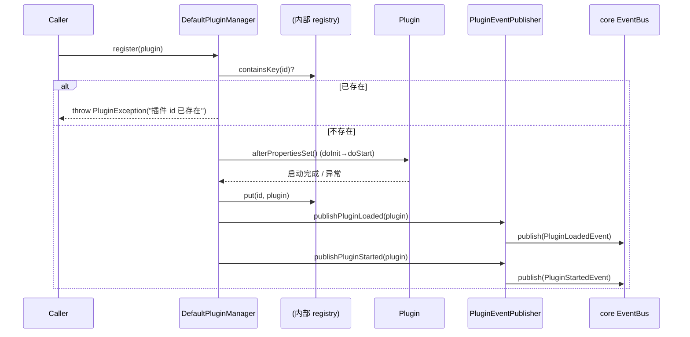
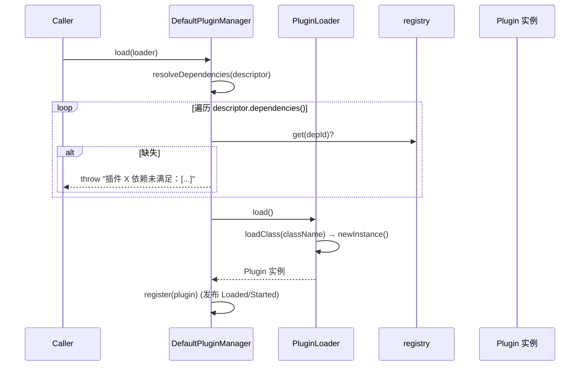
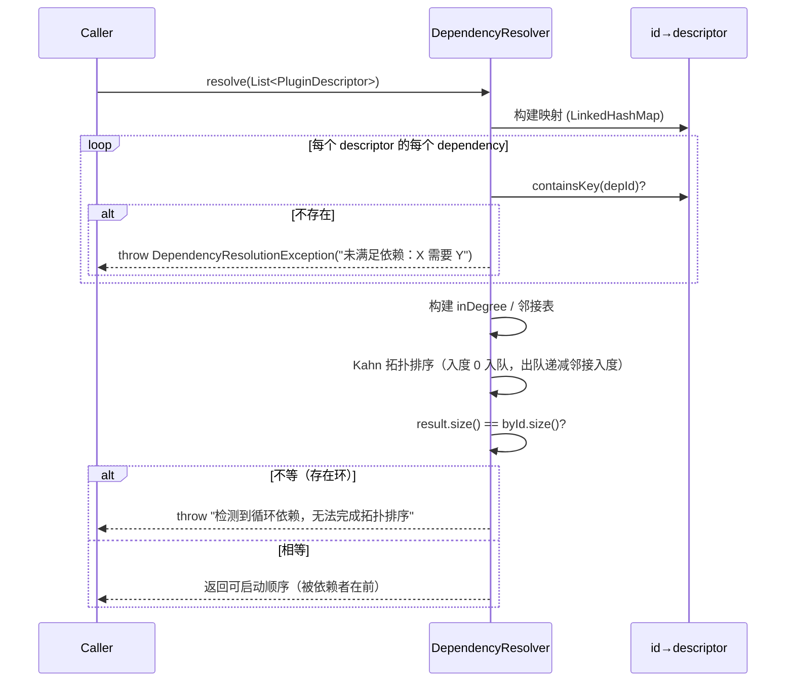
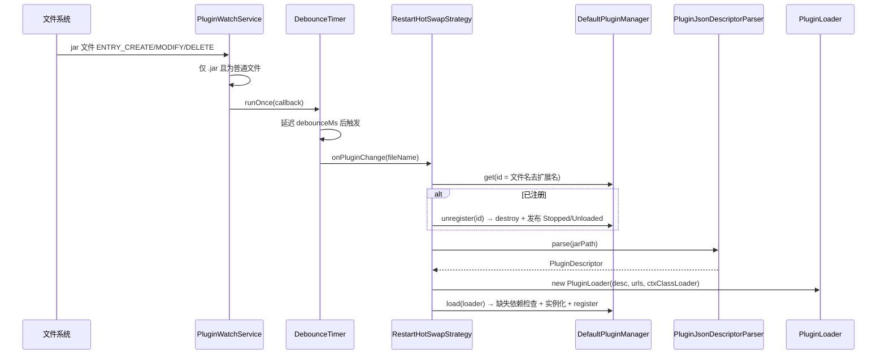

# framework-plugin 模块系统架构设计

**作者**：高见远（Gao · Architect）  
**日期**：2026-08-21  
**基线**：Spring Boot 4.1.0 + Java 21，包名 `cn.jowen.framework.plugin`  
**代码基线（commit）**：`5a16172` —— `@fix(plugin): 修复 3 处主源码编译错误并补齐 QA 遗留项`

> 本文档与 `docs/plugin-prd.md`（产品需求文档，作者：许清楚）术语保持一致，并**严格对照 `src/main/java` 下 30 个 `.java` 文件的实际落地实现**编写，不再停留于设计假设。文中凡标「⚠️ 未接线」之处，均表示相关类已实现但未被主流程调用。

---

## Part A：系统架构

### 1. 实现方案

#### 1.1 核心挑战与解法（按真实实现修订）

| 维度 | 真实挑战 | 真实解法（代码中已落地） |
|------|----------|--------------------------|
| 类加载隔离 | 插件 jar 与宿主 classpath 隔离；按 `exportedPackages` 委派父加载器 | 提供 `PluginClassLoader`（抽象基类）+ `FrameworkApiDelegateClassLoader`（按包委派父加载器）+ `IsolatedClassLoader`（child-first 完全隔离）三层类加载器。**⚠️ 注意：这些类当前未被主流程使用**——`PluginLoader` 仍直接 `extends URLClassLoader`（见 Part B 根包与 Part E-P1-1）。 |
| 依赖解析 | 插件间 DAG 依赖：拓扑排序 + 循环检测 + 缺失依赖拒绝 | `DependencyResolver`（独立工具类）实现 **Kahn 拓扑排序（基于入度）** + 缺失依赖检查 + 循环检测；`VersionRange` 提供 Maven 风格 `[1.0.0,2.0.0)` 解析。**⚠️ 未接线**：`DefaultPluginManager.load()` 仅做「依赖是否已注册」的轻量缺失检查，并未调用 `DependencyResolver` 或 `VersionRange`（见 Part E-P0-2）。 |
| 扩展机制 | 插件实现同一扩展点，宿主按 order 获取实现 | **独立注解** `@ExtensionPoint`（标记接口）+ `@Extension`（标记实现，含 `point()`/`name()`/`order()`）+ 自研 `ExtensionRegistry`（按接口 `Class` 注册、按 order 升序排序、支持 `scanAndRegister` 包扫描）。**不依赖** core 的 `@SPI`/`ExtensionLoader`（代码中无 `ExtensionLoader` 引用）。 |
| 热部署 | 监听文件系统变更、防抖、策略切换 | `PluginWatchService`（JDK `WatchService`，监听 `ENTRY_CREATE/DELETE/MODIFY`）+ `DebounceTimer`（基于 `ScheduledExecutorService` 的防抖）+ `HotSwapStrategy` 策略接口 + `RestartHotSwapStrategy`（停止旧实例后重载同名 jar）。 |
| 生命周期 / 事件 | 生命周期编排 + 可观测事件 | `Plugin` 接口继承 core `Lifecycle`（`afterPropertiesSet()`/`destroy()`）；`DefaultPluginManager` 维护 `LinkedHashMap` 注册表并按序编排；`PluginEventPublisher` 封装 core `EventBus`，发布 5 类 `PluginLifecycleEvent` 子类。 |
| 描述符 | 从 jar 内 `plugin.json` 读取元数据 | `PluginJsonDescriptorParser`：**零依赖自研 JSON 解析器**，从 jar 内 `/META-INF/plugin/plugin.json` 解析为 `PluginDescriptor` record（未引 Jackson）。 |

> **与原稿的关键分歧（已据此修正）**：
> 1. 原稿「`DependencyResolver` 使用 **Tarjan SCC 算法**检测循环」→ **错误**。源码 `DependencyResolver.java` 第 44 行明确注释 `// Kahn 算法拓扑排序`，按**入度队列**做拓扑排序，循环依赖通过「排序结果数量 < 节点数」判定。全文已按 Kahn 重写。
> 2. 原稿「`@ExtensionPoint`/`@Extension` 为语义同义包装注解，内部委托 core `ExtensionLoader`」→ **错误**。源码为**独立注解 + 自研 `ExtensionRegistry`**，全模块无 `ExtensionLoader` 引用。`ExtensionRegistry` 以 `@Extension.point()` 接口 `Class` 为 key 注册实现，并按 `@Extension.order()` 升序排序。
> 3. 原稿「`PluginApplicationContext`（Spring 子容器）」→ **错误**。源码中**不存在 `PluginApplicationContext`**（`grep` 全模块无匹配）。实际是 `context/AbstractPlugin` 抽象基类（内含 `State` 枚举与 `doInit/doStart/doStop` 模板方法 + `afterPropertiesSet/destroy` 桥接 core `Lifecycle`）。Spring 子容器（PRD P1-5）**未实现**。

#### 1.2 框架选型（按真实实现修订）

- **JSON 解析**：**自研零依赖 JSON 解析器**（`PluginJsonDescriptorParser` 内联实现 `parseJsonObject`/`parseJsonArray`/括号配对/转义处理），**未引入 Jackson**。`plugin.json` 为轻量扁平 schema，手工解析即可满足，契合「零 Spring/零外部强依赖」目标。
- **SPI / 扩展点**：**不复用 core `@SPI`/`ExtensionLoader`**。plugin 模块自带 `@ExtensionPoint` + `@Extension` + `ExtensionRegistry`，自成体系；`ExtensionRegistry` 通过**运行时反射扫描 base package（仅 `file://` 协议 classpath）或显式 `register(instance)`** 发现实现，`getExtensions(Class)` 按 order 返回不可变快照。
- **WatchService**：JDK 原生 `java.nio.file.WatchService`，零依赖；防抖用 `ScheduledExecutorService`。
- **Spring 桥接**：仅 `config/` 子包（`PluginProperties`、`PluginClassLoadingProperties`）标注 `@ConfigurationProperties`，**依赖 `spring-boot` 仅用于配置绑定**；`spring-context` 在插件模块 pom 中为 `<optional>true</optional>` 或仅测试/桥接层使用。核心 api/descriptor/loader/resolver/lifecycle/event/hotswap/extension/context 均**不依赖 Spring API**。
- **生命周期接口**：复用 core `Lifecycle`（`afterPropertiesSet()`/`destroy()`），`Plugin extends Lifecycle`。

#### 1.3 架构分层（按真实包结构修订）

```
┌─────────────────────────────────────────────────────┐
│   framework-boot-autoconfigure（P2，本模块未实现）      │
│   Actuator 端点 / PluginHealthIndicator 数据源接口     │
├─────────────────────────────────────────────────────┤
│  config/        │  hotswap/        │  context/        │
│  PluginProperties│ PluginWatchService│ AbstractPlugin │
│  (Spring 配置绑定)│ DebounceTimer   │ (抽象基类+State) │
│                 │ HotSwapStrategy  │                 │
│                 │ RestartHotSwapStrategy            │
├─────────────────────────────────────────────────────┤
│  extension/     │  dependency/    │  event/          │
│  @ExtensionPoint│ DependencyResolver│ PluginEventPublisher │
│  @Extension     │ VersionRange    │ PluginLifecycleEvent  │
│  ExtensionRegistry│ DependencyResolutionException│ +4 具体事件 │
├─────────────────────────────────────────────────────┤
│  classloader/         │  descriptor/                │
│  PluginClassLoader     │ PluginJsonDescriptorParser  │
│  FrameworkApiDelegate  │ (plugin.json 零依赖解析)    │
│  IsolatedClassLoader   │                            │
├─────────────────────────────────────────────────────┤
│  根包：PluginManager │ DefaultPluginManager         │
│        PluginLoader  │ PluginDescriptor │ Plugin    │
└─────────────────────────────────────────────────────┘
         全部依赖 framework-core（EventBus / Lifecycle / FrameworkEvent / JSpecify）
```

**核心数据流方向**：`PluginManager.load(PluginLoader)` → 缺失依赖检查 → `PluginLoader.load()` 实例化 `Plugin` → `DefaultPluginManager.register()` 调 `afterPropertiesSet()` 并发布事件；热部署经 `PluginWatchService` → `DebounceTimer` → `HotSwapStrategy` 回调 `DefaultPluginManager`。

---

## Part B：模块详细设计

### B.0 包总览与核心类型关系（Mermaid 类图）

```mermaid
classDiagram
    class Plugin {
        <<interface>> +String id() +String version() +String description()
    }
    class Lifecycle {
        <<interface core>> +afterPropertiesSet() +destroy()
    }
    class AbstractPlugin {
        <<abstract>> -PluginDescriptor descriptor -State state +afterPropertiesSet()$ +destroy()$ #doInit() #doStart() #doStop() +getState() +getDescriptor()
        <<enum State>> CREATED INITIALIZED STARTED STOPPED FAILED
    }
    class PluginManager {
        <<interface>> +register(Plugin) +load(PluginLoader) +unregister(String) +stopAll() +get(String) Plugin +all() List~Plugin~
    }
    class DefaultPluginManager {
        -LinkedHashMap~String,Plugin~ registry -PluginEventPublisher eventPublisher +load(PluginLoader) -resolveDependencies() +register(Plugin) +unregister(String)
    }
    class PluginLoader {
        <<final extends URLClassLoader>> -PluginDescriptor descriptor +load() Plugin +descriptor() +PluginException
    }
    class PluginDescriptor {
        <<record>> +String id +String version +String className +String description +List~String~ dependencies +List~String~ exportedPackages +boolean springEnabled +of(...) +of(...,List)
    }
    class PluginEventPublisher {
        -EventBus eventBus +publishPluginLoaded/Started/Stopped/Unloaded/Install(Plugin) +subscribe(...)
    }
    class PluginClassLoader {
        <<abstract extends URLClassLoader>> #List~String~ exportedPackages +loadClass(name,resolve) +getExportedPackages()
    }
    class FrameworkApiDelegateClassLoader {
        <<final>>
    }
    class IsolatedClassLoader {
        <<final>>
    }
    class DependencyResolver {
        <<final>> +resolve(List~PluginDescriptor~) List~String~ +DependencyResolutionException
    }
    class VersionRange {
        <<final>> +matches(String) +compareVersions(String,String)
    }
    class ExtensionRegistry {
        -ConcurrentHashMap~Class,List~Object~~ registry +register(Object) +getExtensions(Class) List +getExtension(Class,String) +scanAndRegister(String)
    }
    class PluginJsonDescriptorParser {
        <<final>> +parse(JarFile) +parse(String) +parseJson(String) +DescriptorParseException
    }
    class PluginWatchService {
        <<final Closeable>> +start() +close() -watchLoop()
    }
    class DebounceTimer {
        <<final>> +runOnce(Runnable) +shutdown()
    }
    class HotSwapStrategy {
        <<interface>> +onPluginChange(String)
    }
    class RestartHotSwapStrategy {
        <<final>>
    }

    Lifecycle <|-- Plugin
    Plugin <|-- AbstractPlugin
    PluginManager <|.. DefaultPluginManager
    PluginLoader -- PluginDescriptor
    DefaultPluginManager --> PluginLoader
    DefaultPluginManager --> PluginEventPublisher
    PluginEventPublisher --> "core.EventBus"
    PluginClassLoader <|-- FrameworkApiDelegateClassLoader
    PluginClassLoader <|-- IsolatedClassLoader
    DefaultPluginManager ..> DependencyResolver : ⚠️未调用
    ExtensionRegistry ..> PluginLoader : 复用 PluginException
    HotSwapStrategy <|.. RestartHotSwapStrategy
    PluginWatchService --> HotSwapStrategy
    PluginWatchService --> DebounceTimer
    RestartHotSwapStrategy --> DefaultPluginManager
```

---

### B.1 根包（`cn.jowen.framework.plugin`）

#### B.1.1 `Plugin` 接口

```java
public interface Plugin extends cn.jowen.framework.core.lifecycle.Lifecycle {
    String id();           // 唯一标识，@NonNull
    String version();      // 版本，@NonNull
    default String description() { return ""; }
}
```

- **职责**：插件契约。继承 core `Lifecycle`，故必须提供 `afterPropertiesSet()`（启动）与 `destroy()`（停止）。
- **设计决策**：复用 core `Lifecycle` 而非自定 `init/start/stop`，避免与 Spring `InitializingBean`/`DisposableBean` 语义重复，也便于宿主用统一生命周期管理。`Plugin` 本身不含 `@Extension` 注解（扩展点机制是独立体系）。

#### B.1.2 `PluginDescriptor`（record，已增强）

```java
public record PluginDescriptor(
    String id, String version, String className, String description,
    List<String> dependencies, List<String> exportedPackages, boolean springEnabled) {

    // 兼容构造（无导出包/默认空、springEnabled=false）
    public PluginDescriptor(id, version, className, description, dependencies) { this(..., List.of(), false); }
    // compact 构造做 null 安全：dependencies / exportedPackages 默认 List.of() + copyOf
    public static PluginDescriptor of(id, version, className);
    public static PluginDescriptor of(id, version, className, List<String> exportedPackages);
}
```

- **职责**：插件静态描述符，加载前校验与依赖解析的输入。
- **关键字段**：`className`（实现类全限定名）、`dependencies`（依赖的插件 id）、`exportedPackages`（导出包）、`springEnabled`（是否启用 Spring 扫描）。
- **向后兼容**：PRD P0-5 要求「新增字段须有默认值」已满足——compact 构造将两个新字段补 `List.of()` / `false`，并提供 `of(...)` 静态工厂兼容旧调用。
- **设计决策**：用 `record` 保证不可变与值语义；`exportedPackages/dependencies` 经 `List.copyOf` 防御外部修改。

#### B.1.3 `PluginLoader`（final class，extends URLClassLoader）

```java
public final class PluginLoader extends URLClassLoader {
    private final PluginDescriptor descriptor;
    public PluginLoader(PluginDescriptor descriptor, URL[] urls, ClassLoader parent) { super(urls, parent); ... }
    public PluginDescriptor descriptor() { ... }
    public Plugin load() {            // 加载并实例化
        Class<?> clazz = loadClass(descriptor.className());
        if (!Plugin.class.isAssignableFrom(clazz)) throw new PluginException("插件类未实现 Plugin 接口");
        return (Plugin) clazz.getDeclaredConstructor().newInstance();
    }
    public static final class PluginException extends RuntimeException { ... }
}
```

- **职责**：承载 jar 的 `URLClassLoader`，并封装「按 `className` 实例化插件」的逻辑。
- **⚠️ 关键事实**：`PluginLoader` **直接 `extends URLClassLoader`**，并未使用 Part B.2 的 `PluginClassLoader` 体系。原稿「`PluginLoader` 使用 `PluginClassLoader` 而非直接使用 `URLClassLoader`」**与代码不符**（见 P1-1）。
- **实例化约束**：插件实现类必须有**无参构造器**，否则抛 `PluginException`；且必须实现 `Plugin` 接口。

#### B.1.4 `PluginManager` 接口 & `DefaultPluginManager`

```java
public interface PluginManager {
    void register(Plugin plugin);
    void load(PluginLoader loader);
    void unregister(String id);
    void stopAll();
    @Nullable Plugin get(String id);
    List<Plugin> all();   // 按注册顺序
}

public final class DefaultPluginManager implements PluginManager {
    private final Map<String, Plugin> registry = new LinkedHashMap<>();
    private final PluginEventPublisher eventPublisher;   // 可为 null（无 EventBus 时）
    public DefaultPluginManager() { this(null); }
    public DefaultPluginManager(@Nullable EventBus eventBus) { ... }

    public void load(PluginLoader loader) {
        PluginDescriptor d = loader.descriptor();
        resolveDependencies(d);        // ⚠️ 仅做「依赖是否已注册」轻量检查
        Plugin plugin = loader.load();
        register(plugin);
    }
    private void resolveDependencies(PluginDescriptor d) {
        // 遍历 d.dependencies()，若 registry 中不存在则抛
        // "插件 X 依赖未满足：[...]" 的 PluginException
    }
    public void register(Plugin plugin) {
        // 重复 id 校验 → plugin.afterPropertiesSet() → 放入 registry
        // → publishPluginLoaded + publishPluginStarted
    }
    public void unregister(String id) {
        // registry.remove → plugin.destroy() → publishPluginStopped + publishPluginUnloaded
    }
    public void stopAll() { /* 逆注册顺序 destroy + clear */ }
}
```

- **职责**：注册表 + 生命周期编排 + 事件发布中枢。
- **注册顺序**：`LinkedHashMap` 保持注册顺序，`all()`、`stopAll()`（逆序）据此编排。
- **事件发布时机**：`register()` 中 **先 `afterPropertiesSet()` 成功，再依次发布 `PluginLoadedEvent`、`PluginStartedEvent`**；`unregister()` 中 **先 `destroy()`，再依次发布 `PluginStoppedEvent`、`PluginUnloadedEvent`**。
- **⚠️ 依赖解析未接线**：`load()` 内 `resolveDependencies` 仅检查「依赖 id 是否已在 `registry` 中」，不调用 `DependencyResolver`（无拓扑排序/循环检测/版本仲裁）。即多插件批量加载时不会做 DAG 排序，也不会拒绝循环依赖（见 P0-2）。
- **事件总线可空**：`eventPublisher` 为 `null` 时（未传入 `EventBus`）跳过所有事件发布，保证非 Spring / 无 core 事件场景可用。

---

### B.2 classloader 子包

三层类加载器，均基于 `URLClassLoader`，目标是在「框架 API 共享」与「插件私有隔离」之间做取舍。

#### B.2.1 `PluginClassLoader`（抽象基类）

```java
public abstract class PluginClassLoader extends URLClassLoader {
    private final List<String> exportedPackages;
    protected PluginClassLoader(URL[] urls, ClassLoader parent, List<String> exportedPackages) { ... }
    public List<String> getExportedPackages() { ... }

    @Override protected Class<?> loadClass(String name, boolean resolve) {
        Class<?> c = findLoadedClass(name);
        if (c != null) { if (resolve) resolveClass(c); return c; }
        try { c = findClass(name); ... return c; }       // ① 先试自身 URL
        catch (ClassNotFoundException ignored) { }
        return super.loadClass(name, resolve);           // ② 回退父加载器（URLClassLoader 默认父优先）
    }
    @Override public URL getResource(String name) {      // 父优先，再自身 findResource
        URL url = super.getResource(name); if (url != null) return url;
        return findResource(name);
    }
}
```

- **职责**：封装统一的「双检（已加载 → 自身 `findClass`） + 父委派回退」加载行为，子类只需决定委派策略。
- **加载顺序**：已加载 → 自身 `findClass` → 父加载器（默认）。即**自身优先、父加载器回退**的折中策略。

#### B.2.2 `FrameworkApiDelegateClassLoader`（final）

- **委派规则**：`loadClass` 中若类名前缀命中 `exportedPackages`，则**委派父加载器**（`getParent().loadClass(name)`，父为 `null` 时回退 `ClassLoader.getSystemClassLoader().loadClass(name)`）；否则走 `super.loadClass`（父优先）。
- `getResource` 同样对命中包优先从父加载器取资源。
- **用途**：实现「框架/宿主 API 共享 + 插件私有类隔离」并存——被导出的包由父（宿主）加载，保证类型一致；其余插件自有类由自身 `findClass`。

#### B.2.3 `IsolatedClassLoader`（final，child-first 完全隔离）

```java
public final class IsolatedClassLoader extends PluginClassLoader {
    public IsolatedClassLoader(URL[] urls) { super(urls, null, emptyList()); }
    public IsolatedClassLoader(URL[] urls, ClassLoader parent) { super(urls, parent, emptyList()); }
    @Override protected Class<?> loadClass(String name, boolean resolve) {
        Class<?> c = findLoadedClass(name); ... 
        try { c = findClass(name); ... return c; }
        catch (ClassNotFoundException e) { throw e; }   // 不委派父加载器
    }
}
```

- **职责**：完全隔离——**只从自身 URL 查找，找不到直接抛 `ClassNotFoundException`，绝不委派父加载器**。父加载器仅被持有但不会被用于类解析。
- **用途**：需彻底隔离宿主类的场景（如插件自带冲突版本的三方库）。

> **⚠️ 未接线说明**：上述三个类加载器是**独立可复用组件**，但当前 `PluginLoader` 直接 `extends URLClassLoader`、热部署 `RestartHotSwapStrategy` 也直接 `new PluginLoader(...)`，因此 `PluginClassLoader` 体系**未参与主加载流程**（见 P1-1）。

---

### B.3 dependency 子包

#### B.3.1 `DependencyResolver`（final，Kahn 拓扑排序）

```java
public final class DependencyResolver {
    public List<String> resolve(List<PluginDescriptor> descriptors)
            throws DependencyResolutionException {
        // 1) 构建 id→descriptor 映射（LinkedHashMap，保序）
        // 2) 缺失依赖检查：某 descriptor 的 dependency 不在映射中 → 抛
        //    "未满足依赖：X 需要 Y，但注册表中不存在"
        // 3) Kahn 拓扑排序（基于入度）：
        //    - inDegree、adj 邻接表；依赖方入度 = 其 dependencies 数量
        //    - 入度为 0 入队；出队后邻接点入度 -1，归零再入队
        // 4) 循环检测：if (result.size() != byId.size())
        //        throw new DependencyResolutionException("检测到循环依赖，无法完成拓扑排序");
        // 返回按「被依赖者在前」的可启动顺序
    }
}
```

- **算法**：**Kahn 算法（拓扑排序，基于入度队列）**。循环依赖通过「拓扑结果数量 < 节点总数」判定（经典 Kahn 收尾检查），**非 Tarjan SCC**。
- **⚠️ 未接线**：该类未被 `DefaultPluginManager` 调用。`load()` 的 `resolveDependencies` 只做注册表存在性检查（见 P0-2）。

#### B.3.2 `VersionRange`（final，Maven 风格区间）

```java
public final class VersionRange {
    public VersionRange(String expression);   // 解析 "[1.0.0,2.0.0)" 等，非法抛 DependencyResolutionException
    public boolean matches(String version);   // 落在区间内？
    public static int compareVersions(String a, String b); // 三段式语义化比较
    // 字段：lower, upper, lowerInclusive, upperInclusive
}
```

- **职责**：解析与判定 Maven 风格版本区间（`[` `]` 闭，`(` `)` 开）。`compareVersions` 按 `major.minor.patch` 数值比较。
- **⚠️ 未接线**：`matches()` 未被 `DependencyResolver` 或 manager 调用，仅为可用工具。

#### B.3.3 `DependencyResolutionException`（final RuntimeException）

- 依赖缺失 / 版本非法 / 循环依赖的统一异常类型，被 `DependencyResolver` 与 `VersionRange` 抛出。

---

### B.4 descriptor 子包

#### B.4.1 `PluginJsonDescriptorParser`（final，零依赖 JSON 解析）

```java
public final class PluginJsonDescriptorParser {
    private static final String PLUGIN_JSON_PATH = "META-INF/plugin/plugin.json";

    public PluginDescriptor parse(JarFile jarFile) throws IOException;     // 从 jar 内读 plugin.json
    public PluginDescriptor parse(String jarPath) throws IOException;      // 开 JarFile 后转上
    public PluginDescriptor parseJson(String json) throws DescriptorParseException;

    // 自研解析：parseJsonObject / parseJsonArray / 括号配对 / 转义 / 跳过空白
    public static final class DescriptorParseException extends RuntimeException { ... }
}
```

- **职责**：从 jar 内 `/META-INF/plugin/plugin.json` 读取并解析为 `PluginDescriptor`。
- **JSON key 映射**（重要，写代码时易错）：
  | JSON 字段 | 映射到 `PluginDescriptor` |
  |-----------|---------------------------|
  | `id` | `id` |
  | `version` | `version` |
  | `class` | `className`（⚠️ 不是 `className` 而是 `class`） |
  | `description` | `description`（默认 `""`） |
  | `dependencies` | `dependencies`（字符串数组） |
  | `exportedPackages` | `exportedPackages`（字符串数组） |
  | `springEnabled` | `springEnabled`（布尔，默认 `false`） |
- **自研解析器特点**：手写 `parseJsonObject`/`parseJsonArray`，支持嵌套对象/数组、字符串转义、`true/false/null`、数字（`Long`/`Double` 兜底）。**未引入 Jackson**，契合零依赖目标。
- **已知薄弱点**：无 schema 校验、对转义/嵌套容错有限、`parseJsonArray` 非字符串元素用 `substring`（见 Part F）。

---

### B.5 event 子包

#### B.5.1 事件层次（继承 core `FrameworkEvent`）

```java
public abstract class PluginLifecycleEvent extends cn.jowen.framework.core.event.FrameworkEvent {
    private final Plugin plugin;
    protected PluginLifecycleEvent(Plugin plugin) { super(plugin); ... }
    public Plugin getPlugin(); public String pluginId(); public String pluginVersion();
}

// 五个具体事件（均为 final，构造接收 Plugin；PluginInstallEvent 额外持 PluginDescriptor）
public final class PluginLoadedEvent   extends PluginLifecycleEvent { ... }
public final class PluginStartedEvent  extends PluginLifecycleEvent { ... }
public final class PluginStoppedEvent  extends PluginLifecycleEvent { ... }
public final class PluginUnloadedEvent extends PluginLifecycleEvent { ... }
public final class PluginInstallEvent  extends PluginLifecycleEvent {
    private final PluginDescriptor descriptor;
    public PluginInstallEvent(Plugin plugin, PluginDescriptor descriptor) { ... }
    public PluginDescriptor getDescriptor();
}
```

- **职责**：生命周期事件的统一载体。`PluginLifecycleEvent` 继承 core `FrameworkEvent`，可被 core `EventBus` 统一分发。
- **⚠️ `PluginInstallEvent` 未触发**：五个事件类齐备，但 `DefaultPluginManager` 只发布 `Loaded/Started/Stopped/Unloaded` 四类；`PluginInstallEvent`（设计用于「描述符提交注册、早于实际加载」）**当前无发布点**。

#### B.5.2 `PluginEventPublisher`（final）

```java
public final class PluginEventPublisher {
    private final EventBus eventBus;
    public PluginEventPublisher(EventBus eventBus) { ... }
    public void publishPluginLoaded(Plugin p)   { eventBus.publish(new PluginLoadedEvent(p)); }
    public void publishPluginStarted(Plugin p)  { eventBus.publish(new PluginStartedEvent(p)); }
    public void publishPluginStopped(Plugin p)  { eventBus.publish(new PluginStoppedEvent(p)); }
    public void publishPluginUnloaded(Plugin p)  { eventBus.publish(new PluginUnloadedEvent(p)); }
    public void publishPluginInstall(Plugin p, PluginDescriptor d) { eventBus.publish(new PluginInstallEvent(p, d)); }
    public void subscribe(EventListener<PluginLifecycleEvent> listener) { eventBus.register(listener); }
}
```

- **职责**：对 core `EventBus` 的薄封装，统一构造并发布插件事件；`subscribe` 透传 core `EventListener` 注册。
- **设计决策**：复用 core `EventBus` 而非自建发布订阅，降低耦合、统一可观测底座。

---

### B.6 extension 子包

#### B.6.1 `@ExtensionPoint` 与 `@Extension`（独立注解）

```java
@Documented @Retention(RUNTIME) @Target(TYPE)
public @interface ExtensionPoint {
    String value() default "";   // 扩展点标识，空时默认用类的全限定名
}

@Documented @Retention(RUNTIME) @Target(TYPE)
public @interface Extension {
    Class<?> point();   // 所属扩展点接口（必填）
    String name() default "";  // 实现名，空时用类名小写
    int order() default 0;     // 排序权重，越小越优先
}
```

- **职责**：`@ExtensionPoint` 标记扩展点接口；`@Extension` 标记实现类并声明归属接口、名称、顺序。
- **与原稿关键差异**：**不依赖 core `@SPI`/`ExtensionLoader`**，是 plugin 模块自有的独立注解体系。

#### B.6.2 `ExtensionRegistry`（final，自研注册表）

```java
public final class ExtensionRegistry {
    private final Map<Class<?>, List<Object>> registry = new ConcurrentHashMap<>();

    public void register(Object extension) {
        // 读取 @Extension；未标注 → 抛 PluginException
        // 校验 point().isInstance(extension)；不符 → 抛 PluginException
        // 加入列表并按 @Extension.order() 升序重排
    }
    public <T> List<T> getExtensions(Class<T> point) {   // 返回按 order 升序的不可变快照
        // 查不到或空 → List.of()；否则 List.copyOf(list)
    }
    public <T> T getExtension(Class<T> point, String name) {   // 按 扩展点+实现名 取单个
        // 用 defaultName(ann) = name().isEmpty() ? point.simpleName.toLowerCase() : name()
    }
    public void scanAndRegister(String basePackage) {
        // 取 contextClassLoader 下 basePackage 路径资源
        // ⚠️ 仅 "file" 协议：扫描目录 .class 文件，Class.forName(false)，
        //    过滤 @Extension 且非接口非抽象 → 无参构造实例化 → register
    }
}
```

- **发现机制**：扩展点实现的「发现」有两条路径：
  1. **显式注册**：调用方 `register(instance)`，依赖 `@Extension` 注解存在 + `point().isInstance()` 类型校验；
  2. **包扫描**：`scanAndRegister(basePackage)` 用**线程上下文类加载器**定位 base package 目录（`"file"` 协议），递归列出 `.class`，对标注 `@Extension`、非接口、非抽象的类用**无参构造**实例化后注册。
- **key 的设计**：注册表以 **`@Extension.point()` 接口 `Class`** 为 key，**并非** `@ExtensionPoint.value()` 字符串 id。即「扩展点 = 接口类型」，`getExtensions(接口.class)` 取实现列表。
- **排序**：每次 `register` 后对同扩展点列表按 `order()` 升序 `sort`，`getExtensions` 返回 `copyOf` 不可变快照，避免外部修改。
- **⚠️ 包扫描限制**：仅支持 `file://` 协议 classpath，**无法扫描 jar 内的 `.class`**（判 `url.getProtocol().equals("file")` 否则直接 return）。即插件 jar 内的扩展实现无法通过 `scanAndRegister` 自动发现，需显式 `register`。

---

### B.7 hotswap 子包

#### B.7.1 `HotSwapStrategy`（接口）

```java
public interface HotSwapStrategy {
    void onPluginChange(String fileName);   // jar 文件名变化回调
}
```

#### B.7.2 `PluginWatchService`（final，实现 `Closeable`）

```java
public final class PluginWatchService implements Closeable {
    public PluginWatchService(Path watchDir, HotSwapStrategy strategy, long debounceMs) { ... }
    public void start() {   // 注册 ENTRY_CREATE/DELETE/MODIFY；起守护线程 watchLoop
        watchDir.register(watchService, ENTRY_CREATE, ENTRY_DELETE, ENTRY_MODIFY);
        ...
    }
    private void watchLoop() {
        while (running.get()) {
            WatchKey key = watchService.poll(500, MILLIS);
            for (WatchEvent<?> e : key.pollEvents()) {
                Path changed = (Path) e.context();
                if (!isRegularFile(watchDir.resolve(changed))) continue;   // 仅普通文件
                if (!changed.toString().endsWith(".jar")) continue;        // 仅 .jar
                debounceTimer.runOnce(() -> { if (running.get())
                    strategy.onPluginChange(changed.getFileName().toString()); });
            }
            key.reset();
        }
    }
    @Override public void close() { running=false; executor.shutdownNow(); watchService.close(); join(watcherThread); }
}
```

- **职责**：监听 `plugins-dir` 的 jar 文件增删改，过滤非 `.jar`/非普通文件，**经 `DebounceTimer` 防抖后**回调 `HotSwapStrategy`。
- **实现要点**：单线程 `ScheduledExecutorService` + 守护线程 `watchLoop`；`poll(500ms)` 非阻塞轮询；`close()` 优雅停止并关闭 `WatchService`。

#### B.7.3 `DebounceTimer`（final）

```java
public final class DebounceTimer {
    private final long delayMs;
    private final ScheduledExecutorService scheduler;   // 单线程守护
    private final AtomicBoolean pending = new AtomicBoolean(false);
    public void runOnce(Runnable runnable) {
        pending.set(true);
        scheduler.schedule(() -> {
            if (pending.compareAndSet(true, false) && runnable != null) runnable.run();
        }, delayMs, MILLISECONDS);
    }
    public void shutdown() { scheduler.shutdownNow(); }
}
```

- **职责**：防抖——短时间内多次触发只执行一次。每次 `runOnce` 重置 `pending` 并重新调度；到点时若 `pending` 仍为 true 则执行。
- **行为注脚**：属「重置式防抖」，在突发连发中可能执行**首个** runnable 而非严格最后一次（因首个定时任务到点即消费 `pending`）。当前热部署场景可接受，但非严格 trailing-edge（见 Part F）。

#### B.7.4 `RestartHotSwapStrategy`（final）

```java
public final class RestartHotSwapStrategy implements HotSwapStrategy {
    private final DefaultPluginManager manager;
    private final Path pluginsDir;
    public void onPluginChange(String fileName) {
        String id = fileNameWithoutExt(fileName);          // ⚠️ 假设 jar 文件名 == 插件 id
        Plugin plugin = manager.get(id);
        if (plugin != null) { try { manager.unregister(id); } catch (Exception ignored) {} }
        Path jarPath = pluginsDir.resolve(fileName);
        if (!Files.isRegularFile(jarPath)) return;
        try {
            PluginDescriptor desc = new PluginJsonDescriptorParser().parse(jarPath.toString());
            PluginLoader loader = new PluginLoader(desc, new URL[]{jarPath.toUri().toURL()},
                                                   Thread.currentThread().getContextClassLoader());
            manager.load(loader);
        } catch (Exception e) { /* TODO: log required（当前吞掉异常） */ }
    }
}
```

- **职责**：热部署重启策略——停止旧插件（若已注册）→ 重新解析 jar → `new PluginLoader` → `manager.load`。
- **⚠️ 关键限制**：
  1. **id 取自带 jar 文件名**（去扩展名），假设「jar 文件名 == 插件 id」，与 descriptor 内 `id` 可能不一致；
  2. 仅对**已注册**插件做 restart，**不会安装全新 jar**（无 install 分支）；
  3. 解析/加载异常被 `catch` 吞掉（注释 `// log required`），缺乏错误上报；
  4. 复用上下文类加载器作为 `PluginLoader` 父加载器，未走 `PluginClassLoader` 隔离体系。

---

### B.8 config 子包

#### B.8.1 `PluginProperties`（final，@ConfigurationProperties）

```java
@ConfigurationProperties(prefix = "framework.plugin")
public final class PluginProperties {
    private boolean enabled = true;
    private String pluginsDir = "plugins";
    private boolean hotSwap = false;
    private PluginClassLoadingProperties classLoading = new PluginClassLoadingProperties();
    private SpringProperties spring = new SpringProperties();   // enabled / scanComponentScan / basePackage

    @ConfigurationProperties(prefix = "framework.plugin.class-loading")
    public static final class PluginClassLoadingProperties {     // ⚠️ 与独立文件同名类重复
        private String strategy = "delegate";   // delegate | isolated
        private List<String> exportedPackages = emptyList();
    }
    @ConfigurationProperties(prefix = "framework.plugin.spring")
    public static final class SpringProperties {
        private boolean enabled = false;
        private boolean scanComponentScan = true;
        private String basePackage = "";
    }
}
```

#### B.8.2 `PluginClassLoadingProperties`（final，独立文件，@ConfigurationProperties）

```java
@ConfigurationProperties(prefix = "framework.plugin.class-loading")
public final class PluginClassLoadingProperties {   // ⚠️ 与 PluginProperties 内嵌同名类字段完全一致
    private String strategy = "delegate";
    private List<String> exportedPackages = Collections.emptyList();
    // getter / setter
}
```

- **职责**：承载 `framework.plugin.*` 配置（启用开关、插件目录、热部署开关、类加载策略、Spring 桥接开关）。
- **⚠️ 重复定义**：存在**两份** `PluginClassLoadingProperties`——独立文件 `config/PluginClassLoadingProperties` 与 `PluginProperties` 的**静态内嵌类** `PluginProperties.PluginClassLoadingProperties`，二者 `@ConfigurationProperties` 前缀与字段完全一致。属于冗余/潜在冲突（见 Part F）。
- **设计决策**：仅 `config/` 子包依赖 Spring（`@ConfigurationProperties`），符合「核心逻辑零 Spring API、配置层按需桥接」的分层。

---

### B.9 context 子包

#### B.9.1 `AbstractPlugin`（abstract，实现 `Plugin`）

```java
public abstract class AbstractPlugin implements Plugin {
    private final PluginDescriptor descriptor;
    private volatile State state = State.CREATED;
    protected AbstractPlugin(PluginDescriptor descriptor) { ... }

    @Override public String id() { return descriptor.id(); }
    @Override public String version() { return descriptor.version(); }
    @Override public String description() { return descriptor.description(); }
    public State getState() { ... }
    public PluginDescriptor getDescriptor() { ... }

    protected void doInit() throws Exception {}
    protected void doStart() throws Exception {}
    protected void doStop() throws Exception {}

    @Override public final void afterPropertiesSet() {   // 模板方法（来自 core Lifecycle）
        try { doInit(); state = INITIALIZED; doStart(); state = STARTED; }
        catch (Exception e) { state = FAILED; throw new RuntimeException("插件启动失败：" + id(), e); }
    }
    @Override public final void destroy() {
        try { doStop(); state = STOPPED; }
        catch (Exception e) { state = FAILED; throw new RuntimeException("插件停止失败：" + id(), e); }
    }

    public enum State { CREATED, INITIALIZED, STARTED, STOPPED, FAILED }
}
```

- **职责**：插件实现者的抽象基类，封装 `descriptor`/`state` 公共状态与生命周期模板方法，减少样板代码。
- **模板方法（重要，与原稿措辞修正）**：插件作者实现的是 **`doInit()` / `doStart()` / `doStop()`** 三个 protected 钩子；真正被 `PluginManager` 调用的是从 core `Lifecycle` 继承的 **`afterPropertiesSet()` / `destroy()`**（二者为 `final`，内部依次调用 `doInit → doStart` / `doStop` 并维护 `State`）。原稿「`init/start/stop` 模板方法」对应此处 `doInit/doStart/doStop`。
- **State 枚举**：`CREATED / INITIALIZED / STARTED / STOPPED / FAILED`——对应 PRD P2-3 的 `PluginState` 雏形（但为内嵌枚举、缺 `DISABLED`、无独立状态机转换规则，见 Part E-P2-3）。
- **⚠️ 非 Spring 容器**：`AbstractPlugin` **不创建 `ApplicationContext`**，仅提供状态与描述符。PRD P1-5 的 Spring 子容器未实现。

---

## Part C：关键数据流 / 时序图

### C.1 插件加载流程（register 已注册实例）



### C.2 通过 PluginLoader 加载（含缺失依赖检查）



> 注：上述 `resolveDependencies` 仅做「是否已注册」存在性检查，**未调用** `DependencyResolver`（无拓扑排序/循环检测）。`DependencyResolver` 为独立工具（见 C.3）。

### C.3 依赖解析流程（DependencyResolver，独立工具，当前未接线）



### C.4 热部署流程



---

## Part D：设计决策与权衡（Rationale）

| 决策 | 选择 | 理由 / 权衡 |
|------|------|-------------|
| **零 Spring 强依赖** | 核心子包（api/descriptor/loader/resolver/lifecycle/event/hotswap/extension/context）均不 import Spring；仅 `config/` 用 `@ConfigurationProperties` | 保证 plugin 模块对非 Spring 宿主（纯 Java / 其他容器）可用；配置层按 Spring 可选桥接，符合 PRD 非功能要求。代价：无 IoC 注入，插件作者需自行管理依赖。 |
| **类加载隔离策略分两层** | `PluginClassLoader` 基类（自身优先+父回退）+ `FrameworkApiDelegateClassLoader`（按包委派父）+ `IsolatedClassLoader`（child-first 不委派） | 兼顾「框架 API 类型一致（委派父）」与「插件私有类隔离（自身优先/完全隔离）」。代价：当前主流程未接线（见 P1-1）。 |
| **自研 JSON 解析而非 Jackson** | `PluginJsonDescriptorParser` 手写解析 | 零额外依赖、启动快、可控；代价：容错弱、无 schema 校验、嵌套/转义处理有限（见 Part F）。对扁平 `plugin.json` 足够。 |
| **事件总线复用 core EventBus** | `PluginEventPublisher` 薄封装 `EventBus` | 避免自建发布订阅，统一可观测底座；`EventBus` 为 `null` 时安全跳过，保持非 Spring 可用。 |
| **扩展机制自研而非复用 core `@SPI`** | `@ExtensionPoint`/`@Extension` + `ExtensionRegistry` | 语义更贴合「插件扩展点」（带 `order`、`name`、接口归属），不绑架 core SPI 模型；代价：与 core `@SPI` 不互通，扫描仅 `file` 协议。 |
| **生命周期复用 core `Lifecycle`** | `Plugin extends Lifecycle`（`afterPropertiesSet`/`destroy`） | 复用既有生命周期契约，降低概念冗余；`AbstractPlugin` 以 `doInit/doStart/doStop` 钩子 + `final` 模板方法桥接。 |
| **依赖解析「工具独立、暂未接线」** | `DependencyResolver`/`VersionRange` 独立实现，`DefaultPluginManager` 仅做存在性检查 | 先落地算法正确性，后续再把 DAG 排序/版本仲裁接入 `load()`。当前批量加载不保证拓扑顺序、不拒循环依赖（已知缺口）。 |
| **热部署「WatchService + 策略框架」** | 监听 + `DebounceTimer` + `HotSwapStrategy` 接口 | 策略可扩展（未来可加 `NoneSwapStrategy`/版本化策略）；当前仅 `RestartHotSwapStrategy`。 |

---

## Part E：与 PRD 的映射（需求实现状态）

> 状态图例：**已实现** / **部分实现** / **延后（未实现）** / **待验证**（需跑测试确认，本任务不运行测试）。

### P0（Must Have）

| 编号 | 需求 | 实现状态 | 说明 |
|------|------|----------|------|
| P0-1 | 骨架类保留并补全 | ✅ 已实现 | `Plugin`/`PluginDescriptor`/`PluginLoader`/`PluginManager`/`DefaultPluginManager` 全部保留并扩展；`PluginDescriptor` 增 `exportedPackages`/`springEnabled`；`PluginLoader` 为 `final URLClassLoader` 并新增 `load()`/`PluginException`。 |
| P0-2 | 依赖解析（DAG 拓扑+循环+缺失拒绝；VersionRange） | ⚠️ **部分实现** | `DependencyResolver`（Kahn 拓扑+循环+缺失检查）与 `VersionRange` 已落地，但**未接入** `DefaultPluginManager.load()`；manager 仅做「依赖是否已注册」的存在性检查，无拓扑排序/循环拒绝/版本仲裁。 |
| P0-3 | 插件事件总线集成（core EventBus；5 事件；PluginEventPublisher） | ✅ 已实现 | 5 个事件类 + `PluginEventPublisher` 封装 `EventBus` 均到位。**注脚**：`PluginInstallEvent` 已定义但 manager 当前未发布。 |
| P0-4 | 扩展机制基础（@ExtensionPoint/@Extension/ExtensionRegistry，按 id、order 排序） | ✅ 已实现 | 独立注解 + 自研注册表，按 `order` 升序。**注脚**：注册表以接口 `Class` 为 key（非 `@ExtensionPoint.value()`）；`scanAndRegister` 仅 `file` 协议。 |
| P0-5 | PluginDescriptor 增强（exportedPackages/springEnabled，向后兼容） | ✅ 已实现 | record 增两字段，compact 构造给默认值，`of(...)` 工厂兼容。 |
| P0-6 | 配置属性（PluginProperties + PluginClassLoadingProperties） | ✅ 已实现 | `@ConfigurationProperties(prefix="framework.plugin")` 齐备。**注脚**：存在两份同名 `PluginClassLoadingProperties`（独立文件 + 内嵌类），属冗余（见 Part F）。 |
| P0-7 | 现有测试兼容 + 新测试覆盖 | ⏳ 待验证 | 本任务约束「不运行测试」，未在源码确认；建议按 PRD 构建命令复跑验证。 |

### P1（Should Have）

| 编号 | 需求 | 实现状态 | 说明 |
|------|------|----------|------|
| P1-1 | 类加载隔离策略（PluginClassLoader/FrameworkApiDelegate/Isolated；PluginLoader 使用 PluginClassLoader） | ⚠️ **部分实现** | 三个类加载器均已实现，但 `PluginLoader` **仍直接 `extends URLClassLoader`**，未使用 `PluginClassLoader`；热部署亦直接 `new PluginLoader`。隔离能力为「可用组件」但**未接入主流程**。 |
| P1-2 | SharedLibraryResolver（按 Maven GAV 解析共享库） | ❌ 延后 | 源码中**无此类**，未实现。 |
| P1-3 | plugin.json 描述符解析 | ✅ 已实现 | `PluginJsonDescriptorParser` 从 jar 内 `META-INF/plugin/plugin.json` 零依赖解析。**注脚**：无 schema 校验。 |
| P1-4 | 热部署基础能力（WatchService + DebounceTimer + RESTART） | ✅ 已实现 | `PluginWatchService` + `DebounceTimer` + `HotSwapStrategy` + `RestartHotSwapStrategy` 均已落地。 |
| P1-5 | Spring 子容器 PluginApplicationContext（spring.enabled 时创建） | ❌ 延后 | 源码**无 `PluginApplicationContext`**；仅有 `descriptor.springEnabled` 字段与 `config` 开关，无容器创建代码。 |
| P1-6 | AbstractPlugin 抽象基类 + 模板方法 | ✅ 已实现 | `AbstractPlugin` 含 `descriptor`/`state` 与 `doInit/doStart/doStop` 钩子（桥接 core `afterPropertiesSet`/`destroy`）+ `State` 枚举。 |

### P2（Nice to Have）

| 编号 | 需求 | 实现状态 | 说明 |
|------|------|----------|------|
| P2-1 | Actuator 集成（PluginHealthIndicator + /actuator/plugins） | ❌ 延后 | 应在 `framework-boot-autoconfigure`；plugin 模块未提供，且依赖未实现的 P1-5。 |
| P2-2 | plugin.yaml 支持（SnakeYAML optional） | ❌ 延后 | 无 YAML 解析路径。 |
| P2-3 | PluginState 枚举（CREATED/STARTING/STARTED/STOPPING/STOPPED/FAILED/DISABLED + 状态机） | ⚠️ **部分实现** | `AbstractPlugin.State` 提供 `CREATED/INITIALIZED/STARTED/STOPPED/FAILED`（缺 `STARTING`/`STOPPING`/`DISABLED`，无独立 `PluginState` 类与转换规则）。 |
| P2-4 | PluginContext 接口（getPluginId/getDescriptor/getSharedData/publishEvent） | ⚠️ **部分实现** | `AbstractPlugin` 提供 `getDescriptor()`/`getState()`/`id()`/`version()`，但**无独立 `PluginContext` 接口**，缺 `getSharedData()`/`publishEvent()`。 |
| P2-5 | PluginPackage 打包工具（extractPluginJar/calculateChecksum/isValidPluginId） | ❌ 延后 | 无此类工具方法。 |

---

## Part F：已知限制与后续演进

### F.1 当前限制（基于真实代码能力）

1. **类加载隔离未接线**：`PluginClassLoader`/`FrameworkApiDelegateClassLoader`/`IsolatedClassLoader` 已实现但主加载流程（`PluginLoader`、`RestartHotSwapStrategy`）未使用，插件实际以「上下文类加载器为父的 `URLClassLoader`」加载，未体现 `exportedPackages` 委派或完全隔离。
2. **依赖解析未接线**：`DefaultPluginManager.load()` 仅做依赖存在性检查，缺失拓扑排序 / 循环依赖拒绝 / 版本区间仲裁（`DependencyResolver`、`VersionRange` 为孤岛）。多插件批量加载不保证启动顺序，循环依赖不会被拦下。
3. **`PluginInstallEvent` 未被发布**：事件类存在，但 manager 无发布点；安装时不可观测。
4. **扩展扫描仅 `file` 协议**：`ExtensionRegistry.scanAndRegister` 只能扫 classpath 目录里的 `.class`，**无法发现 jar 内插件**的扩展实现，需显式 `register(instance)`。
5. **热部署策略局限**（见 B.7.4）：
   - 插件 id 取自 jar **文件名**（去扩展名），假设与 descriptor `id` 一致；
   - 仅 restart 已注册插件，**不安装新 jar**；
   - 加载/解析异常被吞（`// log required`），缺错误上报与失败回滚；
   - 复用上下文类加载器，未走隔离类加载器。
6. **`DebounceTimer` 非严格 trailing-edge**：重置式防抖在连发中倾向执行首个 runnable，而非严格「最后一次」。
7. **零依赖 JSON 解析器容错有限**：`PluginJsonDescriptorParser` 无 schema 校验、转义/嵌套支持弱、`parseJsonArray` 非字符串元素用 `substring` 兜底；非法 `plugin.json` 可能给出不友好错误。
8. **无 `URLClassLoader.close()` 热替换**：`PluginLoader` 未调用 `close()`，旧插件 jar 仍被文件句柄占用，热部署替换大 jar 时可能受操作系统文件锁影响（与 PRD US-02「ClassLoader 可被 GC 回收」需配套 `close()`）。
9. **配置冗余**：两份同名 `PluginClassLoadingProperties`（独立文件 + `PluginProperties` 内嵌类）字段一致，易引发绑定歧义/维护混乱。
10. **无远程推送 / 版本化热部署**：热部署仅本地目录文件监听，无远程分发、灰度、版本保留。

### F.2 建议演进路线

| 优先级 | 演进项 | 说明 |
|--------|--------|------|
| 高 | 接线 `DependencyResolver` 到 `load()` | 在批量加载前做 DAG 拓扑排序 + 循环拒绝 + 版本仲裁；`VersionRange.matches` 用于依赖版本校验。 |
| 高 | 接线 `PluginClassLoader` 体系 | `PluginLoader` 依据 `config.strategy`（`delegate`/`isolated`）与 `exportedPackages` 选择 `FrameworkApiDelegateClassLoader` / `IsolatedClassLoader`；热部署同步改用隔离加载器。 |
| 高 | 补全 `PluginInstallEvent` 发布点 | 在 `load()` 解析 descriptor 后、实际加载前发布，满足「安装早于加载」语义。 |
| 中 | 扩展扫描支持 jar | `scanAndRegister` 增加 `JarFile` 遍历 `.class` 入口，使插件 jar 内 `@Extension` 可被发现。 |
| 中 | 热部署健壮性 | id 取自 descriptor 而非文件名；新增（install）分支；异常日志化 + 失败回滚；`PluginLoader.close()` 释放。 |
| 中 | 清理配置冗余 | 保留单一 `PluginClassLoadingProperties`（建议内嵌于 `PluginProperties` 或独立其一），消除双重定义。 |
| 低 | P1-5 / P2 全量 | Spring 子容器 `PluginApplicationContext`、Actuator 端点、plugin.yaml、`PluginState` 独立类与状态机、`PluginContext` 接口、`PluginPackage` 工具。 |
| 低 | 替换自研 JSON 解析 | 评估引入 Jackson（optional）/ 或加强自研解析器的 schema 校验与容错。 |

---

> **文档一致性声明**：本文 Part A/B/C/D 严格对照 `src/main/java/cn/jowen/framework/plugin/` 下 30 个 `.java` 文件（commit `5a16172`）编写；与原稿不一致的三处（Tarjan→Kahn、ExtensionLoader 委托→自研 ExtensionRegistry、PluginApplicationContext→AbstractPlugin）已在 1.1 节明确标注并据此修正。Part E/F 如实标注了「已实现 / 部分实现 / 延后」与已知限制。
